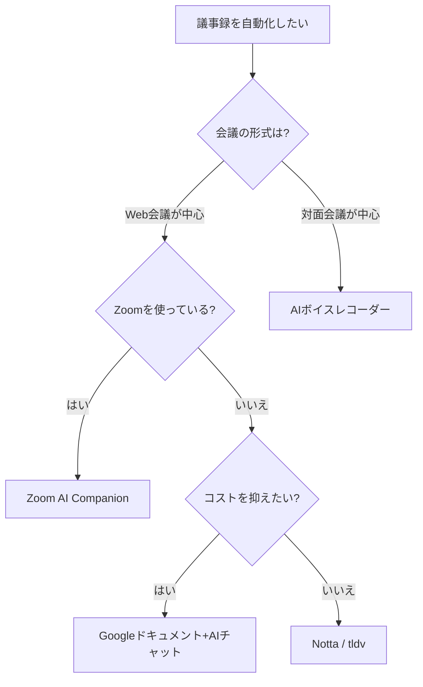

※本記事はアフィリエイト広告(PR)を含みます。

## 議事録作成、まだ手作業でやっていませんか?

会議のたびにメモを取り、終わってから清書して共有する——議事録作成は、地味に時間を奪われる作業の代表格です。1時間の会議なら、議事録の整理にさらに30分以上かかることも珍しくありません。

近年のAIツールを使えば、この作業の大部分を自動化できます。この記事では、AI議事録の基本的な仕組みと、初心者でも使いやすいおすすめツールを紹介します。

## AI議事録ツールの仕組み

AI議事録ツールは、大きく次の2つのステップで動きます。

1. **文字起こし**:会議の音声をAIがテキストに変換する
2. **要約・整形**:発言内容をAIが要約し、決定事項やTODOを抽出する

最近のツールは話者の区別(誰が話したか)にも対応しており、「Aさんの発言」「Bさんの発言」と自動で振り分けてくれるものもあります。

## おすすめAI議事録ツール5選

### 1. Notta(ノッタ)

日本語の文字起こし精度に定評のあるツールです。ZoomやGoogle Meetとの連携機能があり、Web会議の内容を自動で記録できます。無料プランで試せるので、最初の1つとしておすすめです。

### 2. tl;dv

Web会議の録画と文字起こしをまとめて行えるツールです。会議の重要な場面にタイムスタンプを付けられるため、「あの発言どこだったっけ?」を後から探しやすいのが特徴です。

### 3. Zoom AI Companion

普段からZoomを使っているなら、追加ツールなしで使えるのが魅力です。有料プランに付属するAI機能で、会議の要約や論点の整理を自動で行ってくれます。

### 4. Googleドキュメントの音声入力 + AIチャット

コストをかけたくない場合の組み合わせ技です。Googleドキュメントの音声入力で[文字起こしを行い](/2026/06/12/ai-transcription-comparison/)、その文章をChatGPTやClaudeなどのAIチャットに貼り付けて「議事録の形式に要約して」と頼む方法です。精度では専用ツールに劣りますが、無料で始められます。

### 5. PLAUD NOTE などのAIボイスレコーダー

対面会議が多い方には、録音から文字起こしまで一台で完結するAIボイスレコーダーという選択肢もあります。スマホアプリと連携して、録音データを自動で要約してくれます。

👉 [Amazonで「AIボイスレコーダー」を見る](https://af.moshimo.com/af/c/click?a_id=5632371&p_id=170&pc_id=185&pl_id=38594&url=https%3A%2F%2Fwww.amazon.co.jp%2Fs%3Fk%3DAI%25E3%2583%259C%25E3%2582%25A4%25E3%2582%25B9%25E3%2583%25AC%25E3%2582%25B3%25E3%2583%25BC%25E3%2583%2580%25E3%2583%25BC)

## どれを選ぶべき?早見フローチャート

自分に合うツールは、会議のスタイルから逆算すると選びやすくなります。

## 精度を上げるコツは「録音環境」

どんなに優秀なAIでも、音声がこもっていたり雑音が多かったりすると、文字起こしの精度は大きく下がります。Web会議が多い方は、マイクを見直すだけで議事録の品質が目に見えて変わります。

- 単一指向性のUSBマイクは、自分の声だけを拾いやすい
- ヘッドセットタイプは、口元との距離が一定に保てるため安定する

👉 [Amazonで「USBマイク 単一指向性」を見る](https://af.moshimo.com/af/c/click?a_id=5632371&p_id=170&pc_id=185&pl_id=38594&url=https%3A%2F%2Fwww.amazon.co.jp%2Fs%3Fk%3DUSB%25E3%2583%259E%25E3%2582%25A4%25E3%2582%25AF%2520%25E5%258D%2598%25E4%25B8%2580%25E6%258C%2587%25E5%2590%2591%25E6%2580%25A7)

## 導入時の注意点

- **社内ルールの確認**:会議の録音・外部サービスへのアップロードが許可されているか、事前に確認しましょう。
- **参加者への周知**:録音する場合は、会議の冒頭で参加者に伝えるのがマナーです。
- **機密情報の扱い**:無料ツールに機密性の高い会議を任せるのは避け、利用規約(データの取り扱い)を確認してから使いましょう。

料金プランや機能は頻繁に変わるため、導入前に必ず各ツールの公式サイトで最新情報をご確認ください。

## まとめ

AI議事録ツールを使えば、「会議後30分の清書作業」をほぼゼロにできます。

- まず試すなら無料プランのある **Notta**
- Zoom中心なら **Zoom AI Companion**
- コストゼロで始めるなら **Googleドキュメント + AIチャット**
- 対面会議が多いなら **AIボイスレコーダー**

自分の会議スタイルに合ったツールを選んで、議事録作成の時間をもっと価値のある仕事に回しましょう。
