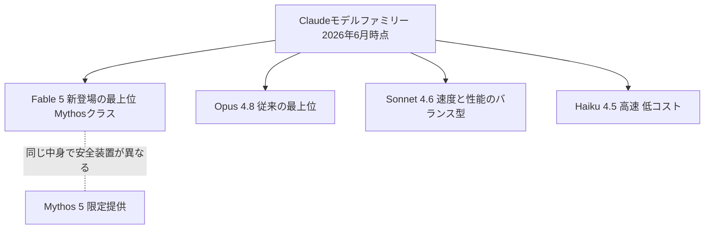

※本記事はアフィリエイト広告(PR)を含む場合があります。

## Claudeに新しい最上位モデル「Fable 5」が登場

2026年6月、Anthropicが新しいAIモデル **Claude Fable 5(クロード・フェイブル5)** を発表しました。これまでClaudeの最上位は「Opus」シリーズでしたが、Fable 5はその**さらに上に位置する新しいクラス(Mythosクラス)**の、初めての一般提供モデルです。

この記事では、「Fable 5で何ができるのか」「Opus 4.8と何が違うのか」「自分は使えるのか」を、発表内容をもとに整理します。

ちょっとした余談ですが、実は当サイトの構築・運営にもClaudeを活用しており、この記事の執筆にはFable 5自身が関わっています。AIが自分自身の解説記事を書く時代になりました。

## Fable 5は何がすごいのか

発表によると、Fable 5はAnthropicがこれまで一般提供したどのモデルをも上回る能力を持ち、**ほぼすべてのAI能力ベンチマークで最高水準(state-of-the-art)**を記録しています。特に強いとされる分野は次のとおりです。

- **ソフトウェア開発**:[コードの読解・修正・大規模な移行作業](/2026/06/13/ai-programming-study/)
- **ナレッジワーク**:[資料作成・分析・調査などの知的業務](/2026/06/13/ai-presentation-tools/)
- **画像理解(ビジョン)**:スクリーンショットや図表の読み取り
- **科学研究**:専門領域の調査・分析の補助

### 「数ヶ月の作業を数日に」という実例

早期テストに参加した決済企業のStripeは、「Fable 5は数ヶ月分のエンジニアリングを数日に圧縮した」と報告しています。具体例として、**5,000万行の巨大なコードベース全体の移行作業を1日で完了**させたとのこと。人手ならチームで2ヶ月以上かかる規模の作業です。

これは、Fable 5が従来のClaudeよりも**長時間、自律的に working し続けられる**ようになったことが大きく影響しています。「指示を出したら、完了まで任せられる時間」が大幅に伸びたイメージです。

## Claudeのモデルラインナップにおける位置づけ

## Opus 4.8との違いを比較

| 項目 | Fable 5 | Opus 4.8 |
|------|---------|----------|
| 位置づけ | 最上位(Mythosクラス) | 従来のフラッグシップ |
| 性能 | ほぼ全ベンチマークで最高水準 | 高性能(長時間の自律作業に強い) |
| API価格(入力) | $10/100万トークン | $5/100万トークン |
| API価格(出力) | $50/100万トークン | $25/100万トークン |
| 向いている用途 | 最難関タスク・大規模開発・研究 | 高度な開発・執筆・分析全般 |

※価格は記事執筆時点の発表内容です。最新の料金は必ずAnthropic公式サイトでご確認ください。

ざっくり言うと、**価格はOpus 4.8の2倍、性能はそれを上回る最高水準**という位置づけです。日常的な用途ならOpus 4.8やSonnet 4.6で十分なケースが多く、Fable 5は「これまでのAIでは歯が立たなかった難しい仕事」に投入する切り札と考えるとよいでしょう。

## 「Mythos 5」との関係は?

同時に発表された **Claude Mythos 5** は、**Fable 5と同じ中身のモデル**です。違いは安全装置(セーフガード)の設定にあります。

- **Fable 5**:サイバーセキュリティや生物学などの高リスク領域への回答をブロックする新しい安全装置を搭載。この仕組みにより一般提供が可能になりました。安全装置は保守的に調整されており、発動するのは平均してセッションの5%未満とされています
- **Mythos 5**:一部領域の安全装置を解除したバージョン。サイバー防御の専門家やインフラ事業者などの限られた組織向けに、米政府と連携したプログラム(Project Glasswing)を通じて提供されます

つまり一般ユーザー・企業が使うのはFable 5で、Mythos 5は特別な審査を経た組織だけが使える、という関係です。

## 誰が使える?

発表時点では、Fable 5は**企業顧客と有料プランの加入者向け**に提供されます。APIからも利用でき、料金は前述のとおり入力$10・出力$50(100万トークンあたり)です。これは上位クラスのモデルとしては従来(Mythos Preview)の半額以下とされています。

## よくある質問

### 無料で試せる?

発表時点では有料プラン向けの提供です。まずはClaudeの無料プランで下位モデルを試し、物足りなくなったら有料プランを検討する流れがおすすめです。

### 普段使いにはどのモデルがいい?

[文章作成や調べ物などの日常用途](/2026/06/12/ai-blog-writing-guide/)なら、SonnetやOpusで十分高品質です。Fable 5が真価を発揮するのは、大規模なコード移行・難しい研究調査・長時間の自律作業といった「最難関」の仕事です。

## まとめ

- **Claude Fable 5**は、Opusの上に新設された最上位「Mythosクラス」の初の一般提供モデル
- ほぼすべてのベンチマークで最高水準。特に開発・ナレッジワーク・画像理解・研究に強い
- 長時間の自律作業が可能になり、「数ヶ月の作業を数日に」という実例も
- 価格はOpus 4.8の2倍($10/$50)。日常用途はOpus/Sonnet、難関タスクはFable 5という使い分けがおすすめ
- 安全装置を解除した**Mythos 5**は限定提供で、一般利用はFable 5が窓口

AIモデルの進化は非常に速いため、最新情報は[Anthropicの公式発表](https://www.anthropic.com/news/claude-fable-5-mythos-5)をチェックしてください。

### 参考リンク

- [Claude Fable 5 and Claude Mythos 5(Anthropic公式)](https://www.anthropic.com/news/claude-fable-5-mythos-5)
- [Anthropic releases Mythos-like AI model to the public, Claude Fable 5(CNBC)](https://www.cnbc.com/2026/06/09/anthropic-mythos-claude-fable-5.html)
- [Anthropic Launches Claude Fable 5, Its First Public Mythos-Class Model(MacRumors)](https://www.macrumors.com/2026/06/09/anthropic-fable-5/)
