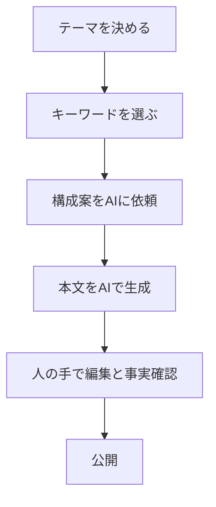

※本記事はアフィリエイト広告(PR)を含みます。

## AIでブログ記事を書く方法を初心者向けに解説します

「AIでブログ記事を書く方法を知りたいけれど、何から始めればいいかわからない」——そんな方のための完全ガイドです。この記事を読むと、AIを使ったブログ記事作成の具体的な手順、ツールの選び方、文章の質を高めるコツ、そして気になる「無料で使えるの?」という疑問まで、まとめて理解できます。

AIライティングツールとは、人工知能(AI)があなたの指示(プロンプトと呼びます)をもとに文章を自動で生成してくれるサービスのことです。うまく使えば、これまで数時間かかっていた記事執筆が大幅に短縮できます。難しい専門知識は必要ありません。順番に読み進めれば、今日からAIで記事が書けるようになりますよ。

## AIでブログ記事を書く3つのメリット

まずは、なぜAIで記事を書くと良いのか、ポイントを整理しましょう。

- **時間を大幅に短縮できる**:構成案や下書きを数分で作れます。
- **アイデアの幅が広がる**:自分では思いつかない切り口や見出しを提案してくれます。
- **書き出しの心理的ハードルが下がる**:白紙の状態から書き始めるストレスがなくなります。

一方で、AIが生成した文章には事実の誤り(専門用語では「ハルシネーション」と呼ばれる、もっともらしい嘘)が含まれることがあります。そのまま公開せず、必ず人の目で確認することが大前提です。この点は後ほど詳しく説明します。

## AIで記事を書く全体の流れ

最初に、記事完成までの大きな流れをつかんでおきましょう。下の図のステップで進めると迷いません。

ポイントは、AIに丸投げするのではなく「AIと一緒に作る」という意識を持つことです。各ステップを順番に見ていきましょう。

## ステップ別・AIブログ記事の書き方

### ステップ1:テーマとキーワードを決める

まずは「誰に」「何を」伝える記事かを決めます。そのうえで、読者が検索しそうなキーワードを考えましょう。たとえば「家庭菜園 初心者」「節約 レシピ」のように、具体的な言葉を選ぶのがコツです。

キーワードが思いつかないときは、AIに「家庭菜園に関するブログ記事のキーワード候補を10個挙げて」と聞くだけでも十分役立ちます。

### ステップ2:構成案(見出し)を作る

いきなり本文を書かせるより、まず構成(見出しの一覧)を作るのがおすすめです。次のように依頼してみましょう。

> 「初心者向け 家庭菜園の始め方」というテーマで、ブログ記事の見出し構成を作ってください。読者は野菜を育てたことがない人です。

生成された構成を見て、不要な見出しを削ったり、順番を入れ替えたりして、自分好みに整えます。

### ステップ3:見出しごとに本文を生成する

構成が決まったら、見出しを1つずつAIに渡して本文を書いてもらいます。一度に全部書かせるより、見出し単位で生成したほうが内容が深く、質が安定します。

例:「『土の準備』という見出しの本文を、初心者にもわかるように400字程度で書いてください。」

### ステップ4:編集と事実確認をする

ここが最も大切な工程です。AIの文章を以下の観点でチェックしましょう。

- 事実は正しいか(数値・固有名詞・価格などは特に注意)
- 自分の体験や意見を加えられるか
- 不自然な繰り返しや、回りくどい表現はないか

あなた自身の経験談を1つ加えるだけで、記事の独自性が一気に高まります。

## 良い文章を引き出すプロンプトのコツ

プロンプト(AIへの指示文)の質が、記事の質を大きく左右します。次の4つを意識するだけで結果が変わります。

| コツ | 具体例 |
| --- | --- |
| 役割を与える | 「あなたはプロの編集者です」 |
| 読者を明確にする | 「対象は20代の初心者です」 |
| 形式を指定する | 「箇条書きで5つ挙げて」 |
| 文字数を伝える | 「300字程度で」 |

うまくいかないときは、一度の指示で完璧を目指さず、「もっと具体的に」「専門用語を減らして」と追加で会話を重ねていくのがコツです。

## AIライティングは無料で使える?

「お金をかけずに試したい」という方は多いはずです。結論から言うと、多くのAIツールには無料で使えるプランがあります。

代表的なAIチャットツール(ChatGPT、Claude、Geminiなど)には無料版があり、ブログの下書き作成程度であれば十分に活用できます。ただし、無料版は使える回数や最新モデルへのアクセスに制限がある場合が多いです。本格的に毎日使うなら有料プランの検討もおすすめします。

料金やプランの内容は変更されることがあるため、最新の料金や機能は各ツールの公式サイトで確認してください。まずは無料版で操作に慣れてから、必要に応じて有料版にステップアップするのが安心です。

## 作業効率を上げる環境づくり

AIで記事を書くなら、長時間の作業を快適にする環境も整えておきたいところです。文字を打つ機会が増えるので、打鍵感の良いキーボードがあると作業がぐっと楽になります。

👉 [Amazonで「ワイヤレスキーボード 静音」を見る](https://www.amazon.co.jp/s?k=%E3%83%AF%E3%82%A4%E3%83%A4%E3%83%AC%E3%82%B9%E3%82%AD%E3%83%BC%E3%83%9C%E3%83%BC%E3%83%89%20%E9%9D%99%E9%9F%B3)

また、構成を考えたり情報を整理したりするときは、画面が広いほうが効率的です。デュアルモニター(2画面)にすると、片方でAIとの会話、もう片方で記事の編集ができて非常に便利です。

👉 [楽天市場で「モバイルモニター 15インチ」を探す](https://af.moshimo.com/af/c/click?a_id=5632328&p_id=54&pc_id=54&pl_id=616&url=https%3A%2F%2Fsearch.rakuten.co.jp%2Fsearch%2Fmall%2F%25E3%2583%25A2%25E3%2583%2590%25E3%2582%25A4%25E3%2583%25AB%25E3%2583%25A2%25E3%2583%258B%25E3%2582%25BF%25E3%2583%25BC%252015%25E3%2582%25A4%25E3%2583%25B3%25E3%2583%2581%2F)

## AIで書いた記事はそのまま公開していい?

よくある疑問にお答えします。AIが生成した文章をそのままコピーして公開するのは、おすすめできません。理由は次の3つです。

1. **事実誤認のリスク**:前述のとおり、AIは誤った情報を自信ありげに書くことがあります。
2. **独自性の不足**:他のサイトと似た内容になりやすく、読者にとっての価値が下がります。
3. **あなたらしさが消える**:体験や感想こそが読者に響く部分です。

AIはあくまで「優秀なアシスタント」と考え、最終的な判断と仕上げは自分で行いましょう。この一手間が、読まれる記事と読まれない記事の分かれ道になります。

## まとめ

AIでブログ記事を書く方法を、初心者向けにステップごとに解説してきました。最後にポイントを振り返ります。

- 流れは「テーマ決め→キーワード→構成→本文生成→編集」の順番
- 本文は見出しごとに生成すると質が安定する
- プロンプトは「役割・読者・形式・文字数」を意識する
- 多くのAIツールは無料で試せる(最新情報は公式サイトで確認を)
- AIの文章は必ず人の手で事実確認と編集をする

AIは正しく使えば、ブログ運営の心強い相棒になります。まずは無料版のツールを開いて、「構成案を作ってください」と一言入力してみることから始めてみましょう。最初の一歩が、あなたの記事作成を大きく変えてくれるはずです。
