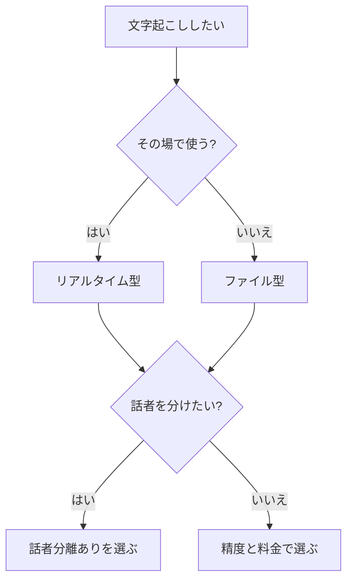

※本記事はアフィリエイト広告(PR)を含みます。

## AI文字起こしツールとは?この記事でわかること

「会議やインタビューの音声を、自分で聞き直して文字に起こすのが大変…」そんな悩みを持つ方に注目されているのが**AI文字起こしツール**です。AI文字起こしツールとは、音声や録音データを自動でテキスト（文字）に変換してくれるサービスのこと。これまで何時間もかかっていた作業が、数分〜数十分で終わることもあります。

この記事を読むと、次のことがわかります。

- AI文字起こしツールの選び方のポイント
- 会議・インタビューなど用途別のおすすめツール
- 無料で使えるのか、料金の目安
- 精度を上げるためのちょっとしたコツ

「結局どれを選べばいいの?」という疑問に、できるだけわかりやすくお答えしていきます。

## AI文字起こしツールの選び方4つのポイント

ツールを選ぶとき、価格だけで決めてしまうと「思ったより使えなかった」となりがちです。次の4つの観点でチェックすると失敗しにくくなります。

### 1. 文字起こしの精度

もっとも大事なのが精度です。特に専門用語が多い会議や、複数人が話すインタビューでは、変換ミスが少ないツールほど後の修正が楽になります。日本語に強いツールを選ぶのがポイントです。

### 2. 話者の聞き分け（話者分離）

「話者分離」とは、誰が話したかを自動で区別して「Aさん」「Bさん」のように分けてくれる機能です。インタビューや複数人の会議では、この機能があると議事録がぐっと読みやすくなります。

### 3. リアルタイムか、録音データかの対応

ツールによって、その場で話しながら文字にする「リアルタイム型」と、後から音声ファイルをアップロードする「ファイル型」に分かれます。会議中にメモ代わりに使いたいならリアルタイム型、録音済みの音源を整理したいならファイル型が向いています。

### 4. 料金とデータの安全性

無料プランがあるか、月額制か、文字起こしできる時間に上限があるかを確認しましょう。また、社外秘の会議を扱う場合はセキュリティ（データの取り扱い方針）も要チェックです。

## 用途別・選び方フローチャート

自分に合ったツールのタイプを、フローチャートで整理してみましょう。

## おすすめAI文字起こしツール比較

ここからは、代表的なAI文字起こしツールをタイプ別に紹介します。料金やプラン内容は変更されることがあるため、**最終的には必ず公式サイトで最新情報を確認してください**。

### 主要ツールの特徴比較表

| ツール | 得意な用途 | 話者分離 | 無料プラン |
|---|---|---|---|
| Notta | 会議・インタビュー全般 | あり | あり（時間制限あり） |
| Rimo Voice | 日本語の会議・議事録 | あり | お試しあり |
| CLOVA Note | 個人利用・メモ | あり | あり |
| Whisper（OpenAI） | 開発者・高精度志向 | 機能による | 無料で利用可能 |

### Notta（ノッタ）

日本語の文字起こしに定評があり、リアルタイム・ファイルの両方に対応しています。会議やインタビューなど幅広く使える万能型で、「まず一つ試したい」という方におすすめです。スマホアプリもあり、外出先での録音にも便利です。

### Rimo Voice（リモボイス）

日本語に特化したツールで、[会議の議事録作成](/2026/06/10/ai-meeting-minutes/)に強みがあります。専門用語が多いビジネスシーンでも比較的精度が高いと評価されています。

### CLOVA Note（クローバノート）

個人での利用に向いた無料中心のツールです。アイデアメモや授業の録音など、まずは無料でAI文字起こしを体験してみたい方にぴったりです。

### Whisper（ウィスパー）

OpenAIが公開している音声認識の仕組みで、精度の高さで知られています。ただしそのまま使うには多少の技術知識が必要なため、初心者よりはエンジニア向けです。

## AI文字起こしツールは無料で使える?

結論から言うと、**多くのツールに無料プランやお試し機能があります**。ただし、無料の場合は次のような制限があることが一般的です。

- 1か月に文字起こしできる時間に上限がある
- 長時間の音声は一部しか変換されない
- 一部の便利機能（話者分離やエクスポートなど）が有料

まずは無料プランで使い心地と精度を確かめ、「これは仕事で本格的に使える」と感じたら有料プランに切り替えるのがおすすめの流れです。無料・有料の違いは公式サイトで最新情報を確認しておくと安心です。

## 文字起こしの精度を上げる3つのコツ

どんなに優秀なツールでも、入力する音声の質が悪いと精度は下がります。次のポイントを意識するだけで、修正の手間が大きく減りますよ。

### 1. クリアな音声で録音する

雑音が少ない環境で録音することが何より大切です。会議室ではマイクを話者の近くに置く、屋外では風の音を避けるなどの工夫が効果的です。

### 2. 高性能なマイクやレコーダーを使う

スマホの内蔵マイクでも文字起こしはできますが、複数人が参加する会議やインタビューでは、専用のICレコーダーや集音マイクを使うと精度が大きく変わります。

👉 [Amazonで「ICレコーダー 高音質 会議」を見る](https://af.moshimo.com/af/c/click?a_id=5632371&p_id=170&pc_id=185&pl_id=38594&url=https%3A%2F%2Fwww.amazon.co.jp%2Fs%3Fk%3DIC%25E3%2583%25AC%25E3%2582%25B3%25E3%2583%25BC%25E3%2583%2580%25E3%2583%25BC%2520%25E9%25AB%2598%25E9%259F%25B3%25E8%25B3%25AA%2520%25E4%25BC%259A%25E8%25AD%25B0)

手元に良いマイクがあると、オンライン会議の録音品質も上がるので一台あると便利です。

👉 [楽天市場で「USBマイク 会議用」を探す](https://af.moshimo.com/af/c/click?a_id=5632328&p_id=54&pc_id=54&pl_id=616&url=https%3A%2F%2Fsearch.rakuten.co.jp%2Fsearch%2Fmall%2FUSB%25E3%2583%259E%25E3%2582%25A4%25E3%2582%25AF%2520%25E4%25BC%259A%25E8%25AD%25B0%25E7%2594%25A8%2F)

### 3. はっきり・ゆっくり話す

早口や声が小さいと誤変換が増えます。インタビューの場合は、相手に少し間を取ってもらうよう意識するだけでも結果が変わります。

## よくある質問（Q&A）

### Q. オンライン会議の音声も文字起こしできますか?

はい、可能です。ZoomやTeamsなどの録画・録音データをファイルとしてアップロードすれば文字起こしできます。ツールによっては会議に直接参加して自動で記録してくれる機能もあります。

### Q. 文字起こししたデータは編集できますか?

ほとんどのツールで、変換後のテキストを画面上で修正できます。音声を聞き返しながら直せる機能があると、修正作業がスムーズです。

### Q. 英語など外国語にも対応していますか?

多くのツールが[多言語に対応](/2026/06/11/ai-translation-comparison/)していますが、対応言語や精度はツールごとに異なります。海外の方へのインタビューに使う場合は、対応言語を事前に確認しておきましょう。

## まとめ

AI文字起こしツールは、会議やインタビューの記録作業を大きく時短してくれる心強い味方です。最後に選び方のポイントをおさらいします。

- **精度・話者分離・対応形式・料金**の4つで比較する
- その場で使うなら**リアルタイム型**、録音音源なら**ファイル型**
- まずは**無料プランで試して**から有料を検討する
- **クリアな録音**と**良いマイク**で精度を底上げする

万能型を探すなら「Notta」、日本語の議事録なら「Rimo Voice」、まず無料で試すなら「CLOVA Note」あたりから始めるのがおすすめです。料金や機能は変わることがあるので、気になったツールは公式サイトで最新情報を確認しつつ、まずは一度実際に試してみてくださいね。
