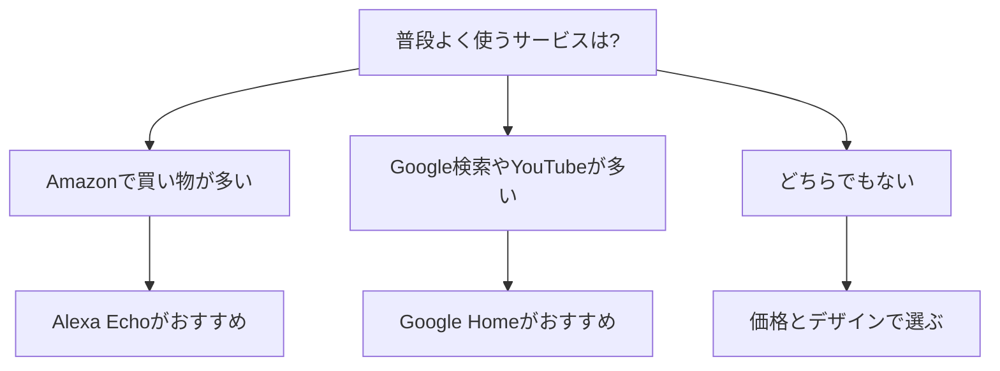

※本記事はアフィリエイト広告(PR)を含みます。

## スマートスピーカーはどれを買うべき?Alexa・Google Homeを比較

「スマートスピーカーが気になるけれど、AlexaとGoogle Homeのどちらを買うべきか分からない」——そんな悩みを持つ方は多いのではないでしょうか。この記事では、スマートスピーカー選びで迷っている初心者の方に向けて、AmazonのAlexa(アレクサ)とGoogleのGoogle Home(グーグルホーム)の違いをわかりやすく比較します。

この記事を読むと、次のことがわかります。

- スマートスピーカーで何ができるのか
- AlexaとGoogle Homeの得意・不得意
- あなたに合うのはどちらか(選び方のポイント)
- 「無料で使えるの?」という疑問への答え

読み終わるころには、自分にぴったりの一台がイメージできるようになっているはずです。

## そもそもスマートスピーカーとは?

スマートスピーカーとは、声をかけるだけで操作できるスピーカーのことです。内部に「音声アシスタント」と呼ばれるAI(人工知能)が入っていて、話しかけると返事をしてくれたり、操作をしてくれたりします。

例えば、こんなことができます。

- 天気やニュースを音声で教えてもらう
- 音楽を「○○をかけて」と声で再生する
- タイマーやアラームをセットする
- 対応した照明やエアコンを声で操作する(スマートホーム)
- 買い物リストやメモを声で記録する

キーボードやスマホを触らず、手が離せないときでも操作できるのが最大の魅力です。

## AlexaとGoogle Homeの基本的な違い

スマートスピーカーの代表格が、Amazonの「Echo(エコー)シリーズ」に搭載された**Alexa**と、Googleの「Google Nest(グーグルネスト)シリーズ」に搭載された**Googleアシスタント(Google Home)**です。

それぞれの特徴を表で整理してみましょう。

| 項目 | Alexa(Amazon Echo) | Google Home(Google Nest) |
|------|------|------|
| 開発元 | Amazon | Google |
| 得意なこと | 買い物・スキル(拡張機能)が豊富 | 検索・調べもの・質問応答 |
| 連携サービス | Amazon Music、Prime Videoなど | YouTube Music、Googleカレンダーなど |
| スマートホーム対応 | 対応機器が非常に多い | 対応機器が多い |
| 呼びかけの言葉 | アレクサ | OKグーグル / ねえグーグル |

### Alexaが得意なこと

Alexaの強みは、「スキル」と呼ばれる拡張機能が豊富なことです。スキルとは、スマホでいうアプリのようなもので、追加することで天気予報や家電操作、ゲームなど機能を増やせます。

また、Amazonでの買い物との相性が抜群です。Amazonをよく利用する方や、Amazon Music・Prime Videoを使っている方には特に便利です。

### Google Homeが得意なこと

Google Homeの強みは、なんといっても「検索・調べもの」の精度です。Googleの検索技術がベースなので、「東京タワーの高さは?」「明日の最高気温は?」といった質問にスムーズに答えてくれます。

GoogleカレンダーやGmail、YouTubeなどGoogleのサービスを日常的に使っている方には、自然に馴染むでしょう。

## どちらを選ぶ?タイプ別の選び方

どちらが優れているというより、「あなたが普段使っているサービス」で選ぶのがいちばん失敗しません。下の図を参考にしてみてください。

### Alexa(Echo)が向いている人

- Amazonで頻繁に買い物をする
- Amazon MusicやPrime Videoを使っている
- スマートホームに本格的に取り組みたい
- スキル(拡張機能)で色々試したい

### Google Home(Nest)が向いている人

- 調べものや質問をたくさんしたい
- GoogleカレンダーやGmailを活用している
- YouTubeやYouTube Musicをよく見る・聴く
- AndroidスマホやChromecastを使っている

## サイズ・タイプの選び方も大切

スマートスピーカーには、大きさや機能の違うモデルがいくつかあります。用途に合わせて選びましょう。

- **小型モデル**:価格が手ごろで、寝室やデスクなど狭い場所向け。まず試したい初心者におすすめ。
- **標準モデル**:音質が良く、リビングで[音楽を楽しみたい](/2026/06/13/wireless-earphones-telework/)人向け。
- **画面付きモデル**:ディスプレイが付いていて、レシピ表示やビデオ通話、写真表示ができる。

初めての一台なら、まずは小型モデルから試してみるのがおすすめです。価格が手ごろなので、「思っていたのと違った」というリスクを抑えられます。

具体的なモデルや最新の価格は、以下から実物をチェックしてみてください。

👉 [Amazonで「Amazon Echo スマートスピーカー」を見る](https://www.amazon.co.jp/s?k=Amazon%20Echo%20%E3%82%B9%E3%83%9E%E3%83%BC%E3%83%88%E3%82%B9%E3%83%94%E3%83%BC%E3%82%AB%E3%83%BC)

👉 [楽天市場で「Google Nest スマートスピーカー」を探す](https://af.moshimo.com/af/c/click?a_id=5632328&p_id=54&pc_id=54&pl_id=616&url=https%3A%2F%2Fsearch.rakuten.co.jp%2Fsearch%2Fmall%2FGoogle%2520Nest%2520%25E3%2582%25B9%25E3%2583%259E%25E3%2583%25BC%25E3%2583%2588%25E3%2582%25B9%25E3%2583%2594%25E3%2583%25BC%25E3%2582%25AB%25E3%2583%25BC%2F)

なお、価格やラインナップは時期によって変わります。セール時に大きく値下がりすることもあるので、購入前に必ず公式サイトや販売ページで最新情報を確認してください。

## よくある疑問Q&A

### Q. スマートスピーカーは無料で使えるの?

本体の購入費用は必要ですが、基本的な機能(天気・タイマー・アラーム・簡単な質問など)は追加料金なしで使えます。

ただし、音楽サービスの中には有料プランが必要なものもあります。例えば、好きな曲を自由に選んで再生するには、Amazon MusicやYouTube Musicなどの有料会員になる必要がある場合があります。無料プランでも使えますが、機能が制限されることがある点は覚えておきましょう。

### Q. スマホがなくても使える?

初期設定(セットアップ)には、スマホの専用アプリが必要です。Alexaなら「Amazon Alexaアプリ」、Google Homeなら「Google Homeアプリ」を使います。設定後は基本的に声だけで操作できます。

### Q. プライバシーは大丈夫?

スマートスピーカーは、呼びかけの言葉(「アレクサ」など)を検知してから録音・処理する仕組みです。気になる方は、本体のマイクをオフにするボタンも用意されているので安心です。録音履歴は専用アプリから確認・削除できます。

### Q. 両方買う必要はある?

基本的には片方で十分です。同じ部屋に両方置くと反応が混乱することもあるため、まずはどちらか一台から始めるのがおすすめです。

## 購入前にチェックしたいポイント

最後に、買う前に確認しておきたいポイントをまとめます。

- 普段使っているサービス(Amazon系かGoogle系か)
- 置きたい場所の広さ(小型か標準か画面付きか)
- 音楽を楽しみたいか、調べもの中心か
- スマートホーム機器と連携させたいか
- 予算(セール時期も要チェック)

これらを整理すれば、自然と選ぶべき一台が見えてきます。

## まとめ

スマートスピーカーは、「どちらが優れているか」より「自分の生活に合うか」で選ぶのが正解です。

- **Amazonをよく使う・スマートホームを楽しみたい人** → Alexa(Echo)
- **検索や調べもの・Googleサービス中心の人** → Google Home(Nest)

初めての一台なら、価格が手ごろな小型モデルから気軽に試してみるのがおすすめです。使ってみると「もうこれなしの生活は考えられない」と感じる方も多い、[生活を便利にしてくれるガジェット](/2026/06/11/home-office-gadgets/)です。

この記事を参考に、ぜひあなたにぴったりの一台を見つけてみてください。価格やモデルの最新情報は、購入前に公式サイトや販売ページで必ず確認しましょう。
