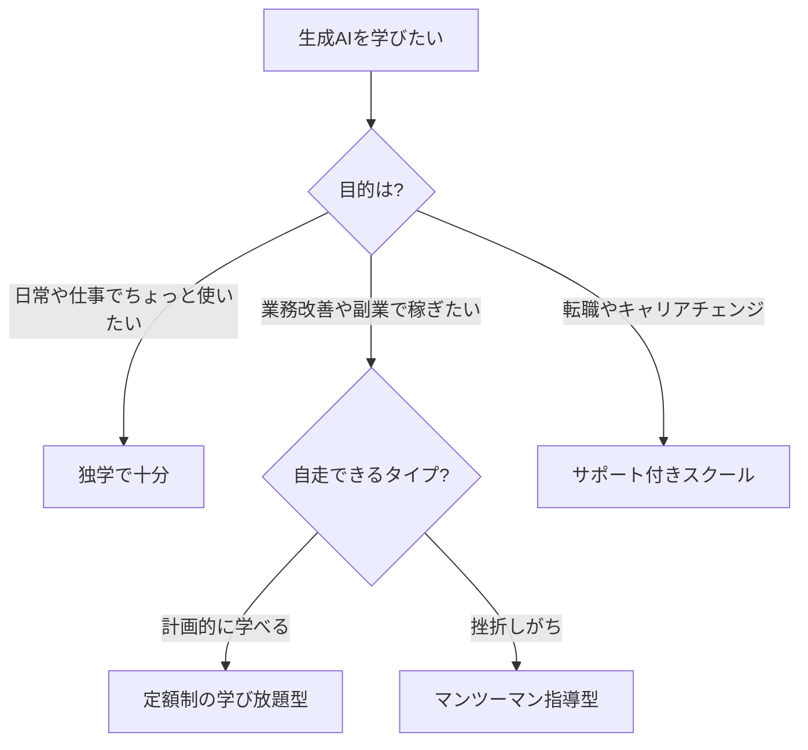

※本記事はアフィリエイト広告(PR)を含みます。

## 生成AIスキル、独学とスクールどっちで学ぶ?

「仕事でAIを使いこなせるようになりたい」「生成AIスキルで副業・転職につなげたい」——そう考える社会人が急増し、生成AIを学べるオンラインスクールも一気に増えました。

この記事では、**独学とスクールの使い分け**、**スクール選びで失敗しないためのチェックポイント**、そして**代表的なスクールの特徴**を整理します。読み終わる頃には、自分がスクールに通うべきかどうか、通うならどこを候補にすべきかが判断できるはずです。

## まず結論:独学で十分な人、スクールが向く人

- **ChatGPTを日常で使えれば十分** → 無料の公式ガイドや入門書で独学がコスパ最強です
- **業務効率化・副業レベルのスキルが欲しい** → 体系的なカリキュラムがある定額制スクールが時短になります
- **転職・キャリアチェンジが目的** → ポートフォリオ作成やキャリアサポートまで付くスクールが有利です

## スクール選びの5つのチェックポイント

### 1. 目的とカリキュラムが一致しているか

「プロンプトの書き方」を学びたいのか、「AIアプリ開発」まで踏み込みたいのかで、選ぶべきスクールは全く違います。カリキュラム一覧を必ず確認しましょう。

### 2. 給付金・補助金の対象か(最重要)

経済産業省のリスキリング支援事業や厚生労働省の教育訓練給付金の**対象講座なら、受講料の最大70%が戻ってくる**場合があります。10万円台〜数十万円のコースでは差が非常に大きいので、申し込み前に必ず対象かどうか・自分が条件を満たすかを公式サイトで確認してください。

### 3. 料金体系(定額制か買い切りか)

- **月額定額制**(月1万円台〜): 自分のペースで幅広く学びたい人向け
- **コース買い切り型**(10万円台〜): 期間集中でサポートを受けたい人向け

### 4. サポート体制

質問し放題か、メンターは現役のプロか、添削はあるか。挫折経験がある人ほどマンツーマン型の価値が高くなります。

### 5. 無料カウンセリング・体験の有無

ほとんどの大手スクールは無料相談を実施しています。**契約前に必ず1〜2社で無料相談を受けて比較**しましょう。ここを省くのが一番の失敗パターンです。

## 代表的な生成AIスクール(2026年6月時点)

### DMM 生成AI CAMP「学び放題」

月額1万円台で約1,000レッスンが受け放題の生成AI特化型。プロンプトエンジニアリングの基礎からGPTs作成、MidjourneyやDALL-Eでの画像生成まで幅広くカバーしています。「まず広く触りたい」人の入口に向いています。

### 侍エンジニア(SAMURAI ENGINEER)

現役エンジニアによる**マンツーマン指導**が特徴。経済産業省のリスキリング支援事業の対象で、条件を満たせば**受講料の最大70%がキャッシュバック**されます。挫折しやすい人・転職目的の人向けです。

### キカガク・デジハク など

業務効率化、副業向け、マーケティング特化など、目的別のコースを持つスクールも複数あります。給付金対象のコースを持つところも多いので、比較サイトや無料相談で横並びに確認するのがおすすめです。

※料金・給付金の対象状況は頻繁に変わります。**申し込み前に必ず各スクールの公式サイトで最新情報を確認してください。**

## 受講前に独学で「肩慣らし」もおすすめ

スクールの効果を最大化するには、基礎用語に慣れてから入るのが近道です。入門書を1冊読んでおくだけで、講座の吸収率が大きく変わります。

👉 [Amazonで「生成AI 入門 本」を見る](https://www.amazon.co.jp/s?k=%E7%94%9F%E6%88%90AI%20%E5%85%A5%E9%96%80%20%E6%9C%AC)

## まとめ

- 日常利用レベルなら**独学で十分**。業務・副業・転職レベルなら**スクールが時短**になる
- スクール選びは「**目的との一致**」「**給付金対象か**」「**料金体系**」「**サポート**」「**無料相談**」の5点でチェック
- 給付金を使えば**実質負担が最大70%減**になる場合があり、ここを見逃すのが一番もったいない
- 契約前に必ず無料カウンセリングを1〜2社受けて比較する

生成AIスキルは「使える人」と「使えない人」の差がこれから一層開く分野です。自分の目的に合った学び方で、早めに一歩を踏み出しましょう。

### 参考リンク

- [2026年版 生成AIスクールおすすめ13社比較(Workship MAGAZINE)](https://goworkship.com/magazine/school-generative-ai/)
- [生成AIスクールおすすめランキング(コエテコキャンパス)](https://coeteco.jp/articles/14062)
