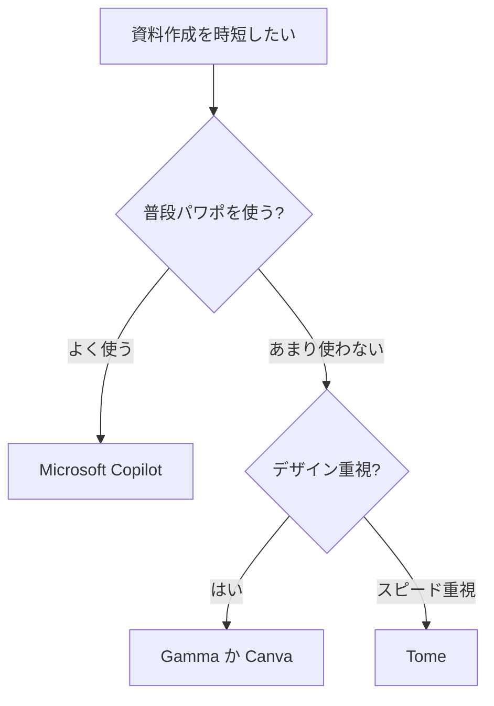

※本記事はアフィリエイト広告(PR)を含みます。

## AIプレゼン資料作成ツールでパワポ作業を時短する方法

「プレゼン資料を作るのに毎回何時間もかかってしまう……」そんな悩みを抱えていませんか?この記事では、AIプレゼン資料作成ツールを比較しながら、パワポ(PowerPoint)作業を大幅に時短する方法をわかりやすく解説します。

この記事を読むと、次のことがわかります。

- AIプレゼン資料作成ツールとは何か、どう便利なのか
- 主要なツールの特徴と比較ポイント
- 自分に合ったツールの選び方
- 無料で使えるかどうかの疑問への回答

「資料作成にかかる時間を減らしたい」という方は、ぜひ最後まで読んでみてください。

## AIプレゼン資料作成ツールとは?

AIプレゼン資料作成ツールとは、作りたい内容のテーマやキーワードを入力するだけで、AI(人工知能)がスライドの構成・文章・デザインを自動で生成してくれるサービスのことです。

これまでは、白紙のスライドに一から文字を打ち込み、レイアウトを整え、画像を探して……という作業を手作業で行っていました。AIツールを使うと、こうした工程の大部分を数十秒〜数分で自動化できます。

### こんな人におすすめ

- 資料作成に時間をかけたくないビジネスパーソン
- デザインのセンスに自信がない方
- 営業提案や企画書を頻繁に作る方
- 学生でレポート発表用のスライドを作りたい方

## 主要なAIプレゼン資料作成ツール比較

ここでは、よく使われている代表的なツールを比較します。それぞれ特徴が異なるので、自分の用途に合うものを探してみてください。

| ツール名 | 特徴 | 向いている人 |
|---|---|---|
| Gamma(ガンマ) | テーマを入力するだけで自動生成。デザイン性が高い | おしゃれな資料を素早く作りたい人 |
| Tome(トーム) | ストーリー性のある資料が得意 | 物語的なプレゼンをしたい人 |
| Canva(キャンバ) | 豊富なテンプレートとAI機能を併用できる | デザインも自分で調整したい人 |
| Microsoft Copilot | パワポ内で直接AI生成ができる | 普段からパワポを使う人 |
| Beautiful.ai | 自動でレイアウトを整えてくれる | レイアウト調整が苦手な人 |

※料金プランや無料枠の範囲は変更される場合があります。利用前に各公式サイトで最新情報を確認してください。

### Gamma(ガンマ)

テーマやアウトラインを入力すると、AIが自動でスライド全体を生成してくれるツールです。デザインの完成度が高く、初心者でもプロっぽい資料が作れます。生成後の編集も直感的にできるのが魅力です。

### Microsoft Copilot

普段からパワポを使っている方には、Microsoft 365に搭載されたCopilot(コパイロット)が便利です。使い慣れたパワポの画面上で、文章の作成やデザインの提案をAIがサポートしてくれます。既存の資料を活かしながら時短できるのが強みです。

## 自分に合ったツールの選び方

どのツールを選べばいいか迷ったときは、次のフローチャートを参考にしてみてください。

### 選ぶときの3つのポイント

1. **普段使っているソフトとの相性**:パワポ中心ならCopilot、Webで完結させたいならGammaなどが便利です。
2. **デザインの自由度**:細かく調整したいならCanva、おまかせで仕上げたいならGammaが向いています。
3. **出力形式**:パワポ形式(.pptx)で書き出せるかどうかも確認しましょう。社内で共有する場合に重要です。

## AIツールでパワポ作業を時短する具体的な手順

実際にAIツールを使って資料を作る流れは、おおむね次のようになります。

1. **テーマを入力する**:「新商品の販売戦略について」など、作りたい内容を入力します。
2. **アウトラインを確認する**:AIが提案した構成(目次)をチェックし、必要なら修正します。
3. **スライドを自動生成する**:ボタンひとつでスライド全体が作られます。
4. **内容を微調整する**:文章や画像を自分の伝えたい内容に合わせて編集します。
5. **書き出して完成**:パワポ形式やPDFで出力すれば完了です。

この流れなら、これまで数時間かかっていた作業を大幅に短縮できます。

### 作業環境を整えるとさらに快適に

長時間の資料作成では、作業環境も大切です。画面が広いと複数の資料を見比べながら編集でき、効率が上がります。[サブモニター](/2026/06/11/home-office-gadgets/)や疲れにくい入力機器を取り入れるのもおすすめです。

👉 [Amazonで「モバイルモニター 15.6インチ」を見る](https://www.amazon.co.jp/s?k=%E3%83%A2%E3%83%90%E3%82%A4%E3%83%AB%E3%83%A2%E3%83%8B%E3%82%BF%E3%83%BC%2015.6%E3%82%A4%E3%83%B3%E3%83%81)

👉 [楽天市場で「ワイヤレスマウス 静音」を探す](https://af.moshimo.com/af/c/click?a_id=5632328&p_id=54&pc_id=54&pl_id=616&url=https%3A%2F%2Fsearch.rakuten.co.jp%2Fsearch%2Fmall%2F%25E3%2583%25AF%25E3%2582%25A4%25E3%2583%25A4%25E3%2583%25AC%25E3%2582%25B9%25E3%2583%259E%25E3%2582%25A6%25E3%2582%25B9%2520%25E9%259D%2599%25E9%259F%25B3%2F)

## AIプレゼン資料作成ツールは無料で使える?

結論からいうと、**多くのツールが無料プランを用意しています**。ただし、無料プランには次のような制限があることが一般的です。

- 生成できる資料の枚数や回数に上限がある
- 一部のデザインや機能が有料プラン限定
- 出力時にツールのロゴ(透かし)が入る場合がある

まずは無料プランで使い心地を試し、本格的に使いたくなったら有料プランを検討するのがおすすめです。なお、無料枠の内容や料金は変更されることがあるため、必ず各公式サイトで最新情報を確認してください。

### Q&A:よくある疑問

**Q. 作った資料はパワポで編集できますか?**
A. 多くのツールがパワポ形式(.pptx)での書き出しに対応しています。ただし、レイアウトが多少崩れる場合もあるので、書き出し後に微調整するとよいでしょう。

**Q. 日本語にも対応していますか?**
A. GammaやCopilotなど、主要なツールは日本語入力・日本語生成に対応しています。ただし、ツールによっては英語のほうが精度が高い場合もあります。

**Q. 機密情報を入力しても大丈夫?**
A. 社外秘の情報を扱う場合は、各サービスのプライバシーポリシーを確認しましょう。会社のルールで生成AIの利用が制限されている場合もあるため注意が必要です。

## AIツールを使うときの注意点

便利なAIツールですが、使う際には次の点に気をつけましょう。

- **内容のチェックは必ず行う**:AIが生成した文章には、事実と異なる情報が含まれることがあります。発表前に必ず自分で確認しましょう。
- **そのまま使わず自分の言葉を加える**:AIの文章をそのまま使うと、平凡な印象になりがちです。自分の体験や具体例を加えると説得力が増します。
- **著作権や画像の利用範囲を確認する**:[商用利用する場合は](/2026/06/11/free-image-ai-tools/)、生成された画像やデザインの利用条件をチェックしましょう。

## まとめ

今回は、AIプレゼン資料作成ツールを比較しながら、パワポ作業を時短する方法を紹介しました。

- AIツールを使えば、構成・文章・デザインの作成を自動化できる
- Gamma・Canva・Microsoft Copilotなど、用途に合わせて選べる
- 普段パワポを使うならCopilot、デザイン重視ならGammaがおすすめ
- 多くのツールに無料プランがあるので、まずは試してみるのがおすすめ
- AIの生成内容は必ず自分でチェックすることが大切

まずは気になるツールの無料プランから試して、資料作成の時短を体感してみてください。空いた時間を、発表内容を磨くことや本来の業務に使えるようになりますよ。
