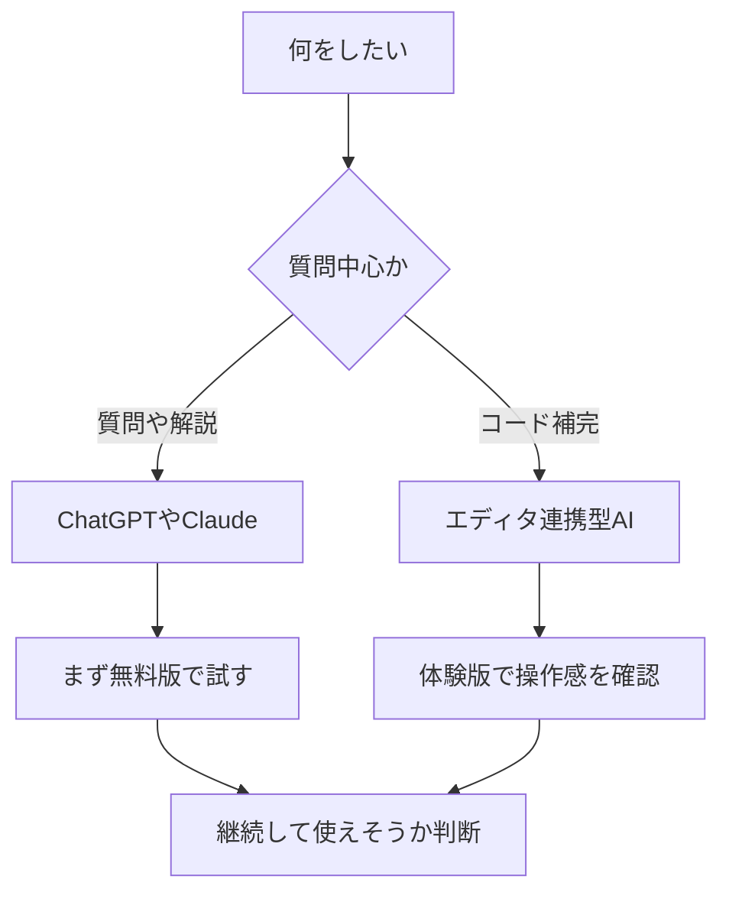

※本記事はアフィリエイト広告(PR)を含みます。

## プログラミング学習にAIを活用する方法とは?

「プログラミングを始めたけれど、エラーが解決できなくて挫折しそう…」そんな悩みを抱えていませんか?実は今、**AI(人工知能)を使ったプログラミング学習**が、初心者の強力な味方になっています。

この記事を読むと、次のことがわかります。

- なぜプログラミング学習にAIが向いているのか
- 具体的にどんな場面でAIを使えばいいのか
- 挫折しないための7つのコツ
- 無料で使えるおすすめツール

AIを上手に使えば、わからないところをすぐに質問でき、まるで専属の家庭教師がいるような環境を、しかも低コストで手に入れられます。これまで「独学は難しい」と諦めていた方こそ、ぜひ最後まで読んでみてください。

## なぜプログラミング学習にAIが向いているのか

プログラミング学習で多くの人がつまずく原因は、主に次の3つです。

1. **エラーが解決できない**:エラーメッセージ(プログラムの間違いを知らせる文章)の意味がわからない
2. **質問できる相手がいない**:独学だと聞ける人がいない
3. **何から学べばいいかわからない**:学習の道筋が見えない

AIはこれらの悩みをまとめて解決してくれます。エラー内容を貼り付ければ原因と解決策を教えてくれますし、24時間いつでも何度でも質問できます。人間の先生と違って「こんな初歩的な質問をしたら恥ずかしい」と気にする必要もありません。

### AIを使った学習と従来の学習の違い

| 項目 | 従来の独学 | AIを活用した学習 |
|------|-----------|----------------|
| 質問への回答 | 自分で検索 | 即座に回答 |
| エラー解決 | 数時間かかることも | 数分で解決のヒント |
| 学習コスト | 教材費中心 | 無料〜低コスト |
| モチベーション維持 | 一人で頑張る | 伴走者がいる感覚 |

## プログラミング学習でAIを使う具体的な5つの場面

### 1. エラーの原因を調べる

プログラムが動かないとき、エラーメッセージをそのままAIに貼り付けて「このエラーの原因と解決方法を教えて」と聞くだけで、わかりやすい説明が返ってきます。初心者がもっとも時間を取られる作業を、大幅に短縮できます。

### 2. コードの意味を解説してもらう

参考書やネットで見つけたコードの意味がわからないとき、「このコードを1行ずつ解説して」とお願いすると、丁寧に説明してくれます。理解が深まり、応用力が身につきます。

### 3. 練習問題を作ってもらう

「Pythonの初心者向け練習問題を3つ作って」と頼めば、あなたのレベルに合った問題を用意してくれます。インプットだけでなくアウトプットの機会を増やせるのが大きな利点です。

### 4. 学習ロードマップを相談する

「Webアプリを作れるようになりたい初心者は、何をどの順番で学べばいい?」と聞くと、学習の道筋を提案してくれます。迷子になりがちな独学の方向性を定めるのに役立ちます。

### 5. コードを書く手助けをしてもらう

やりたいことを伝えると、AIがコードの例を書いてくれます。ただし、これには注意が必要です(後述します)。

## AIで挫折しないための7つのコツ

### コツ1:答えを丸写しせず、必ず自分で理解する

AIが書いてくれたコードをコピペするだけでは、力はつきません。「なぜこう書くのか」を必ず質問し、自分の言葉で説明できるレベルを目指しましょう。

### コツ2:わからない言葉はその場で聞き返す

AIの回答に知らない用語が出てきたら、「〇〇って何?初心者にもわかるように説明して」とすぐ聞き返しましょう。理解の積み残しを防げます。

### コツ3:小さな目標を立てる

「3日でこの機能を作る」など、達成しやすい小さな目標を設定しましょう。AIに「初心者が1週間で作れる練習アプリを提案して」と相談するのもおすすめです。

### コツ4:AIの回答を鵜呑みにしない

AIは時々、間違った情報(ハルシネーションと呼ばれる現象)を返すことがあります。重要な部分は公式ドキュメントでも確認する習慣をつけましょう。

### コツ5:手を動かす時間を確保する

読むだけ・聞くだけでは身につきません。必ず自分でコードを書いて動かしましょう。

### コツ6:学習記録をつける

学んだことをメモに残すと、成長を実感でき、モチベーション維持につながります。

### コツ7:質問の仕方を工夫する

「動かない」だけでなく、「何をしたいか」「どんなエラーが出たか」「何を試したか」を具体的に伝えると、的確な回答が得られます。

## AI学習ツールの選び方

どのツールを使えばいいか迷ったら、次の流れで選んでみてください。

### 質問・解説中心ならチャット型AI

エラー解決や用語の説明には、[ChatGPTやClaudeなどのチャット型AI](/2026/06/09/ai-chat-comparison/)が便利です。文章でやり取りしながら学べます。

### コードを書きながら使うならエディタ連携型

コードを書く画面(エディタ)の中でAIが補完してくれるタイプもあります。実際にコードを書く段階に進んだら検討してみましょう。

## よくある質問(Q&A)

### Q. プログラミング学習用のAIは無料で使える?

はい、多くのAIチャットツールには無料プランがあります。まずは無料版で試して、物足りなくなったら有料版を検討するのがおすすめです。ただし無料版は利用回数や機能に制限がある場合があるため、最新の料金や制限内容は各サービスの公式サイトで確認してください。

### Q. AIに頼りすぎると実力がつかないのでは?

これは正しい心配です。だからこそ「答えを写すのではなく理解する」「自分で手を動かす」というコツが重要になります。AIはあくまで学習を助ける道具と考えましょう。

### Q. 紙の教材は必要?

AIだけでも学べますが、[体系的に基礎を固めたい人](/2026/06/13/ai-online-school-guide/)には書籍の併用がおすすめです。手元に1冊あると、全体像を把握しながら学べます。

👉 [Amazonで「プログラミング 入門書 初心者」を見る](https://www.amazon.co.jp/s?k=%E3%83%97%E3%83%AD%E3%82%B0%E3%83%A9%E3%83%9F%E3%83%B3%E3%82%B0%20%E5%85%A5%E9%96%80%E6%9B%B8%20%E5%88%9D%E5%BF%83%E8%80%85)

学習環境を整えるなら、[長時間でも疲れにくい周辺機器](/2026/06/11/home-office-gadgets/)をそろえるのも効果的です。集中力が続きやすくなります。

👉 [楽天市場で「プログラミング 学習 キーボード」を探す](https://af.moshimo.com/af/c/click?a_id=5632328&p_id=54&pc_id=54&pl_id=616&url=https%3A%2F%2Fsearch.rakuten.co.jp%2Fsearch%2Fmall%2F%25E3%2583%2597%25E3%2583%25AD%25E3%2582%25B0%25E3%2583%25A9%25E3%2583%259F%25E3%2583%25B3%25E3%2582%25B0%2520%25E5%25AD%25A6%25E7%25BF%2592%2520%25E3%2582%25AD%25E3%2583%25BC%25E3%2583%259C%25E3%2583%25BC%25E3%2583%2589%2F)

## まとめ

プログラミング学習にAIを活用すると、エラー解決の時間を大幅に短縮でき、いつでも質問できる環境が手に入ります。これは独学で挫折しがちだった人にとって、大きな追い風です。

最後に、挫折しないためのポイントをおさらいします。

- AIの答えは丸写しせず、必ず理解する
- わからない言葉はその場で聞き返す
- 小さな目標を立てて達成感を積み重ねる
- AIの回答は鵜呑みにせず公式情報でも確認する
- とにかく自分で手を動かす

まずは無料のAIチャットツールを1つ開いて、「Pythonの初心者向け学習ロードマップを教えて」と質問してみるところから始めてみましょう。小さな一歩が、プログラミング習得への確実な道につながります。
