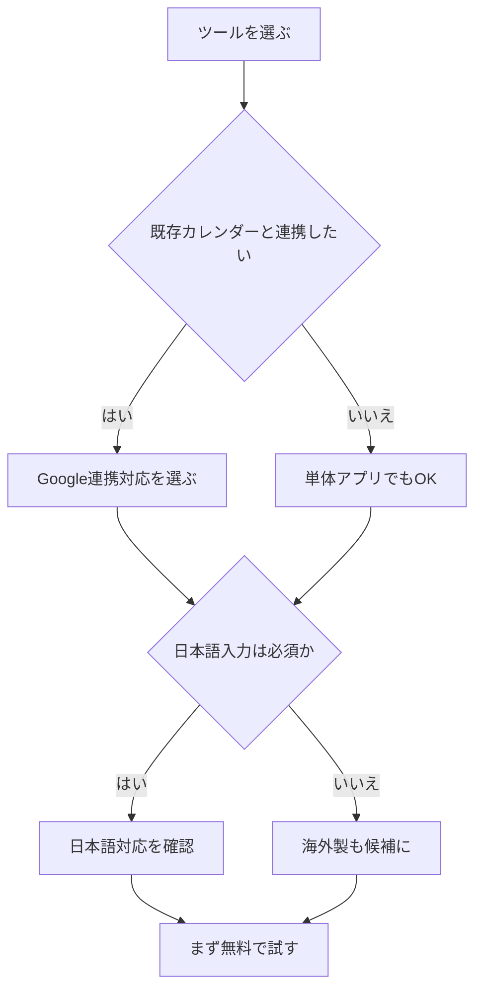

※本記事はアフィリエイト広告(PR)を含みます。

## AIスケジュール管理術とは?忙しい人ほど効果が出る理由

「やることが多すぎて、何から手をつければいいか分からない」「予定を組んでも、結局崩れてしまう」——そんな悩みを抱えていませんか?この記事では、**AIスケジュール管理術**を使って、毎日のタスクを自動で整理・配置する方法を初心者向けに解説します。

この記事を読むと、次のことが分かります。

- AIがスケジュール管理でどんなことを自動化してくれるのか
- 自分に合ったツールの選び方
- 無料で始められる方法と、有料プランの違い
- 今日から実践できる具体的なステップ

難しい設定は必要ありません。スマホとカレンダーアプリがあれば、今日からでも始められます。さっそく見ていきましょう。

## そもそもAIは何を自動化してくれるの?

AIスケジュール管理ツールは、これまで人間が頭を悩ませていた「いつ、何をやるか」の判断を肩代わりしてくれます。具体的には、次のような作業を自動化できます。

| 自動化できること | 内容 |
|---|---|
| タスクの時間割り当て | 締め切りや所要時間をもとに、最適な時間帯に予定を自動配置 |
| 予定の再調整 | 急な変更があったとき、残りのタスクを自動で組み直す |
| 優先順位づけ | 重要度や緊急度をもとに、やるべき順番を提案 |
| リマインド | 予定の前に最適なタイミングで通知 |
| 集中時間の確保 | 会議の合間に作業ブロックを自動で確保 |

ポイントは、**「予定を入れる」から「予定を任せる」へ**の発想の転換です。これまで自分で時間を割り振っていた作業をAIに任せることで、判断の負担が大きく減ります。

> 💡 用語メモ:「タスク」とは「やるべき作業や用事」のこと。「自動化」は「手作業でやっていたことを機械やソフトに代わりにやらせること」を指します。

## AIスケジュール管理ツールの選び方

ツールはたくさんありますが、選ぶときは次の3つを基準にすると失敗しにくいです。

### 1. 普段使っているカレンダーと連携できるか

GoogleカレンダーやOutlookと連携できるツールを選びましょう。既存の予定をそのまま活かせるので、移行の手間がありません。

### 2. 日本語に対応しているか

海外製のツールが多いため、日本語の入力や表示に対応しているかは重要です。音声入力やチャット形式で予定を追加できるものだと、さらに便利です。

### 3. 無料プランで試せるか

いきなり有料契約せず、まずは無料プランで使い勝手を確かめましょう。多くのツールは基本機能を無料で提供しています。

下の図は、自分に合ったツールを選ぶときの考え方です。

## 初心者におすすめの始め方ステップ

難しく考えず、次の流れで始めてみてください。

### ステップ1:タスクをすべて書き出す

まずは頭の中にある「やること」を全部書き出します。紙でもアプリでも構いません。AIに任せる前に、何があるかを見える化することが第一歩です。

### ステップ2:締め切りと所要時間を入力する

各タスクに「いつまでに」「どれくらいかかるか」を設定します。AIはこの情報をもとに最適な時間配分を計算します。

### ステップ3:AIに自動配置してもらう

ツールに任せると、空いている時間にタスクを自動で割り振ってくれます。気に入らなければ手動で微調整も可能です。

### ステップ4:毎朝確認して微調整する

朝に一度スケジュールを確認する習慣をつけましょう。予定が変わってもAIが再調整してくれるので、崩れにくくなります。

## 集中力を高めるガジェットも併用しよう

スケジュールを整えても、作業中に集中できなければ意味がありません。AIで確保した「集中タイム」を最大限に活かすには、周囲の雑音を遮断できるノイズキャンセリングイヤホンがおすすめです。在宅でもカフェでも、自分だけの作業空間を作れます。

👉 [Amazonで「ワイヤレスイヤホン ノイズキャンセリング」を見る](https://www.amazon.co.jp/s?k=%E3%83%AF%E3%82%A4%E3%83%A4%E3%83%AC%E3%82%B9%E3%82%A4%E3%83%A4%E3%83%9B%E3%83%B3%20%E3%83%8E%E3%82%A4%E3%82%BA%E3%82%AD%E3%83%A3%E3%83%B3%E3%82%BB%E3%83%AA%E3%83%B3%E3%82%B0)

また、デスクに小さなタイマーやデジタル時計を置いて、AIが組んだ時間ブロックを意識しながら作業すると、より集中が続きやすくなります。

👉 [楽天市場で「デジタルタイマー 学習用」を探す](https://af.moshimo.com/af/c/click?a_id=5632328&p_id=54&pc_id=54&pl_id=616&url=https%3A%2F%2Fsearch.rakuten.co.jp%2Fsearch%2Fmall%2F%25E3%2583%2587%25E3%2582%25B8%25E3%2582%25BF%25E3%2583%25AB%25E3%2582%25BF%25E3%2582%25A4%25E3%2583%259E%25E3%2583%25BC%2520%25E5%25AD%25A6%25E7%25BF%2592%25E7%2594%25A8%2F)

## よくある質問(Q&A)

### Q. AIスケジュール管理ツールは無料で使えるの?

多くのツールが無料プランを用意しており、基本的なタスク管理や自動配置は無料の範囲で十分使えます。ただし、複数カレンダーの連携や高度な自動化機能は有料プランになることが多いです。料金体系は変更されることがあるため、**必ず各ツールの公式サイトで最新情報を確認してください**。

### Q. 個人情報や予定の内容は安全?

信頼できるサービスは暗号化などのセキュリティ対策をしています。とはいえ、仕事の機密情報を扱う場合は、勤務先のルールを確認してから使うのが安心です。

### Q. ChatGPTなどのAIチャットでもスケジュール管理できる?

できます。たとえば「明日の予定を効率的に組んで」とお願いすれば、優先順位の提案やタイムテーブルの作成を手伝ってくれます。専用ツールほど自動連携はできませんが、考えを整理するのにとても役立ちます。

## 続けるためのちょっとしたコツ

AIに任せても、最初はうまく回らないこともあります。そんなときは次の点を意識してみてください。

- **完璧を目指さない**:予定が崩れても、AIが組み直してくれると割り切る
- **タスクは細かく分ける**:「資料作成」より「資料の構成を考える」のように小さくすると配置しやすい
- **休憩も予定に入れる**:詰め込みすぎは続かない原因。あえて空き時間を作る
- **週に一度振り返る**:うまくいった点・いかなかった点を確認して調整する

小さく始めて、少しずつ自分のスタイルに合わせていくのが長続きのコツです。

## まとめ

AIスケジュール管理術は、忙しい毎日を送る人ほど効果を実感しやすい仕組みです。最後に要点を振り返りましょう。

- AIは**タスクの時間配分・優先順位づけ・再調整**を自動化してくれる
- ツール選びは「**カレンダー連携・日本語対応・無料で試せるか**」の3点で
- まずは**タスクの書き出し→締め切り設定→自動配置→朝の確認**の流れで始める
- 集中タイムを活かすには、ノイズキャンセリングイヤホンなどのガジェットも有効
- 料金やプランは変わることがあるので、**公式サイトで最新情報を確認**する

「時間が足りない」と感じている方こそ、まずは無料プランから一度試してみてください。AIに判断を任せるだけで、頭の中がスッキリし、本当に大切なことに集中できる時間が生まれるはずです。今日の小さな一歩が、明日の余裕につながります。
