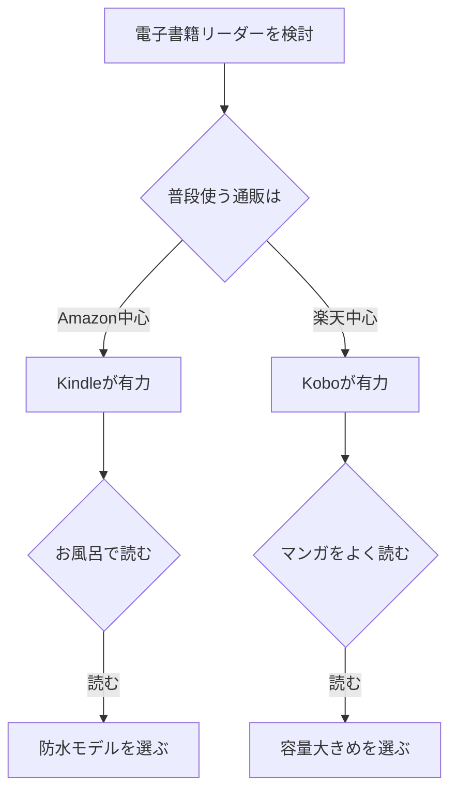

※本記事はアフィリエイト広告(PR)を含みます。

## 電子書籍リーダーは買うべき?KindleとKoboを比較してわかること

「電子書籍リーダーって本当に必要なの?」「KindleとKoboどっちを選べばいいの?」と迷っていませんか。スマホやタブレットでも電子書籍は読めるので、わざわざ専用の機器を買うべきか悩む方は多いと思います。

この記事では、電子書籍リーダーを買うべき人・買わなくてもよい人の見分け方から、二大ブランドである**Kindle(キンドル)**と**Kobo(コボ)**の違い、あなたに合った選び方までを初心者向けにわかりやすく解説します。読み終わるころには「自分はどちらを選べばいいか」がはっきりわかるはずです。

## そもそも電子書籍リーダーとは?

電子書籍リーダーとは、本を読むことに特化した専用の端末のことです。スマホやタブレットとの一番大きな違いは、**E Ink(イーインク)**という画面技術を使っている点にあります。

E Inkは「電子ペーパー」とも呼ばれ、紙のインクのような表示をする画面です。主な特徴は次のとおりです。

- **目が疲れにくい**:スマホのように自ら強く光らないため、長時間読んでも疲れにくい
- **太陽光の下でも見やすい**:屋外や明るい場所でも反射しにくく文字がはっきり読める
- **バッテリーが長持ち**:画面を切り替えるときだけ電力を使うので、一度の充電で数週間使えることも

つまり、「読書のための環境」を最優先したのが電子書籍リーダーなのです。

## 電子書籍リーダーを買うべき人・買わなくてよい人

結論から言うと、すべての人に必要なものではありません。下の表で自分がどちらに当てはまるか確認してみましょう。

| 買うべき人 | 買わなくてもよい人 |
| --- | --- |
| 毎月のように本を読む習慣がある | 本はほとんど読まない |
| 目の疲れや寝る前の読書が気になる | 雑誌やマンガをカラーで楽しみたい |
| 通勤・通学中によく本を読む | スマホ1台で完結させたい |
| 紙の本の置き場所に困っている | 図解や写真が多い実用書中心 |

E Inkは基本的に白黒表示のため、カラーの雑誌やフルカラーのマンガを楽しみたい人には、タブレットの方が向いている場合もあります(最近はカラー対応の電子書籍リーダーも登場していますが、価格は高めです)。

## KindleとKoboの基本的な違い

ここからが本題です。日本で電子書籍リーダーを選ぶとき、候補になるのはほぼこの2つです。

### Kindle(Amazon)

Kindleは、ネット通販大手の**Amazon**が販売している電子書籍リーダーです。最大の強みは、Amazonの巨大な電子書籍ストアと連携している点です。

- 取り扱う本の数が非常に多い
- **Kindle Unlimited**(読み放題サービス)など独自のサービスが充実
- セールやポイント還元が頻繁にある
- 防水機能付きのモデルもあり、お風呂読書にも対応

### Kobo(楽天)

Koboは、**楽天**が展開する電子書籍リーダーです。楽天経済圏を使っている人にとって相性が良いのが特徴です。

- 楽天ポイントが貯まる・使える
- マンガに強いラインナップ
- 一部モデルはSDカードで容量を追加できる
- ファイル形式の対応が幅広く、自分で用意したファイルも読み込みやすい

### 比較表でチェック

| 項目 | Kindle | Kobo |
| --- | --- | --- |
| 販売元 | Amazon | 楽天 |
| ストアの本の数 | 非常に多い | 多い |
| ポイント | Amazonポイント | 楽天ポイント |
| 読み放題 | Kindle Unlimited | Kobo Plus |
| 相性の良い人 | Amazonをよく使う人 | 楽天をよく使う人 |

※価格やラインナップは時期によって変わります。具体的な金額やモデルの詳細は、必ず各公式サイトで最新情報を確認してください。

## あなたに合うのはどっち?選び方フローチャート

迷ったときは、次の流れで考えると決めやすくなります。

基本の考え方は、**普段から使っているサービス(Amazonか楽天か)に合わせる**ことです。すでに片方でたくさん本を買っている場合、同じサービスの端末にすると過去に買った本もそのまま読めることが多く、便利です。

## モデル選びで見るべきポイント

Kindle・Koboどちらを選ぶにしても、機種選びでは次の3点をチェックしましょう。

### 1. 画面サイズ

一般的な小説中心なら6インチ前後で十分です。マンガや図解の多い本をよく読むなら、7インチ以上の大きめサイズが見やすくおすすめです。

### 2. 防水機能

お風呂やキッチンで読みたい人は、防水対応モデルを選びましょう。防水の有無で価格が変わります。

### 3. 容量(ストレージ)

小説中心なら容量は少なめでも問題ありませんが、マンガは1冊あたりのデータが大きいため、たくさん保存したい人は容量の大きいモデルが安心です。

実際の端末を探すときは、以下から最新モデルをチェックしてみてください。

👉 [Amazonで「Kindle 電子書籍リーダー」を見る](https://www.amazon.co.jp/s?k=Kindle%20%E9%9B%BB%E5%AD%90%E6%9B%B8%E7%B1%8D%E3%83%AA%E3%83%BC%E3%83%80%E3%83%BC)

👉 [楽天市場で「Kobo 電子書籍リーダー」を探す](https://af.moshimo.com/af/c/click?a_id=5632328&p_id=54&pc_id=54&pl_id=616&url=https%3A%2F%2Fsearch.rakuten.co.jp%2Fsearch%2Fmall%2FKobo%2520%25E9%259B%25BB%25E5%25AD%2590%25E6%259B%25B8%25E7%25B1%258D%25E3%2583%25AA%25E3%2583%25BC%25E3%2583%2580%25E3%2583%25BC%2F)

## よくある質問(Q&A)

### Q. 電子書籍は無料で読める?

A. すべてが無料ではありませんが、**青空文庫**などの著作権が切れた作品は無料で読めます。また、Kindle UnlimitedやKobo Plusといった月額制の読み放題サービスに加入すれば、対象の本を追加料金なしで読めます。まずは無料作品やお試し期間から始めると、自分に合うか確かめやすいです。

### Q. KindleでKoboの本は読める?

A. 基本的に読めません。KindleはAmazonで買った本、KoboはKoboストアで買った本を読む仕組みです。そのため、**最初にどちらのサービスを使うか決めることが大切**です。一度たくさん本を買うと、後から乗り換えにくくなります。

### Q. スマホアプリでも読めるのに端末は必要?

A. KindleもKoboも無料のスマホアプリがあり、端末がなくても読書は可能です。ただし、**目の疲れにくさや[バッテリーの持ち](/2026/06/13/mobile-battery-guide-2026/)、読書への集中しやすさ**は専用端末の方が上です。「スマホだとつい他のアプリを開いてしまう」という人ほど、専用端末の効果を感じやすいでしょう。

## まとめ

電子書籍リーダーは、読書習慣がある人や目の疲れが気になる人にとって、[とても満足度の高いガジェット](/2026/06/11/home-office-gadgets/)です。最後にポイントを整理します。

- **買うべきか**:本をよく読む・目の疲れが気になる・持ち運びたい人にはおすすめ
- **KindleとKoboの選び方**:普段使う通販(Amazonか楽天か)に合わせるのが基本
- **モデル選び**:画面サイズ・防水・容量の3点をチェック
- **始め方**:まずは無料作品や読み放題のお試しから

どちらも基本性能は十分高いので、「失敗したくない」と考えすぎる必要はありません。あなたが普段ポイントを貯めている経済圏に合わせて選べば、まず後悔は少ないはずです。価格や最新モデルは変動するため、購入前に各公式サイトで最新情報を確認してから、お気に入りの1台を見つけてみてください。
