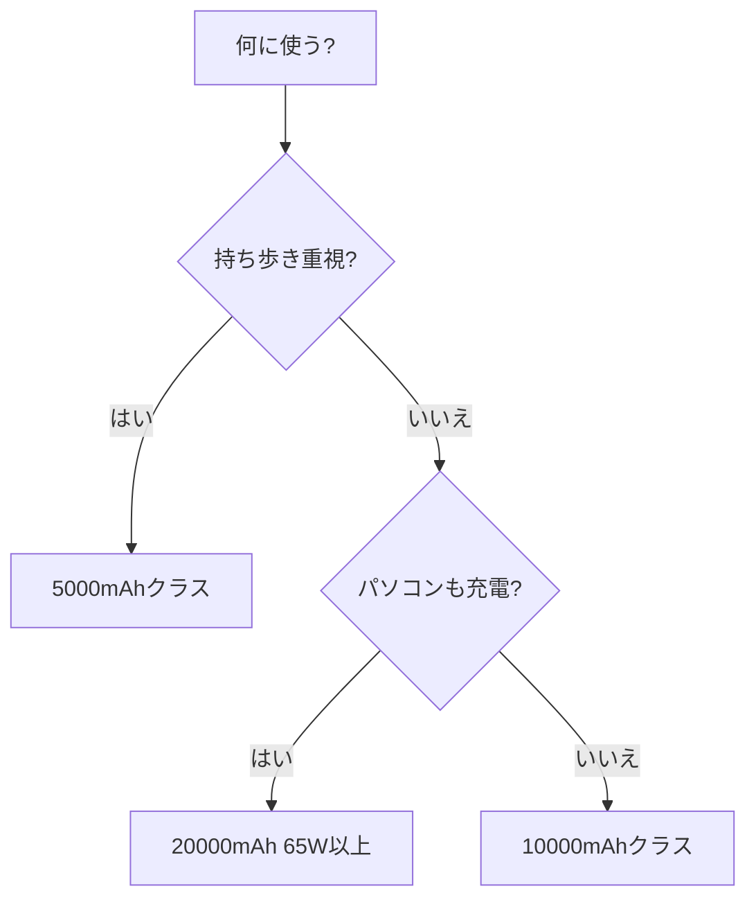

※本記事はアフィリエイト広告(PR)を含みます。

## モバイルバッテリーの選び方で迷っていませんか?

スマホの充電切れは、外出先での大きなストレスですよね。そんなときに頼りになるのがモバイルバッテリーですが、いざ買おうとすると種類が多すぎて「結局どれを選べばいいの?」と迷ってしまう方も多いはずです。

この記事では、**モバイルバッテリーの選び方**を2026年最新の視点から、「容量」「充電速度」「安全性」という3つのポイントで丁寧に解説します。読み終わるころには、あなたの使い方にぴったりの一台を選ぶ基準がわかるようになります。専門用語にも簡単な説明を添えているので、ガジェット初心者の方も安心して読み進めてくださいね。

## まず結論:選び方の3つの軸

細かい話に入る前に、押さえておきたいのは次の3点です。

- **容量(mAh)**:何回スマホを充電できるか
- **充電速度(W)**:どれだけ速く充電できるか
- **安全性**:発熱・発火を防ぐ仕組みがあるか

この3つを自分の用途と照らし合わせれば、失敗しない選択ができます。それぞれ詳しく見ていきましょう。

## ポイント1:容量(mAh)で選ぶ

「mAh(ミリアンペアアワー)」とは、バッテリーに蓄えられる電気の量を表す単位です。数字が大きいほどたくさん充電できますが、その分本体も大きく重くなります。

### 容量の目安

| 容量 | 充電できる回数の目安 | 向いている人 |
|---|---|---|
| 5,000mAh前後 | スマホ約1回 | 軽さ重視・日常の保険 |
| 10,000mAh前後 | スマホ約2回 | 通勤・通学・外出が多い人 |
| 20,000mAh前後 | スマホ約4回 | 旅行・出張・複数台充電 |

なお、表記された容量がそのまま使えるわけではなく、変換ロスなどで実際に使える量は6〜7割程度になるのが一般的です。「10,000mAhならスマホ2回ぴったり」ではなく、少し余裕を持って考えると安心です。

迷ったら、持ち運びやすさと容量のバランスが取れた**10,000mAhクラス**が最初の一台としておすすめです。

👉 [Amazonで「モバイルバッテリー 10000mAh」を見る](https://af.moshimo.com/af/c/click?a_id=5632371&p_id=170&pc_id=185&pl_id=38594&url=https%3A%2F%2Fwww.amazon.co.jp%2Fs%3Fk%3D%25E3%2583%25A2%25E3%2583%2590%25E3%2582%25A4%25E3%2583%25AB%25E3%2583%2590%25E3%2583%2583%25E3%2583%2586%25E3%2583%25AA%25E3%2583%25BC%252010000mAh)

## ポイント2:充電速度(W)で選ぶ

充電速度は「W(ワット)」という単位で表されます。数字が大きいほど速く充電できると考えてください。

### 出力ワット数の目安

- **18W前後**:スマホの急速充電に十分
- **30W前後**:小型のノートパソコンやタブレットも対応
- **65W以上**:ノートパソコンも快適に充電可能

ここで覚えておきたいのが「PD(Power Delivery)」という規格です。これはUSB Type-Cを使った急速充電の共通ルールのことで、対応している機器同士なら効率よく充電できます。[スマホもパソコンも1台で充電したい方](/2026/06/11/ai-laptop-guide-2026/)は、**PD対応**かどうかを必ずチェックしましょう。

また、複数の機器を同時に充電したい場合は、ポート(差込口)が2つ以上あるモデルが便利です。

## ポイント3:安全性で選ぶ

モバイルバッテリーは電気を蓄える製品なので、安全性はとても重要です。安すぎる無名メーカー品の中には、発熱や発火のリスクがあるものも残念ながら存在します。

### 安全性のチェックポイント

- **PSEマーク**:日本の電気用品安全法に適合した証。これがない製品は販売自体が禁止されています
- **過充電・過放電保護**:充電しすぎ・放電しすぎを防ぐ機能
- **温度管理機能**:発熱を抑える仕組み
- **信頼できるメーカー**:サポート体制が整っているか

とくに**PSEマーク**は最低限の必須条件です。パッケージや本体に記載があるか必ず確認してください。価格だけで選ばず、実績のあるメーカーを選ぶのが安心への近道です。

## 用途別の選び方フローチャート

自分にどのタイプが合うのか、下の図で確認してみましょう。

まずは「軽さ」か「容量」のどちらを優先するかを決めると、選択肢がぐっと絞れますよ。

## 2026年に注目したい機能

最近のモバイルバッテリーには、便利な進化が見られます。購入前に知っておくと選択の幅が広がります。

### ケーブル一体型

本体にケーブルが内蔵されているタイプです。「充電したいのにケーブルを忘れた!」というトラブルを防げます。[荷物を減らしたい方に人気です](/2026/06/11/home-office-gadgets/)。

### ワイヤレス充電対応

ケーブルをつながず、置くだけで充電できるタイプです。対応スマホであればケーブルレスで手軽に使えます。ただし、ケーブル充電より速度は遅めな点に注意しましょう。

### USB Type-C統一の流れ

近年は充電端子がUSB Type-Cに統一される流れが進んでいます。新しく買うなら、Type-C入出力に対応したモデルを選んでおくと長く使えて安心です。

👉 [楽天市場で「モバイルバッテリー USB-C PD対応」を探す](https://af.moshimo.com/af/c/click?a_id=5632328&p_id=54&pc_id=54&pl_id=616&url=https%3A%2F%2Fsearch.rakuten.co.jp%2Fsearch%2Fmall%2F%25E3%2583%25A2%25E3%2583%2590%25E3%2582%25A4%25E3%2583%25AB%25E3%2583%2590%25E3%2583%2583%25E3%2583%2586%25E3%2583%25AA%25E3%2583%25BC%2520USB-C%2520PD%25E5%25AF%25BE%25E5%25BF%259C%2F)

## よくある疑問Q&A

### Q. 飛行機にモバイルバッテリーは持ち込める?

多くの航空会社では、一定の容量以下なら**手荷物として機内持ち込み**が可能です(預け入れ荷物には入れられないのが一般的です)。容量によって制限が異なるため、旅行前に利用する航空会社の公式サイトで最新のルールを確認してください。

### Q. 容量が大きいほどお得なの?

必ずしもそうとは限りません。大容量は便利な反面、本体が重く、価格も高くなります。毎日持ち歩くなら軽さが正義になることも多いので、**自分の使い方に合った容量**を選ぶのが一番お得です。

### Q. 安いモバイルバッテリーでも大丈夫?

価格だけで判断するのは避けましょう。前述のPSEマークがあり、保護機能が備わった信頼できるメーカーの製品であれば、手頃な価格でも問題なく使えます。逆に、極端に安い無名製品は安全面のリスクがあるので注意が必要です。

### Q. 寿命はどれくらい?

モバイルバッテリーは充電を繰り返すと少しずつ劣化します。一般的には数百回の充放電で性能が落ちてくると言われています。膨らんできたり、急に充電できる回数が減ったりしたら買い替えのサインです。

## 失敗しないための購入チェックリスト

最後に、購入前に確認したいポイントをまとめました。

- [ ] 容量は自分の使い方に合っているか
- [ ] PD対応など必要な充電速度を満たしているか
- [ ] PSEマークがあるか
- [ ] 必要なポート数があるか
- [ ] 信頼できるメーカーか
- [ ] 重さは許容できる範囲か

このチェックリストを満たしていれば、大きな失敗はまずありません。

## まとめ

モバイルバッテリーの選び方は、**容量・充電速度・安全性**の3つの軸で考えるのが基本です。

- **容量**は使い方に合わせて。迷ったら10,000mAhが万能
- **充電速度**はPD対応かをチェック。パソコンも充電するなら高出力を
- **安全性**はPSEマークと信頼できるメーカーが必須

自分の生活スタイルを思い浮かべながら、今回紹介したチェックリストを使って選べば、きっと長く愛用できる一台に出会えます。価格や具体的なスペックは変動するため、購入前には必ず公式サイトや販売ページで最新情報を確認してくださいね。あなたにぴったりのモバイルバッテリーを見つけて、充電切れの不安から解放されましょう。
