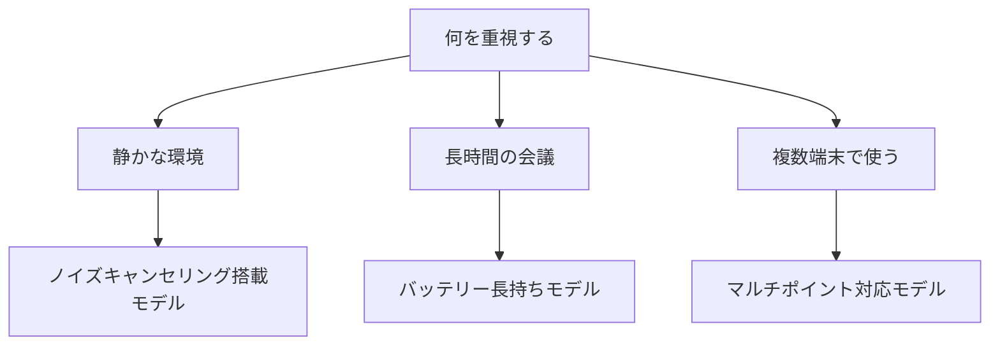

※本記事はアフィリエイト広告(PR)を含みます。

## テレワーク向けワイヤレスイヤホンの選び方を知りたい方へ

[在宅勤務](/2026/06/11/home-office-gadgets/)やリモートワークが当たり前になり、「Web会議用にちゃんとしたワイヤレスイヤホンが欲しいけれど、種類が多すぎてどれを選べばいいかわからない」と感じている方は多いのではないでしょうか。

この記事では、**テレワーク向けワイヤレスイヤホンの選び方**を初心者の方にもわかりやすく解説します。読み終わるころには、次のことがわかるようになります。

- テレワークで使うイヤホンに必要な機能は何か
- 自分に合ったモデルを選ぶための具体的なチェックポイント
- 用途別のおすすめの選び方と探し方

結論から先にお伝えすると、テレワーク用に選ぶなら「マイク性能」「装着感」「接続の安定性」の3つを最優先するのがおすすめです。音楽鑑賞用とは選ぶ基準が少し違うので、ここを押さえるだけで失敗をグッと減らせます。

## そもそもワイヤレスイヤホンとは?

ワイヤレスイヤホンとは、その名のとおりケーブル(線)を使わず、**Bluetooth(ブルートゥース)**という近距離無線通信を使ってスマホやパソコンとつなぐイヤホンのことです。

大きく分けて2つのタイプがあります。

| タイプ | 特徴 |
|---|---|
| 完全ワイヤレス | 左右が完全に独立。ケーブルが一切なくスッキリ |
| 左右一体型 | 左右がコードでつながったネックバンド型など |

テレワークでは取り回しのよい「完全ワイヤレス型(TWSとも呼ばれます)」が人気ですが、長時間の会議には紛失しにくく[バッテリー持ち](/2026/06/13/mobile-battery-guide-2026/)のよい一体型を選ぶ方もいます。

## テレワーク向けに重視したい5つの選び方ポイント

音楽用イヤホンの口コミを見ると「音質」が重視されがちですが、テレワークでは少し優先順位が変わります。ここでは大事な順に解説します。

### 1. マイク性能(相手に声がきれいに届くか)

テレワークで一番大切なのが、実は**自分の声を相手にクリアに届けるマイク性能**です。どれだけ音質がよくても、相手に声が聞き取りづらいと会議が成立しません。

チェックしたいのは以下の機能です。

- **ノイズリダクション(雑音抑制)**:周囲の生活音やキーボードの打鍵音を抑えてくれる
- **複数マイク搭載**:複数のマイクで声と雑音を判別し、声だけを拾いやすくする

商品説明に「通話ノイズキャンセリング」「ENC」などの記載があるものは、通話時の雑音対策がされているモデルです。

### 2. ノイズキャンセリング(集中できる環境を作る)

**ノイズキャンセリング(ANC)**とは、周囲の騒音を打ち消して静かな環境を作る機能のことです。家族の生活音や外の車の音が気になる方には強い味方になります。

ただし注意点もあります。

- **外音取り込み機能**があると、イヤホンを外さずに周囲の声を聞ける
- 一日中つけっぱなしだと耳が疲れる人もいるので、ANCのオン・オフ切り替えができると便利

👉 [Amazonで「ワイヤレスイヤホン ノイズキャンセリング」を見る](https://af.moshimo.com/af/c/click?a_id=5632371&p_id=170&pc_id=185&pl_id=38594&url=https%3A%2F%2Fwww.amazon.co.jp%2Fs%3Fk%3D%25E3%2583%25AF%25E3%2582%25A4%25E3%2583%25A4%25E3%2583%25AC%25E3%2582%25B9%25E3%2582%25A4%25E3%2583%25A4%25E3%2583%259B%25E3%2583%25B3%2520%25E3%2583%258E%25E3%2582%25A4%25E3%2582%25BA%25E3%2582%25AD%25E3%2583%25A3%25E3%2583%25B3%25E3%2582%25BB%25E3%2583%25AA%25E3%2583%25B3%25E3%2582%25B0)

### 3. 装着感(長時間つけても疲れないか)

テレワークでは1日に何時間もイヤホンをつけることになります。装着感が悪いと耳が痛くなり、仕事に集中できません。

- **カナル型**:耳栓のように密閉するタイプ。遮音性が高い
- **インナーイヤー型**:耳に乗せるタイプ。圧迫感が少なく長時間でも疲れにくい
- **耳掛け(イヤーフック)型**:落ちにくく安定感がある

こればかりは個人差が大きいので、可能なら家電量販店で試着してみるのがおすすめです。

### 4. バッテリー持ちと充電ケース

長い会議の途中で電池が切れると困ります。**連続再生時間**と、ケースで充電できる回数を確認しましょう。

- イヤホン本体だけで6時間以上もつと、長めの会議でも安心
- ケースを含めた合計再生時間も要チェック
- 「急速充電(10分の充電で1時間以上使える等)」対応だと、休憩中にサッと充電できて便利

### 5. 接続の安定性とマルチポイント

パソコンとスマホの両方で使う方には、**マルチポイント接続**(2台同時に接続しておける機能)があると非常に便利です。

- パソコンで会議中にスマホへ電話が来ても、つなぎ替えの手間が省ける
- Bluetoothのバージョンが新しいほど接続が安定しやすい傾向

## 選び方フローチャート

自分にどんなモデルが合うか、簡単なフローチャートで整理してみましょう。

まずは「自分が一番困っていること」を起点に考えると、必要な機能が絞り込めます。

## 用途別のおすすめの選び方

### とにかく会議の声をクリアにしたい人

マイク性能を最優先しましょう。複数マイク搭載でENC(通話ノイズキャンセリング)対応のモデルを選ぶと、相手から「声が聞き取りやすい」と言ってもらえます。

### 集中して作業したい人

ノイズキャンセリングが強力なモデルがおすすめです。静かな環境で資料作成やコーディングに没頭できます。

### コストを抑えたい人

最近は手頃な価格でも通話品質の高いモデルが増えています。まずは予算を決め、その範囲で「複数マイク」「マルチポイント」に対応しているかを基準に探すとよいでしょう。

👉 [楽天市場で「ワイヤレスイヤホン テレワーク」を探す](https://af.moshimo.com/af/c/click?a_id=5632328&p_id=54&pc_id=54&pl_id=616&url=https%3A%2F%2Fsearch.rakuten.co.jp%2Fsearch%2Fmall%2F%25E3%2583%25AF%25E3%2582%25A4%25E3%2583%25A4%25E3%2583%25AC%25E3%2582%25B9%25E3%2582%25A4%25E3%2583%25A4%25E3%2583%259B%25E3%2583%25B3%2520%25E3%2583%2586%25E3%2583%25AC%25E3%2583%25AF%25E3%2583%25BC%25E3%2582%25AF%2F)

## よくある疑問にお答えします

### Q. ワイヤレスイヤホンはパソコンでも使えますか?

はい、Bluetoothに対応したパソコンであれば使えます。古いパソコンでBluetoothが内蔵されていない場合でも、**Bluetoothアダプタ(USBに挿す小型機器)**を使えば接続できます。

### Q. 安いイヤホンと高いイヤホンは何が違うの?

おもに「マイクの雑音処理性能」「ノイズキャンセリングの効き具合」「接続の安定性」「装着感の作り込み」に差が出やすいです。テレワークがメインなら、音質よりこれらの実用機能にお金をかけたほうが満足度は高くなります。

### Q. 音が遅れて聞こえることはありますか?

Bluetoothはわずかなタイムラグがありますが、会議の音声程度ならほとんど気になりません。動画編集など映像と音のズレが気になる作業では、**低遅延モード**対応のモデルを選ぶと安心です。

### Q. 価格はどれくらいが目安?

モデルや機能によって幅が大きく、セールでも価格が変動します。**最新の正確な価格は各メーカーの公式サイトや販売ページで確認してください。**機能と予算のバランスで選ぶのがおすすめです。

## 購入前の最終チェックリスト

買う前に、次の項目をもう一度確認しておきましょう。

- [ ] マイクのノイズ抑制機能はあるか
- [ ] 装着感は長時間でも問題なさそうか
- [ ] バッテリーは会議時間に足りるか
- [ ] パソコンとスマホで使うならマルチポイント対応か
- [ ] 普段使う端末のOS(WindowsやMac)で問題なく使えるか

## まとめ

テレワーク向けワイヤレスイヤホンを選ぶときは、音楽用とは違って**マイク性能・装着感・接続の安定性**を優先するのが失敗しないコツです。

- 相手に声をきれいに届けたいなら「複数マイク」「ENC」対応を
- 集中したいなら「ノイズキャンセリング」搭載を
- 複数端末で使うなら「マルチポイント」対応を

まずは自分が一番困っていることを起点に、必要な機能を絞り込んでみてください。気になるモデルが見つかったら、可能であれば店頭で装着感を試し、価格は公式サイトや販売ページで最新情報を確認してから購入すると安心です。あなたのテレワークがより快適になる一台を、ぜひ見つけてくださいね。
