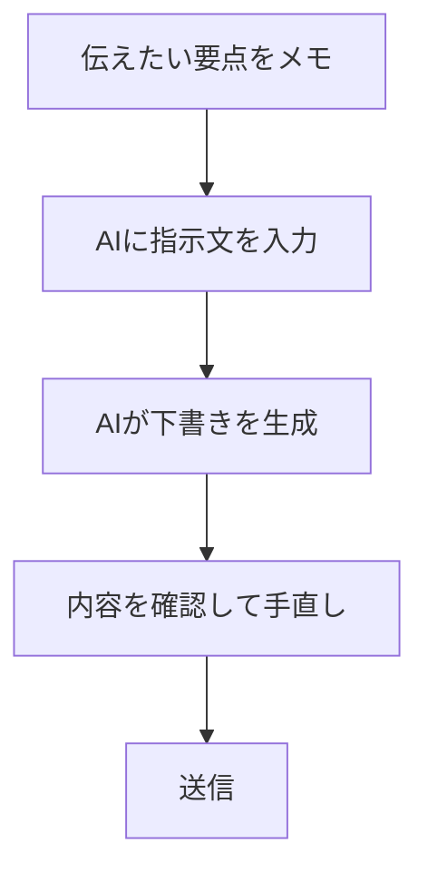

※本記事はアフィリエイト広告(PR)を含みます。

## AIメール作成術とは?ビジネスメールを3倍速く書く方法

「毎日のメール作成に時間を取られて、本当の仕事がなかなか進まない…」そんな悩みを持つ方は多いのではないでしょうか。この記事では、**AIを使ってビジネスメールを今までの3倍速く書く方法**を、初心者の方にもわかりやすく解説します。

この記事を読むと、次のことがわかります。

- AIメール作成で時短できる理由
- すぐ使える具体的なプロンプト(AIへの指示文)の例
- 無料で始められるツールと選び方
- AIメールを使うときの注意点

専門知識は不要です。読み終わるころには、今日からあなたのメール業務がぐっとラクになるはずです。

## なぜAIでメールが速く書けるのか

ビジネスメールの作成に時間がかかる原因は、主に次の3つです。

1. **書き出しや結びの定型文を毎回考えている**
2. **失礼にならない言い回しに悩む**
3. **長い文章を要約・整理するのに手間取る**

AI(ここでは文章を自動生成してくれる「生成AI」を指します)は、こうした作業がとても得意です。要点を伝えるだけで、敬語の整った自然なメール文を一瞬で作ってくれます。つまり、**「ゼロから書く」作業を「手直しする」作業に変える**ことで、大幅な時短が実現するのです。

### こんな場面で特に効果を発揮します

- 謝罪やお断りなど、気をつかう内容のメール
- 同じような依頼を繰り返し送るとき
- 英語など外国語でのビジネスメール
- 長文の問い合わせに丁寧に返信するとき

## AIメール作成の基本的な流れ

まずは全体の流れをイメージしてみましょう。下の図のように、たった4ステップでメールが完成します。



ポイントは、最初の「要点をメモ」の段階です。ここで**誰に・何を・どうしてほしいのか**を箇条書きで書いておくと、AIの出力が一気に正確になります。

## すぐ使えるプロンプト例

AIに指示する文章を「プロンプト」と呼びます。難しく考えず、お願いごとをそのまま書けば大丈夫です。具体例を見てみましょう。

### 例1:日程調整のお願い

```
以下の内容で取引先へ送る丁寧なビジネスメールを作成してください。
・相手:株式会社〇〇の田中様
・用件:来週の打ち合わせ日程を調整したい
・候補:火曜午後、木曜午前
・トーン:丁寧だが堅すぎない
```

### 例2:お断りのメール

```
取引先からの提案を断るメールを作成してください。
相手に失礼にならないよう配慮し、今後も良い関係を続けたい旨を含めてください。
```

### 例3:長い文章を整える

自分で書いた下書きを貼り付けて、「**このメールをより簡潔で丁寧な表現に直してください**」とお願いするだけでも効果的です。

### プロンプト上達のコツ

- 相手との関係性(社内・社外・初対面など)を伝える
- 希望する文章の長さを指定する(例:200字程度)
- 「箇条書きを使って」など形式を指定する

こうした指示の出し方は、メール以外の文章作成にも応用できます。AIで文章を書く基本については[AIでブログ記事を書く方法\|初心者向け完全ガイド](/2026/06/12/ai-blog-writing-guide/)でも詳しく解説しているので、あわせてご覧ください。

## どのAIツールを使えばいい?

代表的なAIチャットツールを簡単に比較してみます。

| ツール | 特徴 | こんな人におすすめ |
|--------|------|------------------|
| ChatGPT | 利用者が多く情報が豊富 | まず試してみたい人 |
| Claude | 長文・自然な日本語が得意 | 丁寧な文章を書きたい人 |
| Gemini | Googleサービスと連携しやすい | Gmailをよく使う人 |

どれもメール作成には十分使えます。それぞれの違いをもっと詳しく知りたい方は、[ChatGPTとClaudeとGeminiを徹底比較!初心者におすすめのAIチャットはどれ?](/2026/06/09/ai-chat-comparison/)が参考になります。

なお、料金プランは変更されることがあるため、最新の価格や無料枠については各サービスの**公式サイトで最新情報を確認してください**。

### AIメール作成は無料で使える?

結論から言うと、**無料でも十分始められます**。ChatGPTやClaude、Geminiはいずれも無料プランが用意されており、日常的なメール作成であれば無料の範囲でこなせるケースが多いです。

ただし、無料プランには利用回数や使えるモデルに制限がある場合があります。「もっと長文を扱いたい」「業務で頻繁に使う」という方は、有料プランの導入を検討すると快適になります。

## さらに効率を上げる組み合わせワザ

AIメール作成は、他の効率化術と組み合わせるとさらに強力になります。

- **音声入力 × AI**:要点を声でメモしてからAIに渡す
- **テンプレート化**:よく使うプロンプトを保存しておく
- **スケジュール管理との連携**:日程調整メールとカレンダーを連動させる

特にタスクやスケジュールの自動化に興味がある方は、[AIスケジュール管理術\|忙しい人のためのタスク自動化入門](/2026/06/13/ai-schedule-automation/)も合わせて読むと、デスクワーク全体の時短につながります。

集中して作業したいときは、周囲の音を抑えるイヤホンがあると効率が上がります。

👉 [Amazonで「ワイヤレスイヤホン ノイズキャンセリング」を見る](https://www.amazon.co.jp/s?k=%E3%83%AF%E3%82%A4%E3%83%A4%E3%83%AC%E3%82%B9%E3%82%A4%E3%83%A4%E3%83%9B%E3%83%B3%20%E3%83%8E%E3%82%A4%E3%82%BA%E3%82%AD%E3%83%A3%E3%83%B3%E3%82%BB%E3%83%AA%E3%83%B3%E3%82%B0)

## AIメールを使うときの注意点

便利なAIですが、そのまま送信するのは禁物です。次の点に必ず気をつけましょう。

### 1. 機密情報の入力に注意

顧客の個人情報や社外秘の内容を、安易にAIへ入力するのは避けましょう。会社のルールを確認し、必要に応じて情報をぼかして入力するのが安全です。

### 2. 事実関係は自分で確認

AIは時々、もっともらしい誤った情報を作ることがあります(これを「ハルシネーション」と呼びます)。日付や金額、固有名詞などは、送信前に必ず自分の目でチェックしてください。

### 3. 不自然な敬語が残っていないか

生成された文章が、ときに丁寧すぎたり機械的に感じられたりすることがあります。最後に一度読み返し、あなたの言葉に少し整えると、より自然で温かみのあるメールになります。

## まとめ

今回は、ビジネスメールを3倍速く書くための「AIメール作成術」を紹介しました。最後にポイントを振り返ります。

- AIは**定型文・敬語・要約**が得意で、メール作成の大幅な時短ができる
- 「**誰に・何を・どうしてほしいか**」を要点でまとめてから指示するのがコツ
- ChatGPT・Claude・Geminiは**無料でも十分始められる**
- ただし**機密情報・事実確認・敬語チェック**は必ず自分で行う

まずは今日届いた1通のメールを、AIに下書きしてもらうところから試してみてください。一度コツをつかめば、毎日の業務時間が驚くほど短くなるはずです。料金や機能の最新情報は各サービスの公式サイトで確認しつつ、自分に合ったツールを見つけていきましょう。
