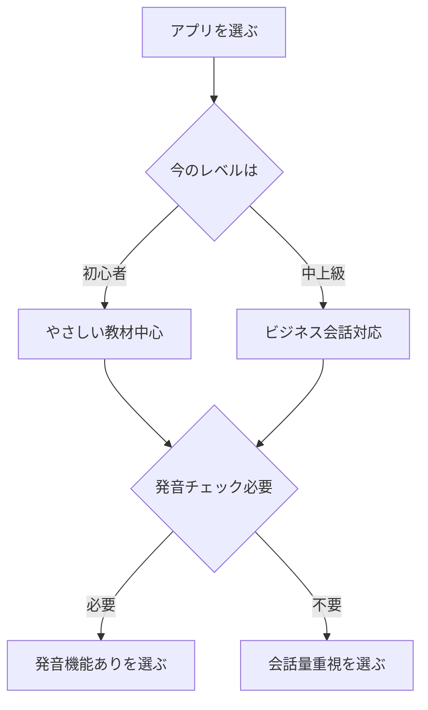

※本記事はアフィリエイト広告(PR)を含みます。

## この記事でわかること

「英会話スクールに通う時間もお金もないけれど、英語を話せるようになりたい」——そんな方に今おすすめなのが、AI英会話アプリです。AI英会話アプリとは、人工知能(AI)を相手に、いつでも何度でも英語で会話練習ができるスマホアプリのことです。

この記事では、独学で英語を話せるようになりたい初心者の方に向けて、次の3点をわかりやすく解説します。

- AI英会話アプリの選び方のポイント
- おすすめのAI英会話アプリ5選
- 独学で効果を出すための具体的な使い方

「無料で使えるの?」「本当に話せるようになるの?」といった疑問にもお答えしますので、ぜひ最後まで読んでみてください。

## なぜ今AI英会話アプリなのか

これまで英会話の練習といえば、対面のスクールやオンライン英会話で「人間の先生」と話すのが一般的でした。しかしAIの進化により、AI相手でも自然な会話練習ができるようになっています。

AI英会話アプリには、人間相手の学習にはないメリットがあります。

- **24時間いつでも使える**:深夜でも早朝でも、思い立ったときに練習できます。
- **間違えても恥ずかしくない**:相手はAIなので、何度言い間違えても気になりません。
- **料金が比較的安い**:オンライン英会話より手頃な価格設定が多いです。
- **発音や文法をその場で添削**:AIが弱点を指摘してくれます。

特に「人前で話すのが恥ずかしい」という初心者にとって、気兼ねなく口を動かせるのは大きな魅力です。

## AI英会話アプリの選び方

アプリを選ぶときは、次の4つのポイントをチェックしましょう。

### 1. 自分のレベルに合っているか

初心者向けに簡単な単語から始められるアプリもあれば、中上級者向けにビジネス会話に特化したものもあります。まずは「やさしすぎる」と感じるくらいのレベルから始めるのがコツです。

### 2. 発音チェック機能があるか

自分の発音をAIが判定し、改善点を教えてくれる機能があると、独学でも正しい発音を身につけやすくなります。

### 3. 続けやすい仕組みがあるか

毎日の学習を後押ししてくれる「継続記録」や「リマインダー」などの機能があると、挫折しにくくなります。

### 4. 料金体系が無理のない範囲か

無料で試せるか、月額いくらかは必ず確認しましょう。価格はキャンペーンなどで変わることがあるため、最新情報は各公式サイトで確認してください。

## AI英会話アプリおすすめ5選

ここからは、初心者にもおすすめのAI英会話アプリを5つご紹介します。それぞれ特徴が異なるので、自分に合うものを選んでみてください。

### 1. スピークバディ(SpeakBuddy)

AIキャラクターと会話しながら学べる人気アプリです。ストーリー仕立てのレッスンが用意されており、ゲーム感覚で続けやすいのが特徴です。発音判定機能もあり、英会話初心者の最初の一歩に向いています。

### 2. ELSA Speak(エルサスピーク)

発音矯正に特化したアプリです。AIが細かく音を聞き取り、どの音が苦手かを具体的に教えてくれます。「発音をしっかり直したい」という方に特におすすめです。

### 3. Duolingo(デュオリンゴ)

世界中で使われている語学学習アプリです。無料でもかなりの範囲を学べるのが魅力で、ゲーム性が高く飽きにくい構成になっています。単語や文法の基礎固めにも役立ちます。

### 4. Speak(スピーク)

「とにかく話す量を増やしたい」人向けのアプリです。AIとの自由な会話練習に力を入れており、実際に口を動かす時間が長いのが特徴です。

### 5. ChatGPTなどの生成AIを活用する

専用アプリではありませんが、ChatGPTのような生成AIを英会話の練習相手にする方法もあります。「英語で雑談して、間違いを直して」と指示すれば、無料でも手軽に会話練習ができます。どのAIチャットが自分に合うか迷う方は、[ChatGPTとClaudeとGeminiを徹底比較した記事](/2026/06/09/ai-chat-comparison/)も参考にしてみてください。

| アプリ | 特徴 | 向いている人 |
|---|---|---|
| スピークバディ | ストーリー型で続けやすい | 初心者全般 |
| ELSA Speak | 発音矯正に強い | 発音を直したい人 |
| Duolingo | ゲーム性が高い | 基礎から固めたい人 |
| Speak | 会話量が多い | とにかく話したい人 |
| 生成AI活用 | 自由度が高く手軽 | 工夫して使いたい人 |

※各アプリの料金・機能は変更される場合があります。詳細は必ず各公式サイトで最新情報を確認してください。

## 独学で話せるようになる使い方

アプリを入れただけでは、英語は話せるようになりません。効果を出すためのコツをお伝えします。

### 毎日10分でも「声に出す」

大切なのは、短くてもいいので毎日続けることです。週末にまとめて1時間やるより、毎日10分ずつ声に出すほうが効果的です。AIアプリは細切れ時間に使いやすいので、通勤中や寝る前などに習慣化しましょう。

### 間違いを恐れず話す

初心者のうちは完璧な文を作ろうとせず、知っている単語をつなげて話してみましょう。AI相手なら間違えても誰も困りません。とにかく口を動かすことが上達への近道です。

### 復習で定着させる

AIに指摘された間違いや、覚えたい表現はメモに残し、後で見返しましょう。発音した内容を録音して聞き直すのも効果的です。

### 学習環境を整える

発音チェックを正確に行うには、周囲の雑音を抑えられるイヤホンがあると便利です。マイク付きのワイヤレスイヤホンなら、外でも口元の音をしっかり拾ってくれます。

👉 [Amazonで「ワイヤレスイヤホン マイク付き」を見る](https://www.amazon.co.jp/s?k=%E3%83%AF%E3%82%A4%E3%83%A4%E3%83%AC%E3%82%B9%E3%82%A4%E3%83%A4%E3%83%9B%E3%83%B3%20%E3%83%9E%E3%82%A4%E3%82%AF%E4%BB%98%E3%81%8D)

イヤホン選びで迷ったら、[テレワーク向けワイヤレスイヤホンの選び方](/2026/06/13/wireless-earphones-telework/)も役立ちます。

## よくある質問(Q&A)

### Q. AI英会話アプリは無料で使えますか?

ほとんどのアプリには無料で試せる範囲や無料プランがあります。たとえばDuolingoは無料でも幅広く学べますし、ChatGPTなどの生成AIも無料版で会話練習が可能です。ただし、発音判定や全レッスンの利用など、本格的に使うには有料プランが必要なことが多いです。まずは無料部分を試してから、有料に進むか判断するとよいでしょう。具体的な料金は各公式サイトで確認してください。

### Q. AI相手で本当に話せるようになりますか?

AIは会話の「量」を確保するのに非常に向いています。話す機会を増やすことが上達の基本なので、独学でも十分に効果を期待できます。ただし、より自然な表現や文化的なニュアンスを学びたい段階になったら、人間の講師との会話を組み合わせるのもおすすめです。

### Q. もっと体系的に学びたい場合は?

AIそのものの活用法を深く学びたい方は、[生成AIが学べるオンラインスクールの比較記事](/2026/06/13/ai-online-school-guide/)もチェックしてみてください。AIを使いこなすスキルは、英語学習以外にも幅広く役立ちます。

## まとめ

AI英会話アプリは、独学で英語を話せるようになりたい方にとって、強力で手軽な味方です。最後にポイントをおさらいします。

- AI英会話アプリは「24時間使える」「恥ずかしくない」「料金が手頃」がメリット
- 選ぶときは**レベル・発音機能・続けやすさ・料金**をチェック
- おすすめは目的別に5つ。まずは無料部分から試すのがおすすめ
- 効果を出すコツは「毎日声に出す」「間違いを恐れない」「復習する」

まずは気になったアプリを1つダウンロードして、今日から1日10分の英語習慣を始めてみましょう。小さな積み重ねが、半年後の「話せる自分」につながります。
