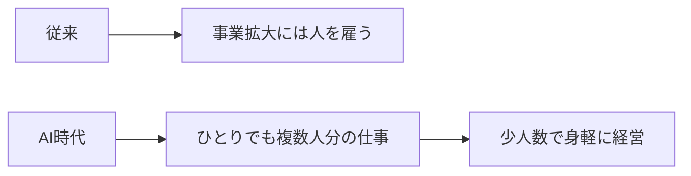

※本記事はアフィリエイト広告(PR)を含みます。

## 「ひとりで会社を回す」が現実的になった理由

「一人会社」「ひとり社長」という働き方に注目が集まっています。かつては「事業を大きくするには人を雇う」のが当たり前でしたが、AIの進化によって、**ひとりでも複数人分の仕事を回せる時代**になってきました。

この記事では、一人会社とは何か、なぜ今増えているのか、そして**AIを使ってひとりでも事業を回す具体的な方法**を、これから挑戦したい人向けにわかりやすく解説します。

## 一人会社・マイクロ法人とは?

**一人会社**は、社長ひとり(または家族のみ)で運営する小規模な会社のことです。なかでも「**マイクロ法人**」は、社会保険料の負担軽減などを目的に、戦略的に設立・運営される会社を指す俗称として使われます。

個人事業の収入は維持しつつ、別にマイクロ法人を作り、そこからの役員報酬を調整することで負担を抑える——といった使われ方をします。

> ※法人化や社会保険の扱いは個人の状況によって最適解が異なります。設立を検討する際は、税理士など専門家への相談をおすすめします。

## なぜ今、一人会社が増えているのか

背景にあるのが、生成AIの急速な普及です。ある調査では、企業が生成AIを導入する目的として「**業務効率化・作業時間の短縮**」が約87%と最多でした。少人数・兼務の体制ほど、検索・要約・文書作成などをAIに任せる効果が出やすいのです。

つまり、**一人会社とAIは非常に相性が良い**組み合わせと言えます。

## 業務別・一人会社のAI活用術

ひとりで事業を回すうえで、AIに任せられる業務は意外と多くあります。

### バックオフィス(事務作業)

- **議事録・打ち合わせメモ**:[AIで議事録を自動作成](/2026/06/10/ai-meeting-minutes/)すれば、商談後の整理が一瞬で終わります
- **スケジュール・タスク管理**:[AIによるスケジュール管理](/2026/06/13/ai-schedule-automation/)で、ひとりでも予定の抜け漏れを防げます

### 営業・情報発信

- **資料作成**:[AIでプレゼン資料を作成](/2026/06/13/ai-presentation-tools/)すれば、提案書づくりの時間を大幅に短縮できます
- **ブログ・SNS発信**:集客のための記事やSNS投稿もAIで効率化できます

### さらに先へ:AIエージェントの活用

複数の作業を自動でこなす[AIエージェント](/2026/06/13/ai-agent-guide/)を使えば、「調べてまとめる」「定型業務を回す」といった仕事を、より広く任せられるようになります。

## ひとりで悩まないための「相談相手」

一人会社の弱点は、**相談相手がいないこと**です。経営判断やキャリアの方向性をひとりで抱え込むと、視野が狭くなりがちです。

そんなときに有効なのが、**キャリアコーチング**です。第三者のプロと対話することで、頭の中が整理され、次の一手が見えやすくなります。特に30〜40代でキャリアの転換期にある人に向いています。



## 発信力を武器にする:動画編集スキル

一人会社の集客では、**SNSでの情報発信**が大きな武器になります。なかでも近年伸びているのが動画(ショート動画含む)です。

動画編集のスキルを身につけておくと、自分のサービスをアピールする発信に使えるのはもちろん、**動画編集自体を副業の収入源**にすることもできます。専門のオンラインスクールで体系的に学ぶと、独学より早く実務レベルに到達できます。



## 一人会社を始める前の注意点

- **法人化は誰にでも得とは限らない**:収入規模によっては個人事業のままが有利な場合も。専門家に相談を
- **すべてをひとりで抱えない**:AI・外注・相談相手をうまく使い、自分は本業に集中する
- **情報の扱いに注意**:AIに業務を任せる際は、機密情報の入力ルールを決めておく

## まとめ

- **一人会社**は、AIの普及で「ひとりでも複数人分の仕事が回せる」ようになり現実的な選択肢に
- 業務効率化を目的にAIを導入する企業は約87%。少人数ほど効果が出やすい
- 議事録・スケジュール・資料作成・発信など、**多くの業務をAIに任せられる**
- 弱点の「相談相手不在」はキャリアコーチング、「集客」は動画など発信スキルで補える
- 法人化の損得は人それぞれ。始める前に専門家に相談を

AIを味方につければ、「ひとり」でも十分に戦えます。まずは身近な業務をひとつAIに任せるところから、新しい働き方の一歩を踏み出してみてください。
