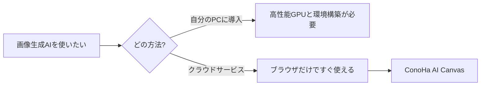

※本記事はアフィリエイト広告(PR)を含みます。

## 高性能PCがなくても画像生成AIは使える

「Stable Diffusionで画像生成を試したいけど、高性能なパソコンが必要そう…」とあきらめていませんか。実は、**ブラウザだけで本格的な画像生成AIが使えるサービス**が登場しています。それが GMO の **ConoHa AI Canvas** です。

この記事では、ConoHa AI Canvasとは何か、料金のしくみ、始め方、どんな人に向いているかを、初心者の方にもわかりやすく解説します。

## ConoHa AI Canvasとは?

ConoHa AI Canvasは、**面倒なセットアップなしに、ブラウザからStable Diffusionを使えるAI画像生成サービス**です。通常、Stable Diffusionを自分のPCで動かすには高性能なGPU(グラフィックボード)と複雑な環境構築が必要ですが、ConoHa AI Canvasならそれらが一切不要です。

主な特徴は次のとおりです。

- **ブラウザだけで完結**:高価なPCやGPUを用意しなくてよい
- **枚数制限なし**で画像を生成できる
- 文章を入力するだけで画像を作る、画像をもとに動きをつけるといった機能に対応
- **国内データセンター**を利用しており、通信速度と安定性に配慮されている

「自分のPCにソフトを入れる」のではなく、「ネット上の高性能なパソコンを借りて画像生成する」とイメージすると分かりやすいです。

無料で使える選択肢を先に知りたい方は、[無料で使える画像生成AIの比較記事](/2026/06/11/free-image-ai-tools/)もあわせてご覧ください。

## どんなしくみ?従来の方法と比較

自分のPCに導入する方法は自由度が高い反面、ハードルも高めです。ConoHa AI Canvasのようなクラウド型は、「まず試したい」「PCのスペックに自信がない」人にぴったりです。

## 料金のしくみ

ConoHa AI Canvasの料金は、**月額の基本料金 + WebUIの利用時間に応じた従量課金**を合算する方式です。

- 基本料金:**月額1,100円から**(プランによって異なる)
- 利用料金:WebUIの利用時間に応じた従量課金(各プランに無料利用枠あり)

ポイントは「**使った分だけ課金される**」という点です。長時間つけっぱなしにすると料金が増えるため、生成が終わったら停止する習慣をつけると無駄がありません。

※料金やプラン内容は変更される場合があります。最新の正確な情報は必ず公式サイトでご確認ください。



## 始め方は3ステップ

1. **アカウント登録**:公式サイトからConoHaのアカウントを作成する
2. **プランを選ぶ**:まずは下位プランで試し、足りなければ上げるのがおすすめ
3. **WebUIを起動して画像生成**:文章(プロンプト)を入力して画像を作る

難しい設定は不要で、登録すればすぐに画像生成を始められます。

## ConoHa AI Canvasが向いている人

- **高性能なPCを持っていない**が、本格的な画像生成AIを使いたい人
- ソフトのインストールや環境構築でつまずきたくない人
- ブログ・SNS・資料用のオリジナル画像を量産したい人

逆に、「月に数枚試すだけ」という人は、まず無料サービスから始めるのも手です。用途に合わせて使い分けましょう。

## 使う前の注意点

- **従量課金に注意**:使った時間に応じて料金がかかるため、使わないときは停止する
- **商用利用のルール確認**:生成した画像をビジネスで使う場合は、利用規約と権利関係を必ず確認する

## よくある質問

### プログラミングの知識は必要?

いいえ。ブラウザの画面上で文章を入力するだけなので、専門知識がなくても使えます。

### スマホでも使える?

基本的にはPCのブラウザでの利用が想定されています。快適に使うならパソコンからのアクセスがおすすめです。

## まとめ

- **ConoHa AI Canvas**は、高性能PC不要でブラウザからStable Diffusionが使えるAI画像生成サービス
- 料金は「月額基本料金 + 従量課金」。月額1,100円から始められる
- 環境構築が不要で、登録すればすぐに画像生成を始められる
- 高性能PCを持っていない人、量産したい人に特に向いている
- 従量課金なので、使わないときは停止するのがコツ

「画像生成AIを試したいけどPCがネック」という方は、まず公式サイトでプランと最新料金をチェックしてみてください。



### 参考リンク

- [ConoHa AI Canvas 公式サイト](https://ai.conoha.jp/canvas/)
- [料金ページ(ConoHa AI Canvas)](https://ai.conoha.jp/canvas/pricing/)
