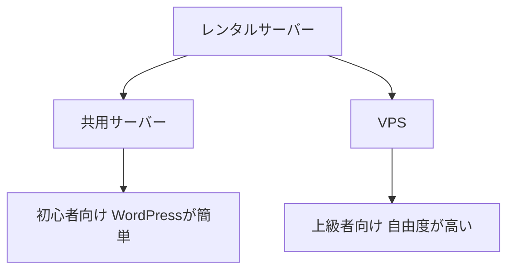

※本記事はアフィリエイト広告(PR)を含みます。

## AIで記事は書けても「公開する場所」が必要

AIを使えば記事は驚くほど早く書けるようになりました。でも、書いた記事をブログとして公開するには「**レンタルサーバー**」が必要です。

この記事では、[AIでブログ記事を書く方法](/2026/06/12/ai-blog-writing-guide/)を実践したい人に向けて、定番のレンタルサーバー3つ(**ConoHa WING・ConoHa VPS・ロリポップ**)を比較し、初心者がどれを選べばいいかをわかりやすく解説します。

## そもそもレンタルサーバーとは?

レンタルサーバーは、ブログやサイトのデータを置いて**インターネット上に公開するための土地**のようなものです。WordPress(ワードプレス)という定番のブログソフトを動かすのにも使います。

サーバーには大きく2タイプあります。

- **共用サーバー**(ConoHa WING・ロリポップ):設定が簡単で、ブログ初心者向け
- **VPS**(ConoHa VPS):自由に構築できる代わりに専門知識が必要。AIツールを自分で動かす用途にも

## 3つのサーバーを比較

| 項目 | ConoHa WING | ロリポップ | ConoHa VPS |
|---|---|---|---|
| タイプ | 共用サーバー | 共用サーバー | VPS |
| 向いている人 | WordPressを最短で始めたい初心者 | とにかく安く始めたい人 | 自分でAI・開発環境を作りたい人 |
| WordPress開設 | クイックスタートで非常に簡単 | 簡単 | 自分で構築が必要 |
| 料金イメージ | 標準的 | 最安クラス | 用途による |

※料金やプラン内容は変更されます。最新の正確な情報は必ず各公式サイトでご確認ください。

## それぞれどんな人に向いている?

### ConoHa WING:初心者がWordPressを最短で始めるなら

**WordPressブログを最小の手間で始めたい人**に一番おすすめです。「クイックスタート」を使えば、ドメイン取得からSSL化(通信の暗号化)まで自動で完了し、即日サイトを公開できます。管理画面もわかりやすく、初心者が迷いにくいのが強みです。



### ロリポップ:とにかく安く始めたいなら

**コストを最優先したい人**向けの定番サーバーです。低価格のプランがあり、「まずは月数百円で気軽にブログを始めてみたい」という人に向いています。



### ConoHa VPS:AIや開発を自分で動かしたいなら

**自由度を重視する中〜上級者**向けです。サーバーを自分で構築できるため、画像生成AIや自作ツールを動かす、開発環境を作るといった用途に使えます。[AIエージェント](/2026/06/13/ai-agent-guide/)を自分のサーバーで動かしてみたい、といった発展的な使い方を考えている人に向いています。



## 迷ったらどれを選ぶ?

- **ブログ・副業を始めたい初心者** → **ConoHa WING**(簡単さと安定性のバランスが良い)
- **とにかく安く試したい** → **ロリポップ**
- **AIや開発を自分で動かしたい** → **ConoHa VPS**

大半の人は、まず **ConoHa WING** を選んでおけば失敗が少ないです。ブログに慣れて「もっと自由に触りたい」となったら、VPSを検討する流れがおすすめです。

## よくある質問

### サーバー代以外にお金はかかる?

独自ドメイン(サイトの住所)の費用が別途かかる場合があります。ただしConoHa WINGのように独自ドメインが無料で付くプランもあります。

### 途中でサーバーを変えられる?

可能ですが、データの引っ越し作業が必要で手間がかかります。最初にある程度きちんと選んでおくほうが安心です。

## まとめ

- AIで記事を書いても、公開するには**レンタルサーバー**が必要
- **初心者でWordPressを最短で始めるならConoHa WING**
- **最安で試すならロリポップ**
- **AIや開発を自分で動かすならConoHa VPS**
- 迷ったらConoHa WINGが無難。慣れたらVPSへ、というステップアップもおすすめ

サーバーが決まれば、あとは[AIで記事を書く](/2026/06/12/ai-blog-writing-guide/)だけ。まずは公式サイトで最新の料金プランを確認して、第一歩を踏み出してみてください。

### 参考リンク

- [ConoHa WINGとロリポップの比較(ツッチーブログ)](https://tsutchii.com/conoha-vs-lolipop)
- [ConoHa WINGとVPSの違い(レンタルサーバーの教科書)](https://sankyo-densan.jp/conoha-wing-vps/)
