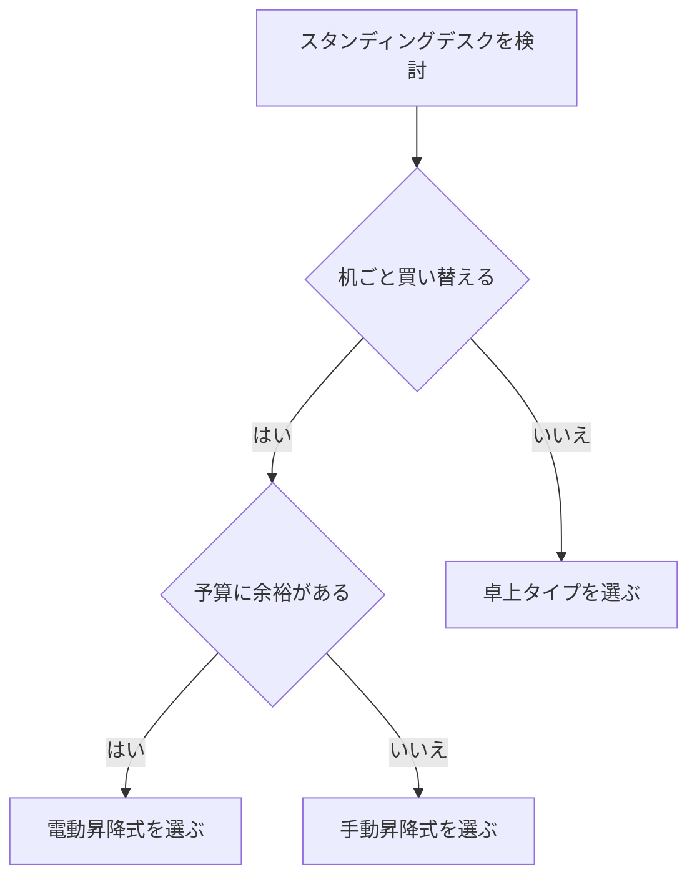

※本記事はアフィリエイト広告(PR)を含みます。

## スタンディングデスクは効果ある?この記事でわかること

「スタンディングデスクは効果あるの?」と気になって検索された方は多いのではないでしょうか。立って作業できる昇降式のデスク(スタンディングデスク=高さを変えられる机)は、在宅ワークの普及とともに一気に人気が高まりました。でも、決して安い買い物ではないので、買って後悔したくないですよね。

この記事では、在宅ワーカー目線で

- スタンディングデスクに本当に効果があるのか
- 感じやすいメリットとデメリット
- 失敗しない選び方のチェック観点
- 無理なく続けるための使い方のコツ

を、初心者の方にもわかりやすく整理してお伝えします。読み終えるころには、「自分に必要かどうか」「どんなタイプを選べばいいか」が判断できるようになります。

## そもそもスタンディングデスクとは?

スタンディングデスクとは、立った姿勢で作業できるように高さを上げられる机のことです。大きく分けると次の3タイプがあります。

| タイプ | 特徴 | 向いている人 |
| --- | --- | --- |
| 電動昇降式 | ボタンで高さを自動調整 | 座り・立ちを頻繁に切り替えたい人 |
| 手動昇降式 | ハンドルやガス圧で手動調整 | コストを抑えたい人 |
| 卓上タイプ | 今の机に乗せて使う | 大きな机を買い替えたくない人 |

「立ちっぱなしで作業するの?」と思われがちですが、実際は座る・立つを切り替えて使うのが基本です。一日中立ちっぱなしはかえって疲れてしまうため、こまめに姿勢を変える使い方が主流になっています。

## スタンディングデスクは効果ある?在宅ワーカーが感じやすいメリット

### 1. 長時間の座りっぱなしを防げる

在宅ワークの一番の悩みといえば「座りっぱなし」です。立つ時間を取り入れることで、同じ姿勢が続くのを防げます。実際に使った人からは「夕方の腰のだるさが軽くなった」という声がよく聞かれます。

### 2. 眠気や集中力の低下に対処しやすい

午後に眠くなったり、集中が切れたりしたとき、立ち上がって作業すると気分を切り替えやすくなります。コーヒーを淹れに行かなくても、その場でリフレッシュできるのは在宅ワークならではのメリットです。

### 3. 姿勢を意識するきっかけになる

立つと自然に背筋が伸びるため、猫背になりがちな人にとっては姿勢を見直すきっかけになります。

ただし、これらの効果は「使い方次第」という点に注意が必要です。買っただけで自動的に健康になるわけではなく、こまめに立つ習慣をつくれるかどうかが分かれ目になります。

## 正直なデメリット・注意点

良いことばかりではありません。購入前に知っておきたい注意点もまとめます。

- **立ちっぱなしは逆に疲れる**:足や腰に負担がかかるため、適度な切り替えが必須です。
- **価格が高め**:電動昇降式はそれなりの価格になります。最新の価格は各メーカーの公式サイトで確認してください。
- **重くて設置場所を選ぶ**:特に電動式は天板が重く、移動が大変なことがあります。
- **慣れるまで時間がかかる**:最初は立つこと自体に疲れを感じる人もいます。

こうしたデメリットは、後述する「使い方のコツ」と「正しい選び方」でかなりカバーできます。

## 失敗しないスタンディングデスクの選び方

選ぶときに見るべき観点を、優先度の高い順に紹介します。

### 昇降の高さ範囲をチェック

自分の身長に合った高さまで上げられるかが最重要です。立ち作業時、肘が90度になる高さが目安と言われます。背の高い方は対応範囲が広いモデルを選びましょう。

### 耐荷重を確認する

モニターやノートパソコン、その他の機材を載せても安定するか、耐荷重(載せられる重さの上限)を確認します。デュアルモニター(2画面)を使う方は特に余裕を持って選びましょう。

### 昇降方式とメモリー機能

電動式の中には、よく使う高さを記憶できる「メモリー機能」付きのモデルがあります。ボタン一つで切り替えられると、座り・立ちの切り替えが面倒になりにくく、続けやすくなります。

### 天板の広さと安定性

作業スペースが狭いと結局使いづらくなります。今のデスク環境に合うサイズかも合わせて検討しましょう。デスク周りの環境づくり全体については、[在宅ワークが捗るデスク周りガジェット10選\|快適環境の作り方](/2026/06/11/home-office-gadgets/)も参考になります。

気になるモデルを比較検討したい方は、まず幅広いラインナップから探してみるとイメージがつかみやすいです。

👉 [Amazonで「スタンディングデスク 電動 昇降」を見る](https://www.amazon.co.jp/s?k=%E3%82%B9%E3%82%BF%E3%83%B3%E3%83%87%E3%82%A3%E3%83%B3%E3%82%B0%E3%83%87%E3%82%B9%E3%82%AF%20%E9%9B%BB%E5%8B%95%20%E6%98%87%E9%99%8D)

👉 [楽天市場で「スタンディングデスク 昇降 卓上」を探す](https://af.moshimo.com/af/c/click?a_id=5632328&p_id=54&pc_id=54&pl_id=616&url=https%3A%2F%2Fsearch.rakuten.co.jp%2Fsearch%2Fmall%2F%25E3%2582%25B9%25E3%2582%25BF%25E3%2583%25B3%25E3%2583%2587%25E3%2582%25A3%25E3%2583%25B3%25E3%2582%25B0%25E3%2583%2587%25E3%2582%25B9%25E3%2582%25AF%2520%25E6%2598%2587%25E9%2599%258D%2520%25E5%258D%2593%25E4%25B8%258A%2F)

## スタンディングデスクは無料で試せる?お試しの方法

「いきなり買うのは不安」という方も多いはずです。次のような方法でハードルを下げられます。

- **卓上タイプから始める**:数千円〜のモデルもあり、今の机にそのまま使えます。
- **返品・お試し期間のあるメーカーを選ぶ**:一定期間内なら返品可能なサービスもあります。条件は公式サイトで最新情報を確認してください。
- **段ボールや棚で仮体験する**:まずは家にあるもので台を作り、立ち作業が自分に合うか試してみるのも有効です。

「合うかどうか」をテストしてから本格的な電動式に移行すると、失敗のリスクをぐっと減らせます。

## 効果を最大化する使い方のコツ

せっかく導入しても、立たなくなっては意味がありません。続けるための工夫を紹介します。

1. **30〜60分ごとに座り立ちを切り替える**:タイマーやスケジュール管理を活用すると習慣化しやすくなります。タスク管理の自動化については[AIスケジュール管理術\|忙しい人のためのタスク自動化入門](/2026/06/13/ai-schedule-automation/)も参考になります。
2. **足元にマットを敷く**:立ち作業時の足の疲れを和らげられます。
3. **会議や通話のときに立つ**:集中力がいらない作業を「立ちタイム」にすると無理なく続けられます。Web会議用のイヤホン選びは[テレワーク向けワイヤレスイヤホンの選び方](/2026/06/13/wireless-earphones-telework/)が役立ちます。
4. **モニターの高さも調整する**:画面が目線の高さに来るようにすると、首や肩の負担が減ります。

## まとめ

スタンディングデスクは「効果ある?」という問いに対して、結論としては**使い方次第で十分に効果が期待できる**といえます。座りっぱなしを防ぎ、気分転換や姿勢の見直しに役立つ一方、立ちっぱなしは逆効果になるため、座り・立ちのこまめな切り替えがカギになります。

選ぶときのポイントは次の4つです。

- 自分の身長に合う昇降の高さ範囲か
- 機材を載せても安定する耐荷重か
- 続けやすいメモリー機能や昇降方式か
- 作業スペースに合う天板サイズか

いきなり高価な電動式を買うのが不安なら、まずは卓上タイプや家にあるもので「立ち作業が自分に合うか」を試すのがおすすめです。価格や返品条件は変わることがあるため、購入前に各メーカーの公式サイトで最新情報を必ず確認してください。自分に合った一台を見つけて、快適な在宅ワーク環境をつくっていきましょう。
