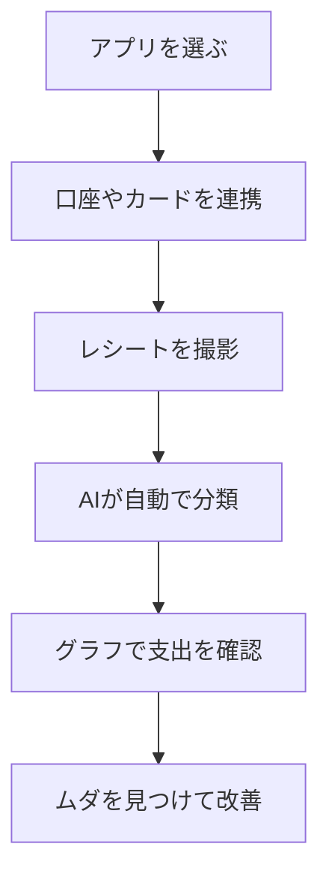

※本記事はアフィリエイト広告(PR)を含みます。

## 家計簿アプリ×AIで「支出の見える化」から始める節約

「毎月なぜかお金が残らない」「節約したいけど何から手をつければいいかわからない」——そんな悩みを持つ方にこそ試してほしいのが、**家計簿アプリ×AI**の組み合わせです。

この記事を読むと、次のことがわかります。

- AIを使うと家計簿アプリで何が自動化できるのか
- 自動で支出を見える化する具体的な手順
- 家計簿アプリは無料で使えるのか
- 続けるためのコツと、節約につなげる考え方

難しい知識は必要ありません。スマホ1台あれば今日から始められますので、肩の力を抜いて読んでみてください。

## そもそも「家計簿アプリ×AI」とは?

家計簿アプリとは、収入や支出を記録して家計の状態を管理してくれるスマホアプリのことです。最近は、これに**AI(人工知能=人間のように学習・判断する技術)**の機能が加わり、より便利になっています。

従来の家計簿は「使ったお金を自分で手入力する」のが基本でした。これが面倒で挫折する人がとても多かったのです。AIを活用した最近のアプリでは、次のような作業を自動でこなしてくれます。

- レシートを撮影するだけで金額や店名を読み取る
- 銀行口座やクレジットカードの利用明細を自動で取り込む
- 「これは食費」「これは交際費」とカテゴリーを自動で分類する
- 使いすぎの傾向を分析し、アドバイスを表示する

つまり、**「記録する手間」をAIが肩代わりしてくれる**のが最大の魅力です。

## なぜ「見える化」が節約につながるのか

節約というと「我慢」をイメージしがちですが、実はもっと大切なのは**現状を正確に知ること**です。

人は意外と、自分が何にいくら使っているかを把握していません。「コンビニでちょこちょこ買い」「サブスク(月額課金サービス)の払い忘れ」など、見えていない支出が積み重なっているケースは少なくありません。

AI家計簿で支出を自動的にグラフや一覧で見える化すると、こうした「ムダの正体」が一目でわかります。気づくだけで使い方が変わる——これが見える化の力です。

## 自動で支出を見える化する手順

ここでは、AI家計簿アプリで支出を自動的に見える化するまでの流れを紹介します。

### ステップ1:アプリを選んでインストールする

まずは自分に合った家計簿アプリを選びます。代表的なものに「マネーフォワード ME」「Zaim」「マネーツリー」などがあります。選び方のポイントは後述します。

### ステップ2:銀行口座やカードを連携する

アプリに銀行口座やクレジットカード、電子マネーを登録すると、利用明細が自動で取り込まれます。手入力がほぼ不要になるため、ここは面倒でもぜひ設定しておきましょう。

連携にはセキュリティ面の不安を感じる方もいるかもしれませんが、大手アプリは銀行と同レベルの暗号化を採用しているのが一般的です。心配な方は、まずは利用明細の「閲覧のみ」できる範囲で連携すると安心です。

### ステップ3:レシートを撮影する

現金払いの支出は、レシートをカメラで撮影するだけでAIが金額と店名を読み取ってくれます。この読み取り技術は文字起こしAIと近い仕組みで、近年精度が大きく向上しています。文字認識の技術に興味がある方は、[AI文字起こしツールおすすめ比較](/2026/06/12/ai-transcription-comparison/)もあわせて読むと理解が深まります。

### ステップ4:AIによる自動分類を確認する

取り込まれた支出は、AIが「食費」「日用品」「交通費」などに自動で振り分けます。分類が間違っていたら手動で直せば、AIが学習して次回から精度が上がっていきます。

### ステップ5:グラフで支出を確認する

月ごとの支出が円グラフや棒グラフで表示されます。「思ったより外食が多い」「サブスクで毎月◯円も払っていた」など、新たな発見があるはずです。

## 家計簿アプリは無料で使える?

結論から言うと、**多くのアプリは基本機能を無料で使えます**。レシート撮影や手入力、簡単なグラフ表示などは無料プランで十分対応できることがほとんどです。

一方で、次のような機能は有料プラン(月額または年額)になっていることが多いです。

| 機能 | 無料プランの傾向 | 有料プランの傾向 |
|---|---|---|
| 口座・カード連携数 | 上限あり | 無制限または多数 |
| 過去データの閲覧 | 直近のみ | 長期間さかのぼれる |
| 詳細な分析・レポート | 簡易版 | 詳細版 |
| 広告表示 | あり | なし |

まずは無料で使ってみて、「連携数が足りない」「もっと分析したい」と感じたら有料プランを検討するのがおすすめです。料金や機能はアプリのアップデートで変わることがあるため、最新情報は各アプリの**公式サイトで確認してください**。

## 続けるための3つのコツ

どんなに便利なアプリも、続かなければ意味がありません。挫折しないためのコツを紹介します。

### 1. 完璧を目指さない

1円単位まで正確に合わせようとすると疲れてしまいます。「だいたいの傾向がわかればOK」くらいの気持ちで始めましょう。

### 2. 週に1回チェックする習慣をつける

毎日見る必要はありません。週末に5分だけアプリを開いて、グラフを眺める習慣をつけるだけで十分です。スケジュール管理が苦手な方は、[AIスケジュール管理術](/2026/06/13/ai-schedule-automation/)で紹介している自動リマインドの考え方も役立ちます。

### 3. 通知機能を活用する

使いすぎを知らせてくれる通知や、予算オーバーのアラートを設定しておくと、無意識の出費にブレーキがかかります。

## さらに進んだ使い方:AIチャットに家計相談する

最近は、ChatGPTのような対話型AIに「先月の食費を減らすには?」と相談して、節約アイデアをもらう人も増えています。家計簿アプリで把握した数字をもとに具体的に質問すると、現実的なアドバイスが返ってきます。

どのAIチャットを使えばいいか迷う方は、[ChatGPTとClaudeとGeminiを徹底比較](/2026/06/09/ai-chat-comparison/)を参考に、自分に合ったものを選んでみてください。

また、レシートをまとめて整理したい方には、スマホスタンド付きの撮影環境を整えると作業が一気に楽になります。

👉 [Amazonで「スマホスタンド 卓上」を見る](https://af.moshimo.com/af/c/click?a_id=5632371&p_id=170&pc_id=185&pl_id=38594&url=https%3A%2F%2Fwww.amazon.co.jp%2Fs%3Fk%3D%25E3%2582%25B9%25E3%2583%259E%25E3%2583%259B%25E3%2582%25B9%25E3%2582%25BF%25E3%2583%25B3%25E3%2583%2589%2520%25E5%258D%2593%25E4%25B8%258A)

家計の書類やレシートを整理する収納グッズもあわせて検討すると、デスク周りがすっきりします。

👉 [楽天市場で「レシート 整理 ファイル」を探す](https://af.moshimo.com/af/c/click?a_id=5632328&p_id=54&pc_id=54&pl_id=616&url=https%3A%2F%2Fsearch.rakuten.co.jp%2Fsearch%2Fmall%2F%25E3%2583%25AC%25E3%2582%25B7%25E3%2583%25BC%25E3%2583%2588%2520%25E6%2595%25B4%25E7%2590%2586%2520%25E3%2583%2595%25E3%2582%25A1%25E3%2582%25A4%25E3%2583%25AB%2F)

## まとめ

家計簿アプリ×AIは、「記録の手間」というこれまでの最大の挫折ポイントを解消してくれる、節約初心者にぴったりの組み合わせです。最後にポイントを振り返りましょう。

- AIがレシート読み取り・明細取り込み・自動分類を肩代わりしてくれる
- 支出を見える化するだけで、ムダな出費に気づける
- 多くのアプリは無料で始められ、必要に応じて有料プランへ
- 完璧を目指さず、週1回のチェックを習慣にするのが継続のコツ
- AIチャットに相談すれば、具体的な節約アイデアも得られる

まずは無料の家計簿アプリを1つインストールして、口座を1件連携してみるところから始めてみてください。最新の料金や機能は各アプリの公式サイトで確認しつつ、自分に合った節約の第一歩を踏み出しましょう。
