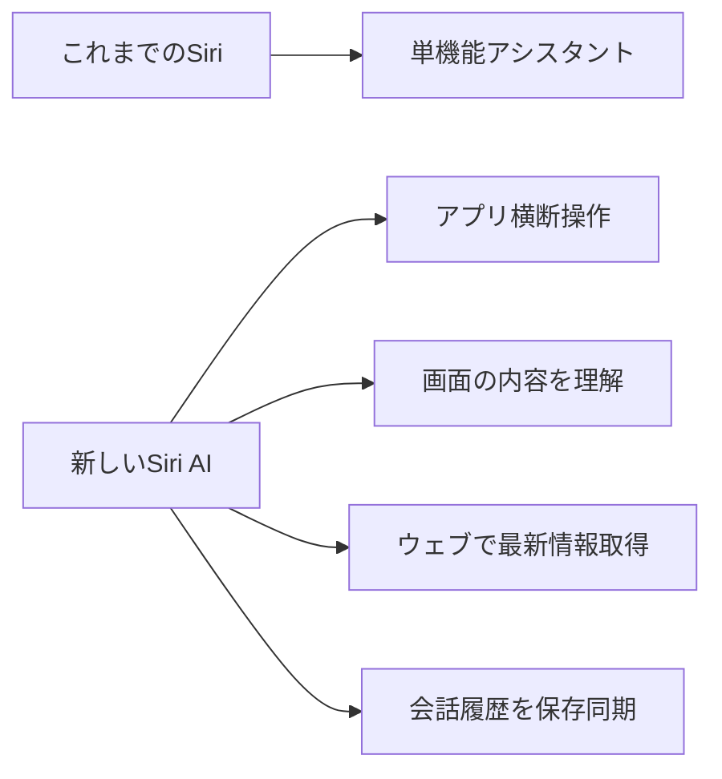

※本記事はアフィリエイト広告(PR)を含みます。

## この記事でわかること

「Siriってあまり使えないよね…」――そんな声が長年つきまとっていたAppleの音声アシスタント「Siri（シリ）」が、ついに大きく生まれ変わります。Appleは米国時間2026年6月8日、年次開発者会議「WWDC（ダブリューダブリューディーシー：世界開発者会議）」で、次期iPhone向けOS「iOS 27」と、AIを統合した新しいSiri「**Siri AI**」を発表しました。

この記事では、**Siri AIとは何か／何が新しくなったのか／自分のiPhoneで使えるのか／日本語にはいつ対応するのか**を、専門用語をかみくだきながら初心者向けに整理します。「結局、自分のiPhoneでいつから便利になるの?」という疑問に答える内容です。

## ① 何が起きたのか

Appleは2026年6月8日のWWDC26基調講演で、iOS 27をはじめとする各種OSの大型アップデートを発表しました。その最大の目玉が「Siri AI」です。

これまでのSiriは「天気を聞く」「アラームをセットする」といった単機能のアシスタントでした。今回のSiri AIは、**複数のアプリを横断して操作できる本格的なAIアシスタント**へと進化しています。

また、技術的な裏側も注目されています。WWDC26の基調講演後、AppleのMachine Learning Research（機械学習研究）チームが「Introducing the Third Generation of Apple's Foundation Models」という記事を公開し、Siri AIを支える新しい基盤モデル（AIの土台となる大規模な学習モデル）について解説しました。

## ② 読者にとって何が嬉しいのか

### Siriがやっと「使えるアシスタント」になる

Appleはプレゼンテーションで、Siri AIが端末の上でユーザーをさまざまに支援できる点を強調しました。具体的には次のようなことができるようになります。

- iPhone画面上部の「Dynamic Island（ダイナミックアイランド：画面上部の黒い表示エリア）」を下にスワイプして、Siri AIで検索したり会話を始めたりできる
- 「メッセージ」「Apple Music」「リマインダー」などのアプリ内で操作を実行できる
- 画面に表示されているコンテンツに関連した質問に答えてくれる
- メッセージ・メール・写真など、複数アプリをまたいだ横断検索ができる
- ウェブにアクセスして最新情報を取得し、回答を生成する
- アプリをまたいだシステム全体での操作（システムワイドなアクション）ができる
- 専用のSiriアプリで会話履歴を管理し、iCloud（アイクラウド：Appleのクラウド保存サービス）で同期できる

つまり、これまでの「単機能のアシスタント」から、**複数アプリを横断する本物のAIアシスタント**へと進化したわけです。AIアシスタントの考え方そのものに興味がある方は、[AIエージェントとは?ChatGPTとの違いと初心者向けの始め方を解説](/2026/06/13/ai-agent-guide/)もあわせて読むと、今回の進化の意味がより理解しやすくなります。

### iPhoneが全体的に速くなる

AIに興味がない人にもメリットがあります。iOS 27ではアプリの起動速度が30%向上し、AirDrop（エアドロップ：Apple端末間でのデータ送信機能）の転送速度は80%高速化されるとのことです。さらに旧型iPhoneの操作レスポンスも改善されるとされています。

### 料金は基本無料

iOS 27は無料アップデートです。Apple Intelligence（アップル・インテリジェンス：AppleのAI機能群）はこれまでも追加のサブスクリプション（月額課金）なしで提供されてきました。

### 裏話：頭脳はGoogleのGemini技術。ただし「そのまま」ではない

Siri AIの基盤となるのは、Appleが2026年2月に発表したGoogleとの提携で、Google Gemini（ジェミニ：GoogleのAI技術）を採用した次世代のApple AI「Apple Foundation Model」です。

ここで誤解されやすい点があります。Appleのソフトウェアエンジニアリング担当上級副社長クレイグ・フェデリギ氏は、「GoogleのGeminiアプリのコードは一切使っていないし、Googleが顧客向けに提供しているモデルも使っていない」と明言しています。つまり**Geminiの技術を土台にしつつ、Apple独自の枠組みで作り直している**ということです。

なお、GeminiやChatGPTなど主要なAIチャットの違いが気になる方は、[ChatGPTとClaudeとGeminiを徹底比較!初心者におすすめのAIチャットはどれ?](/2026/06/09/ai-chat-comparison/)で各サービスの特徴を整理しています。

## ③ 使い方・対応機種・注意点

### 提供開始時期

| 項目 | 内容 |
|---|---|
| iOS 27 本体 | 秋に一般提供（無料アップデート） |
| 開発者向けベータ版 | すでに公開済み |
| パブリックベータ版 | 7月に公開見込み |
| Siri AI | 対応iPhoneで年内にベータ版を提供（まず英語から） |

「ベータ版」とは、正式版の前に試せるお試し版のことです。Siri AIについてAppleは「iPhone 16 Pro」など、Apple Intelligenceに対応したiPhoneで年内にベータ版が**英語で**利用可能になると説明しています。

### 対応機種は「二段構え」に注意

ここが一番大事なポイントです。**OS自体が動く機種**と、**AI機能が使える機種**は別なので混同しないようにしましょう。

| 対象 | 対応機種 |
|---|---|
| iOS 27アップデート | iPhone 11以降、iPhone SE（第2世代）以降 |
| Apple Intelligence対応 | iPhone 15 Pro / 15 Pro Max / iPhone 16シリーズ以降 |

つまり「iOS 27にアップデートできる」=「Siri AIが使える」ではありません。AI機能を使うには、より新しい対応機種が必要になります。買い替えを検討している方は、AI機能を快適に使える端末選びの考え方として[AIノートパソコンの選び方2026|快適に使うための7つのポイント](/2026/06/11/ai-laptop-guide-2026/)も参考になります（端末選びの基本的な考え方は共通します）。

### 日本語対応の時期は「未確定」

AppleはSiri AIについて「年内に、まず英語から提供する」と説明しています。iOS 27本体やApple Intelligenceの一部機能は秋のアップデートで日本でも使えるようになる見込みですが、**Siri AIを日本語で、いつから使えるようになるかは現時点で明確になっていません**。この点は推測せず、Apple公式サイトで最新情報を確認することをおすすめします。

### 地域制限にも注意

- Siri AIは当初英語のみ
- 中国本土は当初非対応
- EU（欧州連合）向けのiOS/iPadOSも当初非対応

### 基盤モデルの構成（技術メモ）

WWDC26では、Appleが第3世代のApple Foundation Models（AFM）として5つのモデルを発表しました。内訳は端末上で動く「オンデバイス」が2つ、クラウド側で動く「Private Cloud Compute（プライベートクラウドコンピュート：Apple独自の安全なクラウド処理）」が3つという構成です。技術的な目玉として、ローカルで動作する20Bモデル（200億パラメータ規模のモデル）を「フラッシュメモリに置く」新しいアーキテクチャ（設計方式）により、薄型の「iPhone Air」でも動くとされています。

## ④ まとめ

今回のポイントを整理します。

- AppleはWWDC26（6月8日発表）で、AIを統合した新Siri「**Siri AI**」を発表
- 複数アプリを横断して操作できる、本格的なAIアシスタントへ進化
- iOS 27は秋に無料提供、AI機能は基本的に追加料金なし
- **iOS 27が動く機種**と**AI機能が使える機種は別物**（AIはiPhone 15 Pro以降など）
- Siri AIはまず英語から。**日本語の提供時期は未確定**
- 技術の土台はGoogle Geminiだが、Apple独自に作り直しており「Googleにデータがそのまま渡る」わけではない

「自分のiPhoneで／日本語で／いつ使えるか」は、機種や地域によって状況が変わります。アップデート前には必ずApple公式サイトで最新情報を確認してください。

## 参考リンク

- [ITmedia NEWS「Siri、ようやく全面刷新へ Appleが『Siri AI』発表」](https://www.itmedia.co.jp/news/articles/2606/09/news063.html)
- [Impress Watch「アップル、Siriを一新 画面認識やアプリ横断操作対応の『Siri AI』」](https://www.watch.impress.co.jp/docs/news/2115446.html)
- [CNET Japan（Yahoo!ニュース）「『iOS 27』発表、AIで進化した新Siri搭載」](https://news.yahoo.co.jp/articles/9de598d3a17f20dbf8befdf73c5cc570999816bb)
- [ITmedia NEWS「『Siri AI』の進化に『Geminiそのまま』の誤解」](https://www.itmedia.co.jp/news/articles/2606/10/news122.html)
