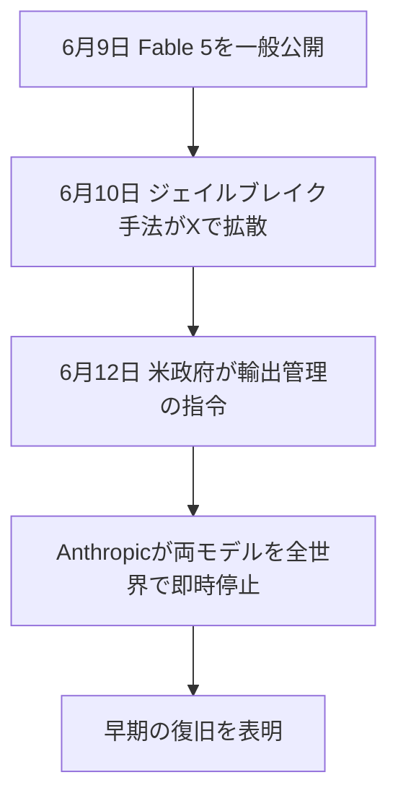

※本記事はアフィリエイト広告(PR)を含む場合があります。

## Claude Fable 5が「公開3日」で全面停止

2026年6月、Anthropicの最上位AIモデル **Claude Fable 5** と **Claude Mythos 5** が、**公開からわずか3日で全面停止**するという異例の事態になりました。原因は、米政府からの**輸出管理に関する指令**です。

> 📌 **続報(6/26)**:その後の復旧交渉の最新は[Claude Fable 5は復活する?復旧交渉の最新と6/26の山場](/2026/06/26/claude-fable-5-recovery-update/)にまとめています。

「先日すごいモデルが出たと聞いたのに、もう使えないの?」と混乱した方も多いはずです。この記事では、**何が起きたのか・なぜ止まったのか・私たちユーザーにどう影響するのか**を、報道をもとに時系列で整理します。

Fable 5自体がどんなモデルだったかは、[Claude Fable 5の解説記事](/2026/06/11/claude-fable-5-guide/)もあわせてご覧ください。

## 何が起きたのか(時系列)

- **6月9日**:Anthropicが Claude Fable 5 を一般公開(Mythos 5 は限定プログラム向け)
- **6月10日**:Fable 5の安全装置を回避する「ジェイルブレイク」手法がX上で公開され、拡散
- **6月12日**:米政府が国家安全保障上の権限にもとづき、**外国籍ユーザーのアクセスを止めるよう指令**(書簡が届いたのは米東部時間の夕方)
- 結果:Anthropicは Fable 5 と Mythos 5 を **全世界の全ユーザーに対して即時停止**

## なぜ「全ユーザー」が止まったのか

指令は「**外国籍の人物によるアクセスを止めること**」を求めるものでした。しかし、サービス側でユーザーの国籍をリアルタイムに正確に判別することはできません。そのため、確実に指令を守るには**全員に対して止めるしかなかった**、というのが全面停止の理由です。

報道によると、これは**米商務省によるAIモデルへの初めての輸出管理指令**とされ、AI業界にとって前例のない出来事でした。

## 止まったモデル・止まっていないモデル

停止の対象は **Fable 5 と Mythos 5 の2つだけ**です。日常的に使われる他のモデルは通常どおり利用できます。

| モデル | 状態 |
|---|---|
| Claude Fable 5 | ⛔ 停止 |
| Claude Mythos 5 | ⛔ 停止 |
| Claude Opus 4.8 | ✅ 利用可 |
| Claude Sonnet 4.6 | ✅ 利用可 |
| Claude Haiku 4.5 | ✅ 利用可 |

つまり、**普段Claudeを使っている人の多くは影響を受けません**。最上位の2モデルだけが一時的に使えなくなった、という整理です。

## Anthropicの反応

Anthropic側は、停止に応じつつも次のように説明していると報じられています。

- 安全装置は公開前に**数千時間のテスト**で検証済みだった
- 確認された脆弱性は軽微かつ既知のもので、**他社の公開モデル(例:OpenAIのGPT-5.5)にも同等の能力は広く存在する**
- そのうえで指令には従い、**早期の復旧を目指す**意向を表明

## 私たちユーザーへの影響と今後

### 普段の利用は基本そのまま

繰り返しになりますが、Opus 4.8・Sonnet 4.6・Haiku 4.5は通常どおり。**最上位のFable 5を使う一部の上級用途**(超大規模な開発や研究など)を除けば、多くの人の使い勝手は変わりません。

### いつ戻る?

本記事の執筆時点では、復旧の正確な時期は未定です。Anthropicは早期復旧の意向を示していますが、**政府の指令が絡むため見通しは流動的**です。最新状況は公式発表や報道でご確認ください。

### 今回の出来事が示すもの

AIの能力が上がるほど、**安全性と国家安全保障の観点からの規制**が現実の論点になってきた、という象徴的な出来事です。今後、最先端モデルの「公開のあり方」に影響していく可能性があります。

## よくある質問

### 自分のClaudeアプリは使える?

はい。一般的なClaude(Opus/Sonnet/Haiku)は影響を受けていません。停止は最上位の2モデルのみです。

### 課金していたら返金される?

提供形態や契約により異なります。該当する場合は、利用していたサービスの公式案内を確認してください。

## まとめ

- **Claude Fable 5・Mythos 5**が、公開3日で**米政府の輸出管理指令により全面停止**
- 引き金は、安全装置を回避する**ジェイルブレイク手法の拡散**
- 国籍を判別できないため、**全ユーザーに対して停止**する形に
- **他のClaudeモデル(Opus 4.8・Sonnet 4.6・Haiku 4.5)は通常どおり利用可能**
- Anthropicは指令に従いつつ**早期復旧を表明**。時期は流動的

AIをめぐる状況は日々動いています。最新情報は[Anthropicの公式発表](https://www.anthropic.com/)や信頼できる報道でチェックしましょう。

### 参考リンク

- [「Claude Fable 5」「Mythos 5」全面停止 米政府の指令により Anthropicは早期復旧を宣言(ITmedia NEWS)](https://www.itmedia.co.jp/news/articles/2606/13/news026.html)
- [アンソロピック、Fable 5などミュトス級AIモデルを公開停止 米国政府が指令(Impress Watch)](https://www.watch.impress.co.jp/docs/news/2116932.html)
- [Anthropic、Claude Fable 5／Mythos 5へのアクセスを停止(gihyo.jp)](https://gihyo.jp/article/2026/06/suspend-access-to-fable-5-and-mythos-5)
