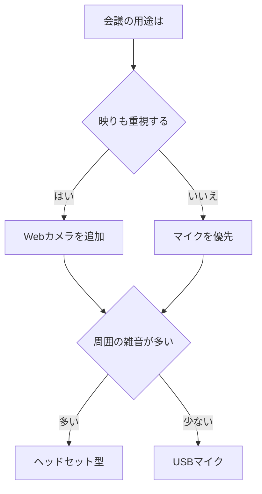

※本記事はアフィリエイト広告(PR)を含みます。

## この記事でわかること

「オンライン会議で自分の映りや声がイマイチ気になる…」「Webカメラやマイクを買い替えたいけど、何を選べばいいの?」——そんな悩みを持つ方に向けた記事です。

この記事を読むと、次のことがわかります。

- オンライン会議の印象を左右する**Webカメラ・マイクの選び方**
- 初心者でも失敗しにくい**チェックポイント**
- 予算や用途に合わせた**機材の選び分け**
- ノートパソコン内蔵のカメラ・マイクで十分かどうかの判断基準

結論から言うと、オンライン会議の印象は「画質」よりも実は**音質**の影響が大きいと言われています。聞き取りやすい声は、それだけで相手に好印象を与えます。まずはマイク、次にカメラ、という優先順位を意識すると失敗しにくいですよ。

## なぜ専用のWebカメラ・マイクが必要なの?

最近のノートパソコンには、カメラとマイクが最初から内蔵されています。「それで十分では?」と思う方も多いでしょう。

たしかに短い打ち合わせなら内蔵機材でも問題ありません。ただし、次のような場面では専用機材の差がはっきり出ます。

- **重要な商談やオンライン面接**で、相手に良い印象を残したいとき
- **長時間の会議**で、声がこもって聞き取りにくいと指摘されたとき
- **顔が暗く映る**、または画質が荒くて表情が伝わりにくいとき

内蔵カメラは画角(映る範囲)や画質が固定されていることが多く、内蔵マイクは周囲の雑音を拾いやすい傾向があります。専用機材を使うだけで、相手の「聞きやすさ」「見やすさ」が大きく改善されるのです。

## Webカメラの選び方

### 画質(解像度)で選ぶ

Webカメラの画質は「解像度」という数値で表されます。代表的なものは次の2つです。

| 解像度 | 特徴 | おすすめの人 |
|---|---|---|
| フルHD(1080p) | きれいで自然な映り。現在の主流 | 一般的な会議・面接 |
| 4K | 非常に高精細。データ量も大きい | 配信・撮影もこなしたい人 |

初心者の方は、まず**フルHD(1080p)対応**を選んでおけば間違いありません。4Kは魅力的ですが、相手側の通信環境によっては画質が落とされてしまうため、会議用途ではフルHDで十分なケースが多いです。

### オートフォーカスと画角

**オートフォーカス**(自動でピントを合わせる機能)があると、少し動いても顔がボケにくく便利です。

また「画角」も大切なポイント。画角が広いと背景まで広く映り、狭いと顔がアップになります。一人で使うなら狭め〜標準、複数人で同じカメラを使うなら広角がおすすめです。

### 明るさ補正機能

部屋が暗いと顔が沈んで見え、印象が悪くなりがちです。**自動で明るさを補正してくれる機能**(オートライト補正などと呼ばれます)があると、逆光や暗い環境でも顔が見やすく映ります。

👉 [Amazonで「Webカメラ フルHD オートフォーカス」を見る](https://www.amazon.co.jp/s?k=Web%E3%82%AB%E3%83%A1%E3%83%A9%20%E3%83%95%E3%83%ABHD%20%E3%82%AA%E3%83%BC%E3%83%88%E3%83%95%E3%82%A9%E3%83%BC%E3%82%AB%E3%82%B9)

## マイクの選び方

前述のとおり、オンライン会議では音質の印象がとても重要です。マイクには大きく3つのタイプがあります。

### タイプ別の特徴

| タイプ | メリット | デメリット |
|---|---|---|
| ヘッドセット型 | 口元で拾うので雑音に強い | 見た目がカジュアル |
| 据え置き(USBマイク) | 音質が良く本格的 | 設置スペースが必要 |
| イヤホン内蔵マイク | 手軽でコンパクト | 音質は控えめ |

「とにかく声をクリアに届けたい」なら、口元で拾える**ヘッドセット型**が最も失敗しにくい選択です。デスク周りをすっきりさせたい、声の質にこだわりたいなら**USBマイク**が向いています。

なお、ワイヤレスイヤホンのマイクで会議をする方も増えています。イヤホン選びについては[テレワーク向けワイヤレスイヤホンの選び方](/2026/06/13/wireless-earphones-telework/)で詳しく解説しているので、あわせてご覧ください。

### ノイズキャンセリング機能

**ノイズキャンセリング**(周囲の雑音を抑える機能)が付いていると、生活音やキーボードの打鍵音が相手に届きにくくなります。在宅で家族の声や外の音が気になる方には、ほぼ必須の機能と言えます。

👉 [楽天市場で「USBマイク ノイズキャンセリング」を探す](https://af.moshimo.com/af/c/click?a_id=5632328&p_id=54&pc_id=54&pl_id=616&url=https%3A%2F%2Fsearch.rakuten.co.jp%2Fsearch%2Fmall%2FUSB%25E3%2583%259E%25E3%2582%25A4%25E3%2582%25AF%2520%25E3%2583%258E%25E3%2582%25A4%25E3%2582%25BA%25E3%2582%25AD%25E3%2583%25A3%25E3%2583%25B3%25E3%2582%25BB%25E3%2583%25AA%25E3%2583%25B3%25E3%2582%25B0%2F)

## 目的別・選び方フローチャート

自分にどのタイプが合うか迷ったら、次の図を参考にしてみてください。

映りも声も両方こだわりたい場合は、Webカメラと単体マイクを組み合わせるのがベストです。まず一つだけ買うなら、用途に合わせてマイクから始めるのがおすすめです。

## 印象をさらに良くするちょっとした工夫

機材を揃えるだけでなく、次のポイントを意識するとオンライン会議の印象がぐっと良くなります。

- **顔の正面に光を当てる**:窓を背にせず、明るい方を向くだけで表情が見やすくなります
- **カメラを目線の高さに合わせる**:見下ろす角度を避けると自然な印象に
- **背景を整理する**:すっきりした背景は信頼感につながります

デスク周りの環境づくり全般については[在宅ワークが捗るデスク周りガジェット10選](/2026/06/11/home-office-gadgets/)も参考になります。照明やモニター位置の工夫も合わせて取り入れると効果的です。

## よくある質問(Q&A)

### Q. 無料で会議の音質や画質を良くする方法はある?

はい、まずはお金をかけずにできる工夫から試すのがおすすめです。

- 会議アプリ側の**ノイズ抑制機能**をオンにする(ZoomやTeamsに搭載されています)
- カメラの正面に明かりを置く
- 静かな部屋を選ぶ

これらだけでも体感はかなり変わります。それでも物足りなければ機材投資を検討する、という順番が無駄がありません。

### Q. Webカメラとマイクは一体型と単体型どちらがいい?

手軽さなら**マイク内蔵のWebカメラ(一体型)**、音質・画質それぞれを追求するなら**単体型**です。初めての一台で「とりあえず両方改善したい」なら一体型から始め、不満が出たらマイクだけ単体に切り替える、というステップが現実的です。

### Q. オンライン会議の議事録づくりも効率化したい

会議の準備や記録もまとめて効率化したい方には、AIを使った議事録ツールが便利です。詳しくは[AIで議事録作成を自動化する方法](/2026/06/10/ai-meeting-minutes/)で紹介しています。良い音質で録音できると、AIの文字起こし精度も上がりますよ。

## 購入前に確認したいこと

機材を選ぶ際は、次の点を必ずチェックしましょう。

- **接続方式**:USBタイプが最も手軽。お使いのパソコンの端子を確認
- **対応OS**:WindowsとMacの両方に対応しているか
- **価格と最新仕様**:モデルや在庫状況で変わるため、購入前に**公式サイトや販売ページで最新情報を必ず確認してください**

特に価格は時期によって変動します。記事中で具体的な金額を断定していないのはこのためで、実際の購入時には最新の情報を確かめることをおすすめします。

## まとめ

オンライン会議の印象を良くするWebカメラ・マイク選びのポイントを振り返ります。

- 印象を左右するのは画質よりも**音質**。まずはマイクから検討する
- Webカメラは**フルHD対応・明るさ補正あり**が初心者に安心
- マイクは雑音が気になるなら**ヘッドセット型**、音質重視なら**USBマイク**
- ノイズキャンセリング機能があると在宅環境でも安心
- 機材だけでなく**照明・カメラ位置・背景**の工夫も効果的
- 価格や仕様は変動するため、購入前に公式情報を確認する

ちょっとした機材の見直しだけで、相手に与える印象は大きく変わります。まずは今のお悩み(声が聞き取りにくい/顔が暗いなど)に合わせて一つずつ改善してみてください。快適なオンライン会議環境づくりの第一歩になるはずです。
