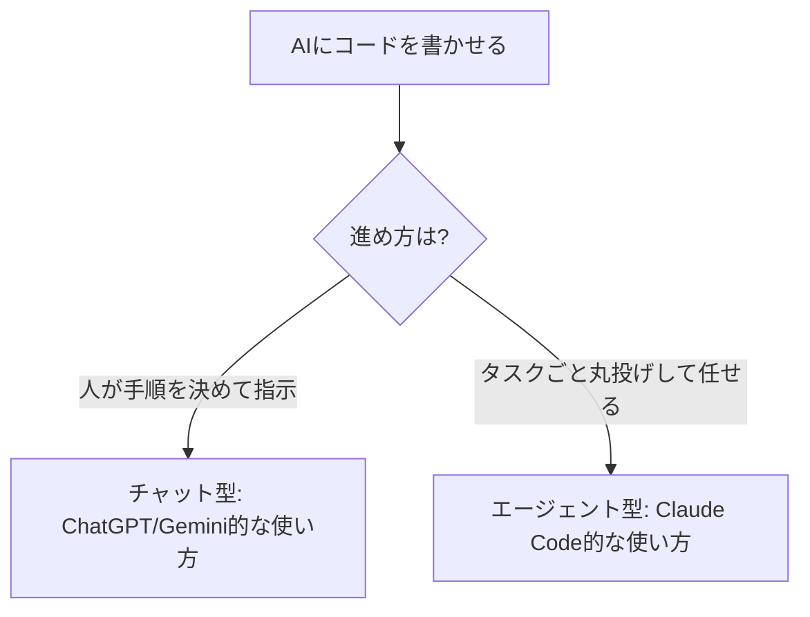

※本記事はアフィリエイト広告(PR)を含みます。

## コーディングこそ、AIの「差」が出る

文章作成や雑談ではどのAIも優秀になりましたが、**プログラミングは各AIの実力差がはっきり出る分野**です。「結局、コードを書かせるならどれが一番いいの?」——この記事では、ChatGPT・Claude・Geminiを**コーディング用途に絞って**比較します。

各サービスの一般的な違い(料金や使い勝手の全体像)は、[ChatGPT・Claude・Geminiの総合比較記事](/2026/06/09/ai-chat-comparison/)もあわせてご覧ください。本記事は**プログラミング特化版**です。

## 結論:コーディング比較早見表(2026年6月時点)

| AI | コーディング性能 | 強み | 専用ツール |
|---|---|---|---|
| Claude(Anthropic) | 最高クラス | コードの読みやすさ・自律実行 | Claude Code |
| ChatGPT(OpenAI) | 最高クラス | 総合力・情報量・周辺機能 | Codex CLI |
| Gemini(Google) | 高い | 超長文脈・無料枠・Google連携 | Gemini CLI |

各種ベンチマーク(SWE-bench Verifiedなど、実際のバグ修正課題でAIを評価する指標)では、**Claudeの最上位モデルが頭ひとつ抜けてトップ**、次いでChatGPTのコーディング特化モデル、Geminiが続く、という結果が報じられています。

ただし注意したいのは、**上位モデル同士の差はごくわずかに縮まっている**こと。「どれを選んでも基本的には十分強い」というのが2026年の実情です。

## 各AIのコーディング特性

### Claude:コードの質と「自律実行」が強み

Claudeは、**簡潔で読みやすいコード**を書くことに定評があります。命名規則やスタイルの一貫性が高く、余計な説明を入れすぎないため、実務でそのまま使いやすいのが特徴です。

最大の武器が、付属の**Claude Code**。これは単なるチャットではなく、**タスクを丸ごと任せると、自分で計画→実行→エラー修正まで進める「エージェント型」**のツールです。「このバグを直して」と頼むと、関連ファイルを横断的に読んで修正まで仕上げてくれます。

なお、最上位モデルはさらに高性能ですが、先日は[最上位モデルが公開3日で停止する出来事](/2026/06/15/claude-fable-5-suspended/)もありました。日常のコーディングは、安定して使える主力モデルで十分戦えます。

### ChatGPT:総合力と周辺エコシステム

ChatGPTは、コーディング性能も最高クラスでありつつ、**画像・音声・最新情報の検索など周辺機能が充実**しているのが強みです。コーディング特化の**Codex**系も用意され、開発ワークフロー全体をカバーできます。

「コードも書きたいが、設計の相談・資料作成・調べ物も1つで済ませたい」という**オールラウンドな使い方**に向いています。

### Gemini:超長文脈・無料枠・Google連携

Geminiの武器は、**最大100万トークンクラスの超長い文脈**。巨大なコードベースや長い仕様書をまるごと読ませる用途で強みを発揮します。

コマンドラインツールの**Gemini CLI**は**オープンソースで無料枠**があり(毎分のリクエスト制限あり)、「まずお金をかけずに試したい」人の入口に最適です。Googleサービスとの連携もスムーズです。

## 重要:「チャット型」と「エージェント型」の違い

プログラミングでAIを使うとき、大きく2つのスタイルがあります。

- **チャット型**:人が「次はこれをやって」と1ステップずつ指示する。学習中や、細かく制御したいときに向く
- **エージェント型(CLI)**:タスクを丸ごと任せ、AIが自分で複数ファイルを編集・実行・修正する。実装スピードを最大化したいときに向く

2026年の開発現場は、チャットから**「CLIエージェント」**へ主戦場が移りつつあります。Claude Code・Codex CLI・Gemini CLIは、いずれもこのエージェント型の代表格です。

## 用途別:どれを選ぶ?

- **コードの質・大規模な改修を任せたい** → **Claude(Claude Code)**
- **コーディング＋調べ物・資料作成も1つで** → **ChatGPT**
- **無料で試したい・巨大なコードを読ませたい** → **Gemini(Gemini CLI)**
- **プログラミング学習中で基礎から** → まず無料のGeminiやChatGPTで“対話しながら”がおすすめ

学習目的なら、AIとの付き合い方そのものが重要です。挫折しないコツは[プログラミング学習にAIを活用する方法](/2026/06/13/ai-programming-study/)で詳しく解説しています。

## コスト面の注意点

コーディングでAIをヘビーに使うと、**料金プランの「使い方ルール」が効いてきます**。各プランの料金は[AIサブスク料金比較の記事](/2026/06/16/ai-subscription-pricing-2026/)にまとめていますが、特に自動化(エージェント)利用は要注意です。

実際、Anthropicは自動化利用を別料金にする変更を予告し、[実施当日に撤回する](/2026/06/16/claude-agent-billing-reversed/)など、料金体系はまだ流動的です。**ヘビーに使う予定なら、各サービスの最新の利用条件を必ず公式で確認**してください。

## 始め方・学習リソース

まずは無料枠で各ツールを触り、自分の書き方に合うものを見つけるのが近道です。体系的に学びたい人は、入門書や[生成AIが学べるオンラインスクール](/2026/06/13/ai-online-school-guide/)も選択肢になります。

👉 [Amazonで「AI プログラミング 活用 本」を見る](https://af.moshimo.com/af/c/click?a_id=5632371&p_id=170&pc_id=185&pl_id=38594&url=https%3A%2F%2Fwww.amazon.co.jp%2Fs%3Fk%3DAI%2520%25E3%2583%2597%25E3%2583%25AD%25E3%2582%25B0%25E3%2583%25A9%25E3%2583%259F%25E3%2583%25B3%25E3%2582%25B0%2520%25E6%25B4%25BB%25E7%2594%25A8%2520%25E6%259C%25AC)

## よくある質問

### 初心者が最初に使うなら?

**無料で始められるGeminiかChatGPT**がおすすめです。対話しながら「なぜそのコードになるか」を聞けるので、学習に向いています。慣れてきたら、実装スピード重視でClaude Codeに進むと効果を実感しやすいです。

### 本格的に開発するならどれ?

コードの質と自律的な実装力で**Claude(Claude Code)**を選ぶ開発者が増えています。ただしChatGPTのCodexも非常に強力で、好みやチームの環境で選んで問題ありません。

### 1つに絞るべき?複数使うべき?

理想は**用途で使い分け**ですが、コストと学習コストを考えると、まずは1つを深く使いこなすのが現実的です。不満が出たら乗り換え・併用を検討しましょう。

### ベンチマークの順位は信用できる?

参考にはなりますが、**数値は時期・条件で頻繁に入れ替わります**。最終的には「自分のコードで試して合うか」が一番確実です。

## まとめ

- コーディング性能は**Claudeの最上位モデルがトップクラス**、ChatGPT・Geminiも僅差で強い
- **Claude=コードの質と自律実行**、**ChatGPT=総合力**、**Gemini=長文脈・無料枠・Google連携**
- 2026年は**チャット型からCLIエージェント型へ**主戦場が移行中
- 迷ったら**無料枠で触り比べ→用途に合うものを深掘り**が失敗しない選び方

プログラミングは、AIを使いこなせる人とそうでない人の差が一番大きく出る分野です。まずは気軽に触って、自分の相棒になる1本を見つけてください。

### 参考リンク

- [Claude vs GPT vs Gemini: Coding Benchmark Leaderboard(Tygart Media)](https://tygartmedia.com/claude-vs-gpt-vs-gemini-coding-benchmark/)
- [【2026年6月最新】AIコーディングCLI徹底比較(GenAI)](https://genai-ai.co.jp/ai-kanri/blog/cc-ai-coding-cli-comparison-2/)
- [ChatGPT vs Claude vs Gemini (June 2026)(Morphllm)](https://www.morphllm.com/comparisons/chatgpt-vs-claude-vs-gemini)
