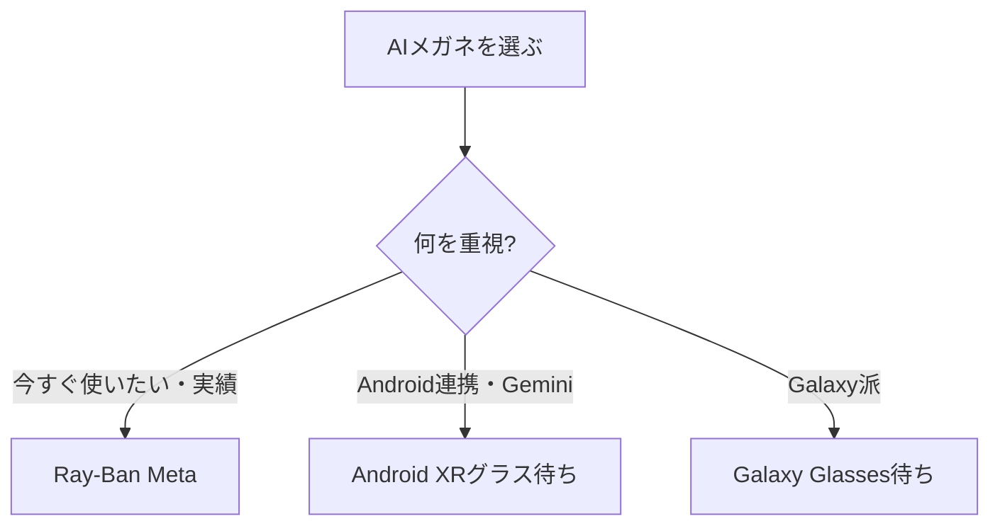

※本記事はアフィリエイト広告(PR)を含みます。

## 2026年は「AIメガネ元年」

スマホの“次”として一気に注目を集めているのが、**AIメガネ(スマートグラス)**です。カメラとマイクを内蔵し、**見たもの・聞いたものをAIが理解してサポート**してくれる——SF映画のようなデバイスが、2026年についに実用段階に入りました。

きっかけは、世界シェア7割超を握る **Ray-Ban Meta** の日本上陸(2026年5月)。さらにGoogleやSamsungも参入し、市場が一気に動き出しています。

この記事では、**主要なAIメガネの特徴・できること・選び方**を、初心者向けにわかりやすく整理します。

## そもそもAIメガネで何ができる?

- **ハンズフリーで写真・動画撮影**:目の前の風景をそのまま記録
- **AIに話しかけて質問**:「これ何?」と聞くと、見ているものを認識して答えてくれる(対応機種)
- **オープンイヤーで音楽・通話**:イヤホン不要で音声を聞ける
- **リアルタイム翻訳・ナビ**(ディスプレイ搭載型の今後の本命機能)

ポイントは、**スマホを取り出さずに「ながら」で使える**こと。両手がふさがっている料理中・移動中・子育て中などに真価を発揮します。

## 主要AIメガネ比較(2026年6月時点)

| 製品 | 特徴 | 状況 |
|---|---|---|
| Ray-Ban Meta(Meta) | 世界シェア7割超。カメラ・音声・Meta AI搭載 | 日本販売中 |
| Android XRグラス(Google) | Gemini搭載。音声型が先行予定 | 2026年秋ごろ予定 |
| Galaxy Glasses(Samsung) | 約50gの軽量。Android XR採用(噂) | 登場前(リーク段階) |

※発売時期・仕様・対応機能は変更されることがあります。**購入前に必ず各メーカーの公式情報を確認してください。**

### Ray-Ban Meta(現状の鉄板)

Ray-Banの定番デザインに、カメラ・オープンイヤーオーディオ・ハンズフリー通話・Meta AIを搭載。**今すぐ買える完成度の高いAIメガネ**として、世界で圧倒的なシェアを持っています。「まずAIメガネを体験したい」人の本命です。

### Android XRグラス(Google / Gemini搭載)

GoogleのAIアシスタント**Gemini**を搭載し、Android XRプラットフォームで動作。まずスピーカー・マイク内蔵の**オーディオ型が2026年秋に先行**し、ディスプレイ搭載型は今後の登場が見込まれています。Androidスマホユーザーとの相性が良さそうです。

### Galaxy Glasses(Samsung)

軽量(約50g)でRay-Ban Metaに近い装着感とされ、Snapdragonチップ搭載が噂されています。まだ登場前ですが、**Galaxyスマホとの連携**に期待が集まっています。

## 失敗しない選び方の3ポイント

1. **今すぐ欲しいか、待てるか**:実機で完成度が高いのはRay-Ban Meta。最新機能を待てるならGoogle/Samsungも候補
2. **使っているスマホとの相性**:iPhone/Androidどちらか、普段のエコシステムに合わせる
3. **重さ・かけ心地**:毎日かけるものなので、軽さとデザインは超重要

## 買う前に知っておきたい注意点

- **プライバシーへの配慮**:カメラ付きのため、撮影マナー(盗撮と誤解されない配慮)が必要です
- **バッテリー**:小型ゆえに連続使用時間は短め。こまめな充電が前提
- **日本語のAI機能**:音声アシスタントの日本語対応状況は機種・時期で差があります

カメラやマイクの基礎知識は、[Webカメラ・マイクのおすすめ機材記事](/2026/06/15/webcam-mic-online-meeting/)も参考になります。音声を聞く快適さを重視するなら、[ワイヤレスイヤホンの選び方](/2026/06/13/wireless-earphones-telework/)の考え方も通じます。

## まずは実機・関連アイテムをチェック

最新の在庫・価格は通販でチェックするのが早いです。

👉 [Amazonで「スマートグラス AIメガネ」を見る](https://af.moshimo.com/af/c/click?a_id=5632371&p_id=170&pc_id=185&pl_id=38594&url=https%3A%2F%2Fwww.amazon.co.jp%2Fs%3Fk%3D%25E3%2582%25B9%25E3%2583%259E%25E3%2583%25BC%25E3%2583%2588%25E3%2582%25B0%25E3%2583%25A9%25E3%2582%25B9%2520AI%25E3%2583%25A1%25E3%2582%25AC%25E3%2583%258D)

👉 [楽天市場で「スマートグラス」を探す](https://af.moshimo.com/af/c/click?a_id=5632328&p_id=54&pc_id=54&pl_id=616&url=https%3A%2F%2Fsearch.rakuten.co.jp%2Fsearch%2Fmall%2F%25E3%2582%25B9%25E3%2583%259E%25E3%2583%25BC%25E3%2583%2588%25E3%2582%25B0%25E3%2583%25A9%25E3%2582%25B9%2F)

## よくある質問

### 視力が悪くても使える?

多くの機種で度付きレンズに対応(または対応予定)しています。購入時にレンズオプションを確認しましょう。

### スマホがないと使えない?

基本的にはスマホと連携して使う製品が中心です。スマホアプリで設定・データ管理を行います。

### 今買うならどれ?

**「今すぐ・確実に使いたい」ならRay-Ban Meta**が鉄板です。Android連携やディスプレイ表示にこだわるなら、GoogleのAndroid XRグラスを待つ手もあります。

## まとめ

- 2026年は**AIメガネ元年**。Ray-Ban Metaの日本上陸で一気に身近に
- **今すぐ買うならRay-Ban Meta**、**待てるならGoogle/Samsung**も有力候補
- 選び方は「**今すぐ欲しいか**」「**スマホとの相性**」「**軽さ・デザイン**」の3点
- プライバシー配慮とバッテリーには注意

スマホの次の主役になるかもしれないAIメガネ。まずは話題のRay-Ban Metaから、新しい体験をのぞいてみてはいかがでしょうか。

### 参考リンク

- [Ray-Ban Metaがついに日本上陸(Mogura VR News)](https://www.moguravr.com/ray-ban-meta-japan-launch-muse-spark-ai-glasse/)
- [Google I/O 2026 Android XR スマートグラス解説(株式会社オブライト)](https://www.oflight.co.jp/ja/columns/google-android-xr-eyewear-io-2026)
- [Samsung初のAIスマートグラス「Galaxy Glasses」リーク(すまほん!!)](https://smhn.info/202605-samsung-galaxy-glasses-ai-smart-glasses-leak-ray-ban-meta)
