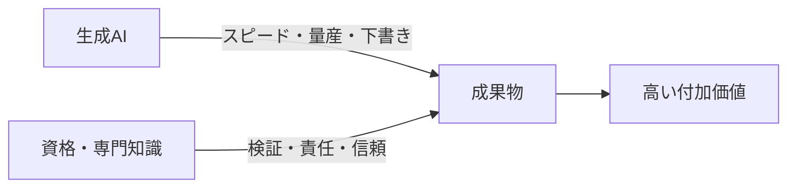

※本記事はアフィリエイト広告(PR)を含みます。

## 「AIがあれば資格はいらない」は本当か?

生成AIが一気に普及して、「もう資格を取っても意味がないのでは?」という声をよく聞くようになりました。たしかに、知識を“暗記しているだけ”の価値は下がっています。AIに聞けば答えが返ってくるからです。

しかし、現場で起きているのはむしろ逆の現象です。**「資格 × 生成AI」をかけ合わせられる人の市場価値が、急上昇している**のです。

この記事では、**なぜ資格とAIの相性が良いのか**、そして**かけ合わせると特に強い資格8選**を、理由と具体的な活かし方つきで紹介します。

## なぜ「資格 × 生成AI」は強いのか

生成AIは「**速く・大量に・それっぽく**」アウトプットを作るのが得意です。一方で、その出力が**本当に正しいか、法的・実務的に問題ないかを判断する力**は持っていません。

ここを担保できるのが**資格者**です。

- **AI** = 下書き・たたき台を一瞬で作る
- **資格者** = その内容を検証し、責任を持って世に出せる

つまり、AIの弱点(間違いを自信満々に出す=ハルシネーション)を、専門知識で打ち消せる人が最強になります。「**AIに仕事を奪われる人**」ではなく「**AIを使いこなして仕事を増やす人**」になれるわけです。

## 生成AIとかけ合わせると強い資格8選

| 資格 | 掛け算で生まれる強み |
|---|---|
| 簿記・会計 | 仕訳・経営分析・レポート作成をAIで高速化 |
| 宅建士 | 物件説明文・契約書チェックの下書きを量産 |
| FP(ファイナンシャルプランナー) | ライフプラン提案・家計分析を瞬時に |
| 社労士・行政書士 | 書類ドラフト・条文検索・問い合わせ対応 |
| Webライティング/SEO系 | 記事構成・量産とAI出力の品質担保 |
| TOEIC・語学系 | 翻訳の精度チェックとグローバル対応 |
| ITパスポート・基本情報 | 社内のAI導入・DX推進の橋渡し役 |
| 中小企業診断士 | 経営分析・提案資料作成を効率化 |

### 1. 簿記・会計

経理は生成AIと最も相性の良い分野のひとつです。**仕訳の下調べ、月次レポートの文章化、経営数値の分析コメント**などをAIに任せ、最終的な正確性を簿記の知識で担保します。数字に責任を持てる人は、AIの普及でむしろ重宝されます。

### 2. 宅建士(宅地建物取引士)

不動産は文章作業の宝庫です。**物件紹介文、メール返信、契約書や重要事項説明書の下書きチェック**などをAIで高速化できます。ただし重要事項説明などの**独占業務は有資格者しかできない**ため、AIに置き換えられない強さがあります。

### 3. FP(ファイナンシャルプランナー)

家計・保険・資産運用の相談は、AIで提案の幅とスピードが一気に上がります。**ライフプランのシミュレーション、家計の見える化、提案書づくり**をAIに任せ、人にしかできない寄り添った提案に集中できます。家計管理の自動化は[AI家計簿アプリの活用法](/2026/06/15/ai-household-budget-app/)も参考になります。

### 4. 社労士・行政書士などの士業

書類作成と条文の調査が中心の士業は、生成AIの恩恵が非常に大きい分野です。**申請書類のドラフト、条文の要約、顧客への一次回答**などを効率化できます。ここでも、最終的な判断と署名は有資格者にしかできないため、独占業務という“堀”がそのまま強みになります。

### 5. Webライティング・SEO系の検定

AIで記事は量産できますが、**そのまま出すと不正確・無個性になりがち**です。構成設計・ファクトチェック・読者目線の編集ができるライターは、AI時代にこそ価値が上がります。AIでの記事制作の流れは[AIでブログ記事を書く方法](/2026/06/12/ai-blog-writing-guide/)で詳しく解説しています。

### 6. TOEIC・語学系の資格

翻訳AIは便利ですが、**ニュアンスの誤り・固有名詞・文脈の取り違え**は人がチェックする必要があります。語学力があれば、AI翻訳を下訳に使って**スピードと品質を両立**できます。学習自体も[AI英会話アプリ](/2026/06/14/ai-english-apps/)で効率化できる時代です。

### 7. ITパスポート・基本情報技術者

専門のエンジニアでなくても、**ITの基礎用語とAIの仕組みを理解している人**は、社内で「AI導入を進める人」として重宝されます。現場とエンジニアの“通訳”ができる人材は、どの会社でも不足しています。プログラミングの基礎は[AIを活用した学習法](/2026/06/13/ai-programming-study/)から始めるのもおすすめです。

### 8. 中小企業診断士

経営コンサルの分野でも、**市場分析・SWOT整理・提案資料の作成**をAIで大幅に時短できます。経営の知識でAIの分析を磨き上げられる人は、副業や独立でも強い武器になります。

## 「資格 × AI」を副業・キャリアにどう活かすか

- **本業で評価される**:同じ資格でもAIを使える人は処理量が段違いで、社内で頼られる存在になります。
- **副業につなげる**:資格 × AIで作業を高速化できれば、空き時間でも案件をこなせます。最終的には[AIを活用した一人会社・スモールビジネス](/2026/06/14/ai-solo-company/)という選択肢も見えてきます。
- **転職・独立で差別化**:「資格保有 × AI実務経験」は、まだ持っている人が少ない希少な組み合わせです。

## 注意点:AIに“丸投げ”はしない

最後に大切な注意点です。

- **AIの出力は必ず検証する**:法律・税務・医療など、間違いが許されない分野ほど人のチェックが必須です。
- **独占業務・倫理を守る**:資格が必要な業務をAIだけで完結させてはいけません。AIはあくまで補助です。
- **情報の取り扱いに注意**:顧客情報や機密情報を安易にAIに入力しないなど、各資格の倫理規定・社内ルールを守りましょう。

## 学び方:独学かスクールか

生成AIスキルは、入門書での独学でも始められますが、**資格と組み合わせて実務レベルまで引き上げたい**なら体系的に学ぶのが近道です。給付金で受講料が戻る制度もあるため、[生成AIが学べるオンラインスクールの選び方](/2026/06/13/ai-online-school-guide/)もあわせて検討してみてください。

まずは1冊、生成AIの使いこなし本で基礎を固めるのもおすすめです。

👉 [Amazonで「生成AI 仕事術 本」を見る](https://af.moshimo.com/af/c/click?a_id=5632371&p_id=170&pc_id=185&pl_id=38594&url=https%3A%2F%2Fwww.amazon.co.jp%2Fs%3Fk%3D%25E7%2594%259F%25E6%2588%2590AI%2520%25E4%25BB%2595%25E4%25BA%258B%25E8%25A1%2593%2520%25E6%259C%25AC)

## よくある質問

### 生成AIがあれば、これから資格を取る意味はない?

いいえ。むしろ「**AIの出力を検証し、責任を持てる人**」の価値が上がっています。資格は、その専門性と信頼を証明する“堀”になります。

### 文系でも「資格 × AI」で戦える?

戦えます。簿記・宅建・FP・士業・語学など、文系で取れる資格ほど文章作業が多く、生成AIとの相性が抜群です。

### どの資格から始めればいい?

今の仕事に近い資格が一番活きます。経理なら簿記、営業や不動産なら宅建、家計や保険ならFP、といった具合に、**本業の延長線上**で選ぶと相乗効果が大きくなります。

## まとめ

- 「AIがあれば資格は不要」ではなく、「**資格 × 生成AI**」で市場価値が上がる時代
- AIは**下書き・量産**、資格者は**検証・責任**——この掛け算が最強
- 簿記・宅建・FP・士業・ライティング・語学・IT基礎・診断士などは特に相性が良い
- ただし**AIに丸投げせず、独占業務と倫理を守る**ことが大前提

資格もAIも、どちらか一方では“その他大勢”です。**かけ合わせて初めて希少な人材**になれます。今持っている資格、これから取る資格に、ぜひ生成AIを組み合わせてみてください。
