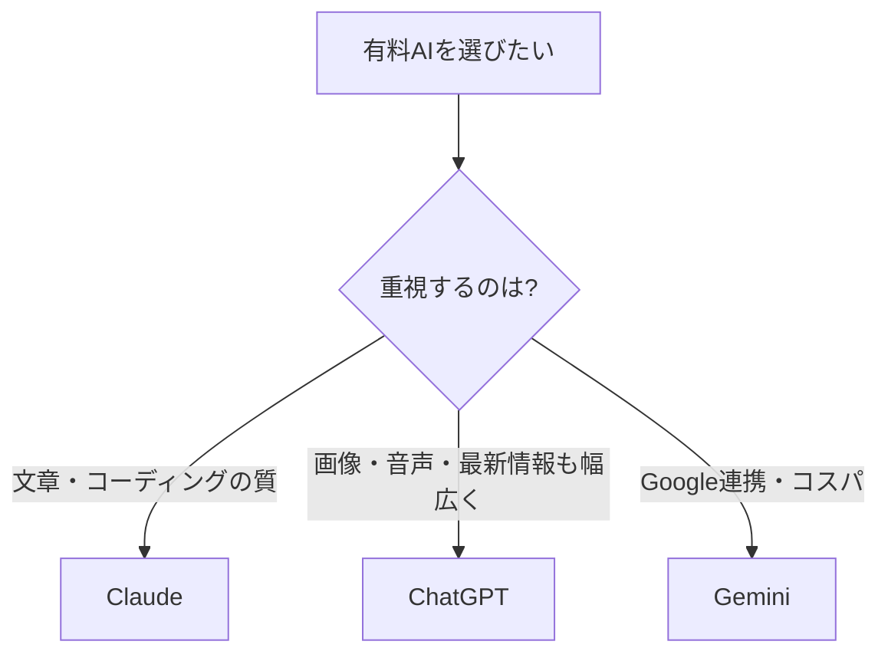

※本記事はアフィリエイト広告(PR)を含む場合があります。

## 2026年6月、AIの料金と性能が一気に動いた

「結局、有料AIはどれに課金すればいいの?」——そう迷っている方は多いはずです。2026年6月は、主要AIサービスが**価格を据え置いたまま、主力モデルを軒並み世代交代**させた、まさに節目の月になりました。

さらに、**Googleが格安プランで価格競争を仕掛ける**など、ユーザーにとっては「同じ値段で性能が上がる」嬉しい動きが続いています。

この記事では、**主要AIサブスクの最新料金を早見表で比較**し、**目的別にどれを選べばいいか**を初心者向けに整理します。

## 主要AIサブスク料金 早見表(2026年6月時点)

| サービス | 標準プラン | 上位プラン |
|---|---|---|
| ChatGPT(OpenAI) | Plus 約20ドル/月 | Pro 約200ドル/月 |
| Claude(Anthropic) | Pro 約20ドル/月 | Max 約100〜200ドル/月 |
| Gemini(Google) | AI Pro 約19.99ドル/月 | AI Ultra 約249.99ドル/月 |

※日本円では、Geminiの上位「AI Pro」が月2,900円前後で提供される時期もあります。為替や改定で変動するため、**契約前に必ず公式サイトで最新の金額を確認してください。**

ポイントは、**標準プランがどれも「月20ドル前後」に収束している**こと。価格はほぼ横並びになり、「どれを選んでも値段は大きく変わらない」状況になっています。

## 今月の2大トピック

### 1. 価格据え置きのままモデルが世代交代

2026年6月、各社は料金を上げずに主力モデルを更新しました。

- **ChatGPT**:GPT-5.5系へ更新(さらに上位版の噂も)
- **Claude**:Opus 4.8へ更新。エージェント性能が向上し、トークンあたりのコストはむしろ下がったと報じられています
- **Gemini**:Gemini 3.5系へ更新

つまり、**同じ月額のまま中身がパワーアップ**しました。すでに課金している人は、何もしなくても性能が上がっています。

### 2. Geminiが格安プランで価格競争を仕掛ける

Googleは、**ChatGPTの廉価プランを下回る月4.99ドル前後の格安プラン**を投入したと報じられ、ストレージ増量もあわせて「コスパで攻める」姿勢を鮮明にしています。AI各社の価格競争は、利用者にとって追い風です。

## 目的別:どれを選ぶ?

- **文章作成やコーディング中心** → 出力品質に定評のある **Claude**
- **画像生成・音声会話・幅広い用途** → 機能のバランスが良い **ChatGPT**
- **GmailやドキュメントなどGoogle連携・コスパ重視** → **Gemini**

実際の使用感や機能の違いは、[ChatGPTとClaudeとGeminiの徹底比較記事](/2026/06/09/ai-chat-comparison/)で詳しく解説しています。まず無料版で試してから、自分の用途に合うものに課金するのが失敗しないコツです。

## 注意:料金体系は「変わる前提」で

価格は据え置きでも、**使い方のルールは変わることがあります**。たとえばAnthropicは、自動化(エージェント)利用を別料金にする変更を予告し、[実施当日に撤回する](/2026/06/16/claude-agent-billing-reversed/)といった動きもありました。

サブスクを選ぶときは、「**今の料金**」だけでなく「**自分の使い方が将来も同じ料金で続けられそうか**」も意識しておくと安心です。

## もっと使いこなしたい人へ

有料プランを最大限活かすには、プロンプト(指示文)のコツや活用法を体系的に学ぶのが近道です。独学なら入門書、本格的に学ぶなら給付金対象の[生成AIオンラインスクール](/2026/06/13/ai-online-school-guide/)という選択肢もあります。

👉 [Amazonで「生成AI 活用 本」を見る](https://af.moshimo.com/af/c/click?a_id=5632371&p_id=170&pc_id=185&pl_id=38594&url=https%3A%2F%2Fwww.amazon.co.jp%2Fs%3Fk%3D%25E7%2594%259F%25E6%2588%2590AI%2520%25E6%25B4%25BB%25E7%2594%25A8%2520%25E6%259C%25AC)

## よくある質問

### 結局どれが一番おすすめ?

用途次第ですが、迷ったら**まず無料版を2〜3個触って**、一番しっくりくるものの有料版に進むのが確実です。値段はほぼ横並びなので、「自分の作業に合うか」で選んで問題ありません。

### 課金しないと使えない?

いいえ。各社とも無料プランがあります。ただし最新モデルや高度な機能は有料が中心です。

## まとめ

- 2026年6月、主要AIは**価格据え置きのままモデルを世代交代**
- 標準プランは**どれも月20ドル前後**に収束、Geminiは格安プランで価格競争を仕掛ける
- 選び方は「**文章・コーディング=Claude**」「**幅広い用途=ChatGPT**」「**Google連携・コスパ=Gemini**」が目安
- 料金は変わる前提で、自分の使い方に合うものを選ぶ

価格が横並びになった今こそ、「**自分の目的に一番合うAI**」を選ぶチャンスです。まずは無料で触り比べてみてください。

### 参考リンク

- [【2026年6月版】生成AI主要8サービス料金早見表(BUSINESS INSIDER JAPAN / Yahoo!ニュース)](https://news.yahoo.co.jp/articles/ba798cfeef3d251d620da4cf101eb3bce5d00674)
- [Google just undercut OpenAI with a $4.99 Gemini plan(TechRadar)](https://www.techradar.com/ai-platforms-assistants/gemini/google-just-undercut-openai-with-a-usd4-99-gemini-plan-heres-whats-included)
