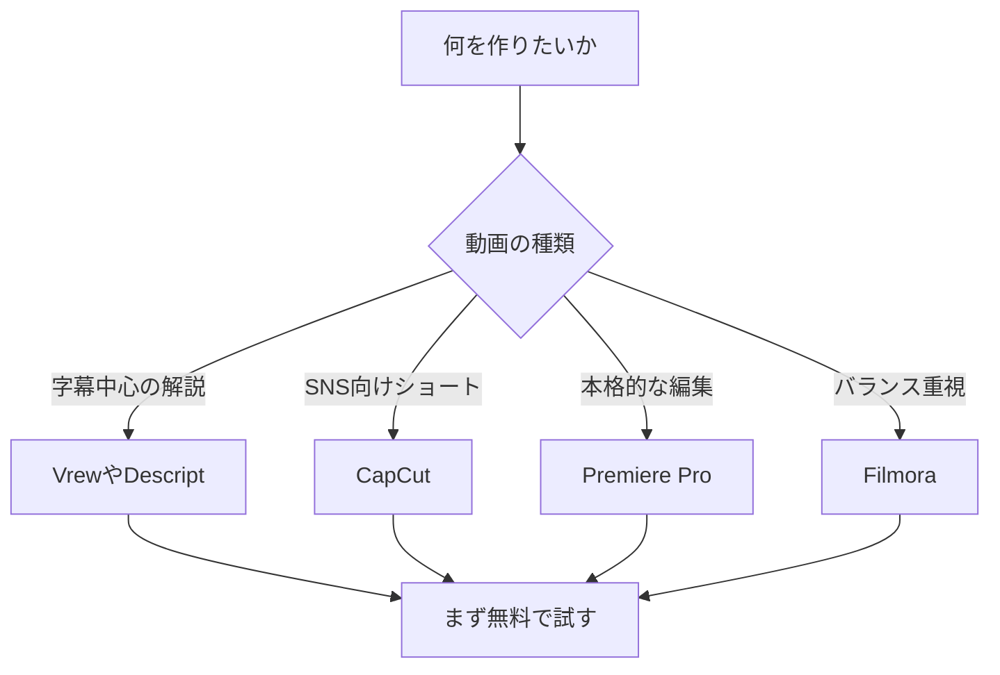

※本記事はアフィリエイト広告(PR)を含みます。

## この記事でわかること

「YouTubeを始めたいけれど、動画編集が難しそう……」と感じていませんか?この記事では、そんなYouTube初心者の方に向けて、**AI動画編集ツール**を比較しながら、自動編集が得意なおすすめソフト5選をご紹介します。

AI動画編集ツールとは、字幕付けやカット、BGM追加などの面倒な作業をAI(人工知能=人の代わりに判断・作業をしてくれる技術)が自動でこなしてくれる編集ソフトのことです。この記事を読めば、以下のことがわかります。

- AI動画編集ツールで何ができるのか
- 初心者におすすめのソフト5選とその違い
- 自分に合ったツールの選び方
- 無料で使えるのか、料金の目安

専門知識がなくても大丈夫です。順番に見ていきましょう。

## AI動画編集ツールでできること

まずは、AIを使うと動画編集のどんな作業がラクになるのかを知っておきましょう。代表的な機能は次の通りです。

- **自動字幕(テロップ)生成**:話した内容を文字に変換して、自動で字幕を付けてくれます。
- **無音・不要部分の自動カット**:「えーっと」などの間や沈黙を検出して削除します。
- **長尺動画からショート動画を自動生成**:長い動画の見どころを切り出し、TikTokやYouTubeショート向けの縦型動画を作ります。
- **BGM・効果音の自動提案**:動画の雰囲気に合った音楽を選んでくれます。
- **AIナレーション(音声合成)**:テキストを入力するだけで自然な読み上げ音声を作成できます。

これまで手作業で何時間もかかっていた作業が、AIによって数分〜数十分に短縮できるのが大きな魅力です。

## 初心者におすすめのAI動画編集ツール5選

ここからは、初心者でも使いやすい代表的なツールを5つ紹介します。それぞれ特徴が異なるので、自分の用途に合うものを探してみてください。

### 1. Vrew(ブリュー)

音声を自動で認識して字幕を付ける機能に強いツールです。動画を読み込むと自動で文字起こしをしてくれて、不要な部分を文章を消す感覚でカットできます。「編集が初めて」という方に特におすすめです。

### 2. CapCut(キャップカット)

スマホでもパソコンでも使える人気ツールです。テンプレート(あらかじめ用意されたデザインの型)が豊富で、自動字幕やショート動画作成にも対応しています。SNS向けの動画を手早く作りたい方に向いています。

### 3. Adobe Premiere Pro(プレミアプロ)

プロも使う本格派の編集ソフトですが、近年はAI機能が充実し、自動文字起こしや無音カットがかなり手軽になりました。「将来は本格的な編集もしたい」という方の長期的な選択肢になります。

### 4. Filmora(フィモーラ)

直感的な操作画面で初心者に人気のソフトです。AIによる背景除去や自動字幕、豊富な素材が揃っており、バランスの良さが魅力です。

### 5. Descript(デスクリプト)

文章を編集するように動画を編集できる海外発のツールです。文字起こしの精度が高く、ポッドキャストや解説系動画と相性が良いのが特徴です。

### 機能比較表

各ツールのおおまかな特徴を表にまとめました。

| ツール | 自動字幕 | 無音カット | ショート生成 | 初心者向け度 |
|---|---|---|---|---|
| Vrew | ◎ | ◎ | ○ | ◎ |
| CapCut | ◎ | ○ | ◎ | ◎ |
| Premiere Pro | ○ | ○ | ○ | △ |
| Filmora | ◎ | ○ | ○ | ◎ |
| Descript | ◎ | ◎ | ○ | ○ |

※機能や対応状況は更新されることがあります。最新の詳細は各公式サイトでご確認ください。

## 自分に合ったツールの選び方

「結局どれを選べばいいの?」と迷ったら、次のフローチャートを参考にしてみてください。

選ぶときのポイントは次の3つです。

1. **作りたい動画のタイプ**:解説動画かショート動画かで最適なツールが変わります。
2. **使うデバイス**:スマホ中心ならCapCut、パソコン中心なら他のツールも候補になります。
3. **予算**:無料プランから始めて、必要に応じて有料版に切り替えるのがおすすめです。

## AI動画編集ツールは無料で使える?

結論から言うと、**多くのツールに無料プランがあります**。ただし、無料版にはいくつか制限があるのが一般的です。

- 書き出した動画に**ウォーママーク(ロゴの透かし)**が入る
- 月あたりの**書き出し時間や回数に上限**がある
- 一部の高度なAI機能が**有料プラン限定**

まずは無料プランで操作感を試し、本格的に投稿を続けると決めたら有料プランを検討するのが賢い進め方です。なお、具体的な料金プランは変更されることが多いので、必ず各公式サイトで最新情報を確認してください。

AIツール全般の文字起こし精度が気になる方は、[AI文字起こしツールおすすめ比較\|会議・インタビューに最適なのは?](/2026/06/12/ai-transcription-comparison/)も参考になります。動画の字幕生成と仕組みが共通しているためです。

## 編集をもっと快適にする周辺機材

ソフトだけでなく、ちょっとした機材を整えると動画のクオリティと作業効率が一気に上がります。特に音声は視聴者の離脱に直結するため、マイクへの投資はおすすめです。

👉 [Amazonで「USBコンデンサーマイク 配信用」を見る](https://af.moshimo.com/af/c/click?a_id=5632371&p_id=170&pc_id=185&pl_id=38594&url=https%3A%2F%2Fwww.amazon.co.jp%2Fs%3Fk%3DUSB%25E3%2582%25B3%25E3%2583%25B3%25E3%2583%2587%25E3%2583%25B3%25E3%2582%25B5%25E3%2583%25BC%25E3%2583%259E%25E3%2582%25A4%25E3%2582%25AF%2520%25E9%2585%258D%25E4%25BF%25A1%25E7%2594%25A8)

また、長時間の編集作業では音をしっかり確認できるイヤホンやヘッドホンがあると便利です。

👉 [楽天市場で「モニターヘッドホン 編集用」を探す](https://af.moshimo.com/af/c/click?a_id=5632328&p_id=54&pc_id=54&pl_id=616&url=https%3A%2F%2Fsearch.rakuten.co.jp%2Fsearch%2Fmall%2F%25E3%2583%25A2%25E3%2583%258B%25E3%2582%25BF%25E3%2583%25BC%25E3%2583%2598%25E3%2583%2583%25E3%2583%2589%25E3%2583%259B%25E3%2583%25B3%2520%25E7%25B7%25A8%25E9%259B%2586%25E7%2594%25A8%2F)

オンライン出演やライブ配信も考えている方は、カメラやマイク選びについて[Webカメラ・マイクのおすすめ｜オンライン会議の印象を良くする機材選び](/2026/06/15/webcam-mic-online-meeting/)もあわせてご覧ください。

## YouTube運営をAIで効率化するヒント

動画編集だけでなく、YouTube運営全体にもAIは役立ちます。たとえば、動画の構成台本やタイトル案、概要欄の文章はAIチャットに下書きを作ってもらうと時短になります。どのAIチャットを使うか迷ったら、[ChatGPTとClaudeとGeminiを徹底比較!初心者におすすめのAIチャットはどれ?](/2026/06/09/ai-chat-comparison/)が参考になります。

サムネイル用の画像づくりには画像生成AIも便利です。用途に合うツールは[無料で使える画像生成AIおすすめ5選\|商用利用の注意点も解説](/2026/06/11/free-image-ai-tools/)で詳しく解説しています。

## まとめ

今回は、YouTube初心者におすすめのAI動画編集ツール5選を比較しながら紹介しました。最後にポイントを振り返ります。

- AI動画編集ツールは、字幕付け・カット・BGM追加などを自動化してくれる
- 字幕中心ならVrewやDescript、SNS向けショートならCapCut、本格派ならPremiere Pro、バランス重視ならFilmoraがおすすめ
- 多くのツールに無料プランがあるので、まずは試してから有料版を検討するのが安心
- 料金や機能は変わりやすいので、必ず公式サイトで最新情報を確認する

まずは気になったツールを1つ、無料で触ってみることが上達への近道です。AIの力を借りて、楽しく動画づくりを始めてみましょう。
