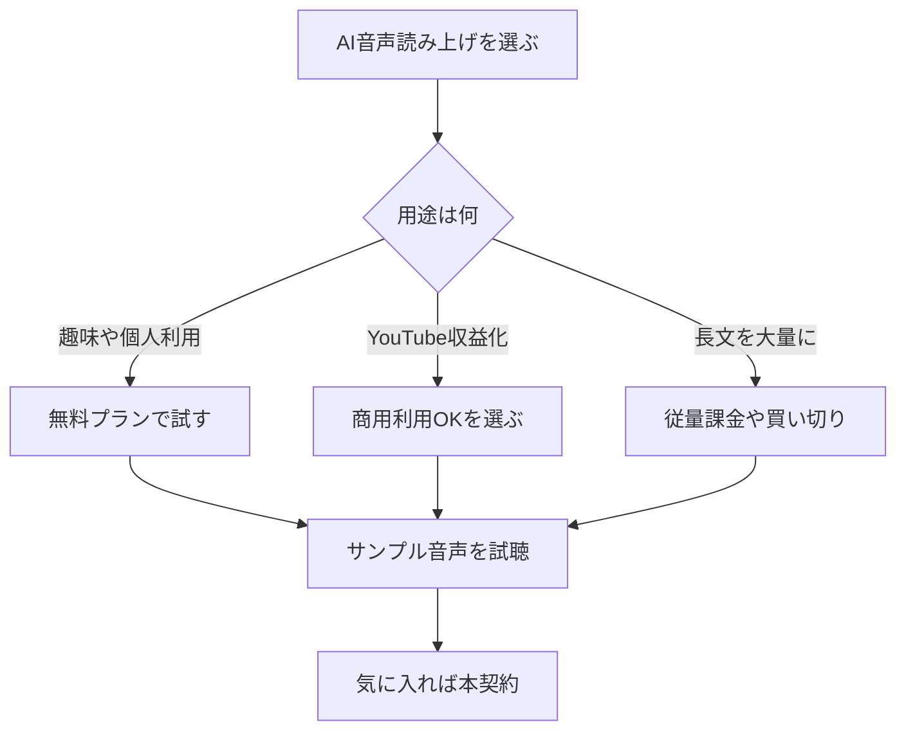

※本記事はアフィリエイト広告(PR)を含みます。

「動画にナレーションを入れたいけれど、自分の声を録音するのは恥ずかしい」「ブログ記事を音声で聴けるようにしたい」——そんなときに役立つのが、**AI音声読み上げ(ナレーション)ツール**です。AIがテキストを自然な合成音声に変換してくれるため、マイクや録音設備がなくても手軽にナレーション付きのコンテンツが作れます。

この記事では、AI音声読み上げツールの選び方、おすすめサービスの比較、そして「無料で使えるの?」「YouTubeで商用利用してもいいの?」といった疑問まで、初心者の方にもわかりやすく解説します。読み終わるころには、あなたの用途にぴったりのツールが見つかるはずです。

## AI音声読み上げツールとは?

AI音声読み上げツールとは、入力したテキスト(文章)を人間に近い自然な音声に変換するサービスのことです。専門的には「TTS(Text To Speech=テキスト読み上げ)」と呼ばれます。

ひと昔前の合成音声は、いかにも「機械的」で抑揚のない読み上げが一般的でした。しかし近年はAI(人工知能)技術の進化により、息づかいや感情のこもった、まるで人間が話しているような自然な音声が作れるようになっています。

### 主な用途

- **YouTube動画のナレーション**:解説動画やゆっくり系コンテンツに
- **ブログの音声化**:記事を「聴くコンテンツ」として提供
- **eラーニング教材**:研修動画やオンライン講座の音声
- **アクセシビリティ**:目が不自由な方や、聴いて情報を得たい人向け
- **ポッドキャスト・オーディオブック**:長文の音声化

## AI音声読み上げツールの選び方

ツールを選ぶときは、次の4つのポイントを意識すると失敗しにくくなります。

### 1. 音声の自然さ(クオリティ)

もっとも重要なのが、音声がどれだけ自然に聞こえるかです。特に長い動画では、不自然なイントネーションが続くと視聴者が離脱してしまいます。気になるツールは必ず**サンプル音声を試聴**してから選びましょう。

### 2. 対応言語と声の種類

日本語に対応しているか、男性・女性・子どもなど声のバリエーションが豊富かをチェックします。複数のキャラクターを使い分けたい場合は、声の種類が多いツールが有利です。

### 3. 商用利用の可否

YouTubeの収益化や商品紹介など、お金が絡む用途で使う場合は**商用利用が許可されているか**を必ず確認してください。無料プランでは商用利用が制限されているケースもあります。

### 4. 料金体系

月額制、文字数による従量課金、買い切りなどさまざまです。自分がどれくらいの量を使うかを考えて選びましょう。

## おすすめAI音声読み上げツール比較

ここでは、初心者にも使いやすい代表的なツールを紹介します。なお、料金やプラン内容は変更されることがあるため、詳細は**各公式サイトで最新情報を確認**してください。

| ツール名 | 特徴 | 日本語 | こんな人向け |
|---|---|---|---|
| VOICEVOX | 無料で使えるソフト | ◎ | コストを抑えたい人 |
| CoeFont | 声の種類が豊富 | ◎ | 多彩な声を使いたい人 |
| ElevenLabs | 非常に自然な音声 | ○ | 高品質を求める人 |
| Amazon Polly | クラウド型で大量処理 | ○ | 開発者や大量利用 |
| Google系TTS | 安定した品質 | ○ | システム連携したい人 |

### VOICEVOX(ボイスボックス)

無料で使える日本語音声合成ソフトです。複数のキャラクター音声が用意されており、ゆっくり系動画や解説動画で広く使われています。パソコンにインストールして使うタイプで、利用規約を守ればクレジット表記のうえで無料利用が可能です。コストをかけずに始めたい初心者の方に特におすすめです。

### CoeFont(コエフォント)

声のバリエーションが非常に豊富なクラウド型サービスです。ブラウザ上でテキストを入力するだけで音声が生成でき、有名人や声優の声を再現したフォントも提供されています。用途やプランによって商用利用の条件が異なるため、利用前に確認しておきましょう。

### ElevenLabs(イレブンラボ)

海外発のツールで、**音声の自然さに定評がある**サービスです。英語が特に得意ですが、日本語にも対応しており、感情表現の豊かさが魅力です。無料枠と有料プランがあり、本格的なナレーション制作に向いています。

### Amazon Polly / Googleの音声合成

どちらもクラウド型の音声合成サービスで、大量のテキストを安定して処理できます。プログラミングの知識があれば自分のシステムに組み込むこともでき、開発者向けの選択肢といえます。

## AI音声読み上げツールは無料で使える?

これはよくある疑問です。結論からいうと、**無料で使えるツールはあります**。VOICEVOXのように完全無料のソフトもあれば、CoeFontやElevenLabsのように「無料枠+有料プラン」という形のサービスもあります。

ただし注意したいのが、**無料プランは利用できる文字数に上限がある**ことや、**商用利用が制限されている**ことが多い点です。たとえば「個人の趣味ならOKだが、YouTube収益化はNG」といったケースもあります。

まずは無料プランや無料ソフトで音声のクオリティを試し、本格的に使いたくなったら有料プランを検討する、という流れがおすすめです。

## YouTubeなどでの商用利用の注意点

AI音声を動画や商品紹介に使う場合は、必ず各ツールの**利用規約**を確認してください。チェックすべきポイントは以下の通りです。

- 商用利用が許可されているか
- クレジット表記(ツール名の記載)が必要か
- 生成した音声を再配布・販売できるか
- 特定の用途(政治・公序良俗に反する内容など)が禁止されていないか

規約を守らずに使うと、動画の削除やアカウント停止につながる可能性もあります。安心して使うためにも、最初に必ず確認しておきましょう。

## 音声品質を上げる小ワザ

AI音声は便利ですが、そのまま使うと少し不自然に感じることもあります。次の工夫で、ぐっと聴きやすくなります。

- **読点(、)を適切に入れる**:文章の区切りで自然な「間」が生まれます
- **漢字の読み方を指定する**:固有名詞など、読み間違いをひらがなで修正
- **数字や記号を言葉に置き換える**:「10%」を「じゅっパーセント」にするなど
- **聴く環境を整える**:作った音声を確認するときは、良いイヤホンで聴くと細かな違いに気づけます

音声編集や視聴の際には、クリアな音が聴けるイヤホンがあると便利です。

👉 [Amazonで「ワイヤレスイヤホン ノイズキャンセリング」を見る](https://af.moshimo.com/af/c/click?a_id=5632371&p_id=170&pc_id=185&pl_id=38594&url=https%3A%2F%2Fwww.amazon.co.jp%2Fs%3Fk%3D%25E3%2583%25AF%25E3%2582%25A4%25E3%2583%25A4%25E3%2583%25AC%25E3%2582%25B9%25E3%2582%25A4%25E3%2583%25A4%25E3%2583%259B%25E3%2583%25B3%2520%25E3%2583%258E%25E3%2582%25A4%25E3%2582%25BA%25E3%2582%25AD%25E3%2583%25A3%25E3%2583%25B3%25E3%2582%25BB%25E3%2583%25AA%25E3%2583%25B3%25E3%2582%25B0)

また、ナレーションを自分の声でも収録したい場合は、マイクの品質も仕上がりを左右します。

👉 [楽天市場で「USBコンデンサーマイク 配信用」を探す](https://af.moshimo.com/af/c/click?a_id=5632328&p_id=54&pc_id=54&pl_id=616&url=https%3A%2F%2Fsearch.rakuten.co.jp%2Fsearch%2Fmall%2FUSB%25E3%2582%25B3%25E3%2583%25B3%25E3%2583%2587%25E3%2583%25B3%25E3%2582%25B5%25E3%2583%25BC%25E3%2583%259E%25E3%2582%25A4%25E3%2582%25AF%2520%25E9%2585%258D%25E4%25BF%25A1%25E7%2594%25A8%2F)

## 関連ツールも組み合わせると便利

AI音声読み上げは、ほかのAIツールと組み合わせることで、コンテンツ制作の効率が一気に上がります。

たとえば、ナレーション原稿そのものをAIに書いてもらう方法は[AIでブログ記事を書く方法\|初心者向け完全ガイド](/2026/06/12/ai-blog-writing-guide/)が参考になります。生成した音声を動画に組み込む際は、[AI動画編集ツール比較\|YouTube初心者におすすめの自動編集ソフト5選](/2026/06/16/ai-video-editing-tools/)もあわせて読むと、動画制作の流れがスムーズになります。

逆に、音声から文字を起こしたい場合は、読み上げとは反対の処理になります。会議やインタビューの音声を文字にしたい方は[AI文字起こしツールおすすめ比較\|会議・インタビューに最適なのは?](/2026/06/12/ai-transcription-comparison/)が役立ちますので、用途に応じて使い分けてみてください。

## よくある質問(Q&A)

### Q. AI音声は自分の声に似せられますか?

ツールによっては、自分の声を学習させて似た音声を作る「ボイスクローン」機能があります。ただし、他人の声を無断で再現するのは肖像権やプライバシーの問題があるため、必ず本人の許可を得たうえで利用してください。

### Q. スマホだけでも使えますか?

クラウド型のサービスなら、ブラウザやアプリからスマホでも利用できるものがあります。一方でVOICEVOXのようなインストール型ソフトはパソコンが必要です。

### Q. 長い文章でも一度に変換できますか?

プランによって1回あたりの文字数制限があります。長文を扱う場合は、文字数上限が大きい有料プランを選ぶとスムーズです。

## まとめ

AI音声読み上げ(ナレーション)ツールは、録音設備がなくても自然な合成音声で動画やコンテンツを作れる便利なツールです。最後にポイントを振り返りましょう。

- **選び方の基本**は「音声の自然さ・声の種類・商用利用の可否・料金」の4つ
- **コストを抑えたいなら**VOICEVOXなどの無料ソフトから試すのがおすすめ
- **高品質を求めるなら**ElevenLabsやCoeFontなどの有料プランも検討
- **商用利用の際は**必ず利用規約を確認する
- 読点や読み方の指定など、**ちょっとした工夫**で音声はもっと自然になる

まずは無料で使えるツールでサンプル音声を試聴し、あなたの用途に合うかどうかを確かめてみてください。気に入ったツールが見つかれば、コンテンツ制作の幅がぐっと広がるはずです。
