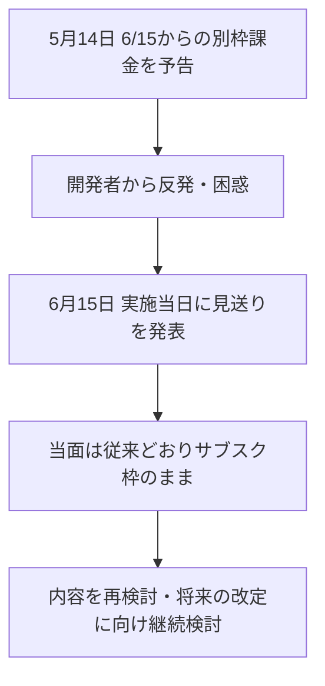

※本記事はアフィリエイト広告(PR)を含む場合があります。

## Claudeの「エージェント別枠化」が、実施当日に撤回

2026年6月、AnthropicがClaudeの有料プランで予定していた大きな課金変更が、**実施予定日の6月15日に撤回(見送り)**されました。

予定されていたのは、**AIエージェント・自動化の利用を、通常のサブスク枠とは「別枠」の従量課金に切り出す**という内容です。一部では「実質的な大幅値上げ」と受け止められ、波紋が広がっていました。

この記事では、**そもそも何が変わる予定だったのか・なぜ撤回されたのか・私たちユーザーにどう影響するのか**を、初心者の方にもわかるように整理します。

## もともと予定されていた変更(おさらい)

Anthropicは5月の時点で、6月15日から以下を実施すると予告していました。

- **Agent SDK**(エージェント開発キット)や **`claude -p`**(コマンドからの自動実行)、**Claude Codeの自動化**、サブスク認証を使う**サードパーティ製ツール**などの利用を対象に
- これらを、定額サブスクの利用枠とは**別枠の「毎月のクレジット」**から消費する形に変更
- そのクレジットは、**APIの標準レートと同じ従量課金**で計算(繰り越しなし)

報じられているクレジットの目安は、**Proで月20ドル前後、Max 5xで100ドル前後、Max 20xで200ドル前後**。対象は **Pro / Max / Team / Enterprise** といった有料プランでした。

つまり、「対話(チャット)」と「自動化(エージェント)」が**完全に分離**され、自動化をヘビーに使う人ほど負担が増える設計だったのです。

## 何が撤回されたのか

Anthropicは**6月15日(実施予定の当日)に、この変更を実施しないこと**を発表しました。

報道によると、**当面はこれまで通り**、割安なサブスクリプションの利用枠のまま、Agent SDKや`claude -p`を使い続けられるとのことです。ただしこれは**あくまで一時的な見送り**で、「内容を再検討するため」とされています。

Anthropicは将来的な改定に向けて、「**Claudeサブスクリプション加入者をよりよくサポートできるよう、プランのアップデートに取り組んでいる**」と説明していると報じられています。

## 実はAnthropicの「方針転換」は今回が初めてではない

今回の件は、Anthropicがこの半年で繰り返してきた**自動化利用をめぐる調整の一環**です。報道を整理すると、おおまかに次のような流れがありました。

- **1月**:サブスクの認証トークンをサードパーティ製ツールで使えないようブロック → 開発者の反発で**数日のうちに撤回**
- **2〜4月**:サードパーティ製エージェントの利用を一度禁止し、さらに制限を強化
- **5月**:「禁止」ではなく「別枠課金として再開」へ方針転換し、6月15日実施を予告
- **6月15日**:その別枠課金も**実施当日に見送り**(今回)

つまり、**何度も予告と撤回を繰り返している**のが実情です。それだけ「自動化・エージェント利用の価格づけ」が難しいテーマだということでもあります。

## なぜこんなに揺れているのか

背景には、**AIエージェントの普及でサーバー負荷とコストが急増**している事情があります。

- 対話(人がチャットする)は、利用量が比較的読みやすい
- 自動化(エージェントが裏で何百回もAPIを叩く)は、**1人で膨大な処理を回せてしまう**

定額サブスクのまま自動化を無制限に許すと、提供側のコストが見合わなくなります。一方で、いきなり別枠課金にすると**実質値上げ**となりユーザーが反発する——この板挟みが、今回の「予告→撤回」を生んでいると考えられます。

## ユーザーへの影響と今後の備え

### 当面は「これまで通り」でOK

サブスクでClaude CodeやAgent SDKを使っている人は、**当面は今までと同じ感覚で使えます**。あわてて別サービスに乗り換える必要はありません。

### ただし「いつか別枠化される前提」で備える

撤回はあくまで一時的です。今後また別枠課金が予告される可能性は高いので、以下を意識しておくと安心です。

- 自分が**月にどれくらい自動化を回しているか**を把握しておく
- 重い自動処理は、**APIの従量課金に切り替えたときのコスト感**を一度試算しておく
- 公式アナウンスを定期的にチェックする

Claudeそのものの使い方や他AIとの違いを整理したい方は、[ChatGPTとClaudeとGeminiの比較記事](/2026/06/09/ai-chat-comparison/)もあわせてご覧ください。最近はAIモデルをめぐる動きが激しく、先日は[最上位モデルが公開3日で停止する出来事](/2026/06/15/claude-fable-5-suspended/)もありました。

## よくある質問

### 今すぐ料金は上がる?

いいえ。6月15日の別枠課金は見送られたため、**当面の料金体系は従来のまま**です。

### 自分のClaude Codeは使える?

はい。サブスク枠での自動化利用は当面継続できます。ただし将来の改定に備え、使用量は把握しておきましょう。

### また変更されることはある?

可能性は高いです。Anthropicは「再検討中」「プランのアップデートに取り組んでいる」としており、**将来的な改定は十分あり得ます**。

## まとめ

- Anthropicは6月15日実施予定だった**Claudeのエージェント別枠課金を、当日に撤回(見送り)**
- 当面はこれまで通り、**サブスク枠のままAgent SDKや`claude -p`を利用可能**
- ただし**一時的な見送り**であり、将来的な改定に向けて再検討中
- 自動化をヘビーに使う人は、**別枠化される前提でコスト感をつかんでおく**と安心

AIの料金体系は、技術の進化とコストの現実のあいだで揺れ続けています。最新の状況は公式発表や信頼できる報道で確認しましょう。

### 参考リンク

- [Claudeのエージェント別枠化が撤回、Anthropicが当日発表 今後のプラン変更に向け再検討中(テクノエッジ)](https://www.techno-edge.net/article/2026/06/16/5187.html)
- [AnthropicがClaudeサブスク刷新 エージェント利用を別枠化、使い方で実質値上げも 6月15日から(テクノエッジ)](https://www.techno-edge.net/article/2026/05/14/5064.html)
- [Anthropic Ends Subscription Subsidy for Agents June 15(Tech Times)](https://www.techtimes.com/articles/317625/20260602/anthropic-ends-subscription-subsidy-agents-june-15-credit-pool-replaces-flat-rate-access.htm)
