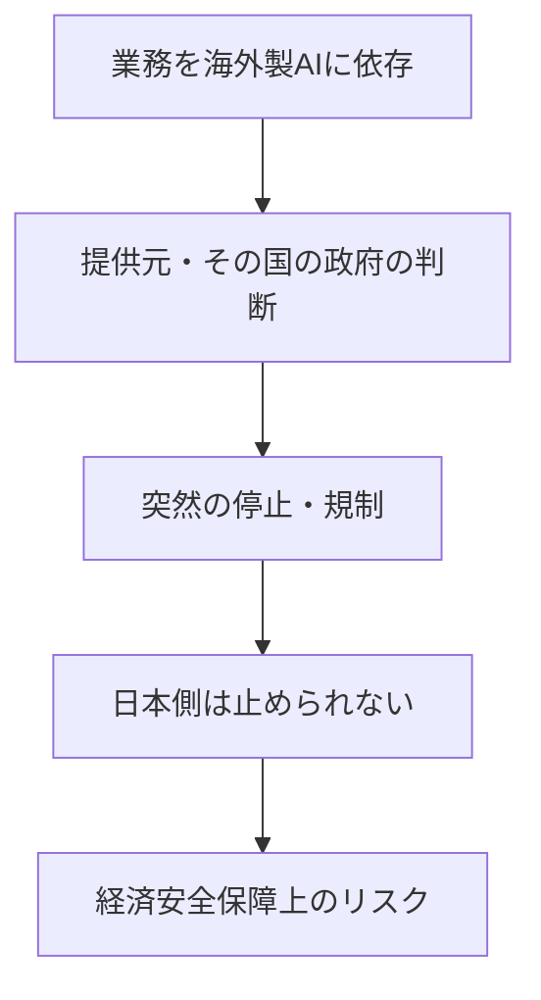

※本記事はアフィリエイト広告(PR)を含む場合があります。

## 「米政府の一声でAIが止まる」時代の衝撃

2026年6月、Anthropicの最上位AI **Claude Fable 5** が、米政府の輸出管理指令により公開3日で全世界停止しました(事の経緯は[Claude Fable 5停止の解説記事](/2026/06/15/claude-fable-5-suspended/)で詳しく整理しています)。

この一件は、単なる「便利なAIが使えなくなった」では済みません。**「海外政府の判断ひとつで、自分たちが使うAIが突然止まりうる」**という現実を、日本の企業・行政に突きつけました。

この記事では、**日本への影響**を「政府・経済安全保障の視点」と「株式市場の受け止め」の2つの角度から、事実にもとづいて整理します。

## 1. 日本政府・経済安全保障の視点

### 正式な政府声明は確認されていない

まず正確にお伝えすると、**本記事執筆時点で、この件に関する日本政府の公式な声明・コメントは確認できていません**。あくまで現時点では、専門家やメディアによる議論が中心です。

そのうえで、論点として繰り返し指摘されているのが次のテーマです。

### 浮き彫りになった「外国製AI依存」のリスク

日本の多くの企業・サービスは、ChatGPTやClaudeなど**海外製AIに業務を依存**し始めています。今回のように**提供国の政府判断で停止**されると、利用側はコントロールできません。これは「経済安全保障時代の新たなベンダーリスク」として、複数の専門メディアが警鐘を鳴らしています。

### 「AI主権」という宿題

こうした事態は、**自国でAIを開発・運用できる力(AI主権)**の重要性をあらためて示しました。日本でも金融や行政など重要インフラでのAI活用が進むなか、「特定の海外サービスに過度に依存しない備え」が課題として議論されています。

なお日本では、2025年に**AI推進法**が成立するなど、AI活用と規制の枠組みづくりが進んでいます。今回の件は、こうした政策議論を後押しする材料になる可能性があります。

## 2. 株式市場の受け止め

### 前提:Anthropicは「非上場」

ここも誤解が多いポイントです。**Anthropicは現時点で非上場**(IPOを秘密裏に申請した段階と report されています)。つまり、**「Fable 5停止で動くAnthropicの株価」は存在しません**。

では市場と無関係かというと、そうではありません。影響は**関連する上場企業や市場心理**に及びます。

### 影響が波及しうる先

| 対象 | 想定される受け止め |
|---|---|
| 半導体・AIインフラ株 | AI需要の先行きへの思惑で変動しやすい |
| AIを使うSaaS企業 | 「AIに置き換えられる/止まる」懸念が浮上 |
| 競合のAI企業 | 一時的に注目が集まる可能性 |

過去には、Anthropicの新モデル発表が「AIがSaaSを時代遅れにするのでは」との懸念(いわゆる「アンソロピックショック」)を呼んだ場面もありました。一方で、証券会社からは**「こうした反応は過剰」との見方**も示されています。

### 個人投資家が気をつけたいこと

この種のニュースは**短期的な思惑で株価が振れやすい**ものです。話題性に流されず、企業の実力やAI需要の本質を見て判断する姿勢が大切です。

> ⚠️ 本記事は情報整理であり、投資の助言ではありません。投資判断はご自身の責任で、最新情報を確認のうえ行ってください。

## 私たちユーザー・企業ができる備え

今回の教訓は、個人にも中小企業にも当てはまります。

- **特定AIに依存しすぎない**:用途ごとに代替を確保しておく(各AIの違いは[ChatGPT・Claude・Geminiの比較記事](/2026/06/09/ai-chat-comparison/)を参照)
- **重要業務は「AIが止まっても回る」設計に**:AIはあくまで補助と位置づける
- **最新動向を追う**:AIモデルは[次々と入れ替わり](/2026/06/16/ai-model-flood-2026/)、提供条件も変わりやすい

## よくある質問

### 日本政府はこの件で何か発表した?

本記事時点では、**公式な声明は確認できていません**。専門家・メディアによる経済安全保障の観点からの議論が中心です。最新の公式情報は政府・省庁の発表でご確認ください。

### Anthropicの株は買える?

**現時点では非上場のため、一般の株式市場では買えません**。将来的なIPO(新規上場)に向けた動きが report されている段階です。

### 普段使うAIも止まる?

通常のClaude(Opus/Sonnet/Haiku)やChatGPT・Geminiは影響を受けていません。今回停止したのは最上位の特定モデルのみです。

## まとめ

- Claude Fable 5の停止は、日本に**「外国製AI依存」「経済安全保障」「AI主権」**という課題を突きつけた
- ただし**日本政府の公式な反応は本記事時点で確認できていない**(議論は専門家・メディア中心)
- **Anthropicは非上場**のため直接の株価はなく、影響は関連株・市場心理に及ぶ。証券会社からは「過剰反応」との見方も
- 個人・企業は**特定AIに依存しすぎない備え**が現実的な対策

便利なAIほど、止まったときの影響も大きくなります。「使いこなす」と同時に「依存しすぎない」——このバランスが、これからますます重要になりそうです。

### 参考リンク

- [Anthropic、「Mythos 5」「Fable 5」の提供を一時停止 米政府指示を受け(ITmedia NEWS / Yahoo!ニュース)](https://news.yahoo.co.jp/articles/2c65948faec78934c88c22ec539516f8f6e24582)
- [【生成AI事件簿】Claude Fable 5の遮断が映し出す外国製AI依存の盲点(JBpress)](https://jbpress.ismedia.jp/articles/-/95385)
- [AI代替懸念「アンソロピックショック」は過剰反応と見る理由(NOMURA ウェルスタイル)](https://www.nomura.co.jp/wealthstyle/article/0613/)
