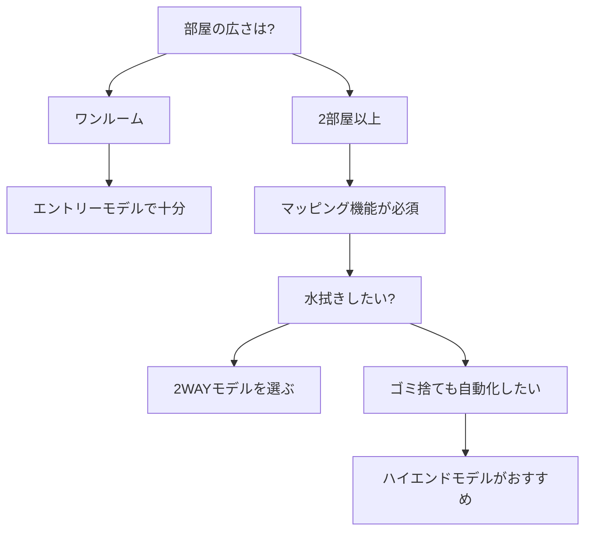

※本記事はアフィリエイト広告(PR)を含みます。

## ロボット掃除機の選び方2026|まずは結論から

「ロボット掃除機が欲しいけど、種類が多すぎてどれを選べばいいかわからない」——この記事は、そんな方のために書きました。2026年最新のロボット掃除機の選び方を、AI搭載モデルを中心に価格と機能の両面から徹底比較していきます。

この記事を読むと、次のことがわかります。

- ロボット掃除機を選ぶときに見るべき5つのポイント
- AI搭載モデルと従来モデルの違い
- 価格帯ごとのおすすめの選び方
- 「水拭き」「ゴミ自動収集」など便利機能の必要性

結論を先にお伝えすると、**「間取りの広さ」「床の種類」「予算」の3つを基準に選べば、失敗はほとんどありません**。それぞれ詳しく見ていきましょう。

## そもそもAI搭載ロボット掃除機とは?

AI搭載ロボット掃除機とは、**カメラやセンサーで部屋の形・障害物を判断し、効率よく掃除するモデル**のことです。AI(人工知能)とは、人間のように状況を判断して動作を最適化する技術を指します。

従来のモデルがランダムに動き回って掃除していたのに対し、AI搭載モデルは次のような賢い動きをします。

- 部屋の地図(マップ)を作り、効率的なルートで掃除する
- 床に落ちたコードやスリッパなどの障害物を避ける
- ペットの排泄物など「避けるべきもの」を画像で認識する
- 部屋ごとに掃除する/しないを指定できる

スマートスピーカーと連携して音声で操作できるモデルも増えています。家電全体をAIで賢くしたい方は、[スマートスピーカーはどれを買うべき?Alexa・Google Home徹底比較](/2026/06/12/smart-speaker-comparison/)もあわせてチェックすると、家全体のスマート化がイメージしやすくなります。

## ロボット掃除機を選ぶ5つのポイント

### 1. 吸引力(吸引パワー)

吸引力は「Pa(パスカル)」という単位で表されます。数字が大きいほどパワフルで、カーペットの奥のゴミやペットの毛もしっかり吸い取ります。

- フローリング中心:中程度のパワーでも十分
- カーペットやペットがいる家庭:高めのパワーがおすすめ

### 2. マッピング(部屋の地図作成)機能

マッピングとは、ロボットが部屋の形を記憶して効率的に掃除する機能です。レーザーセンサー(LiDAR)を使う高精度なタイプと、カメラを使うタイプがあります。複数の部屋がある家ではこの機能が必須と言えます。

### 3. 水拭き機能の有無

最近は「吸引+水拭き」の2WAYモデルが主流です。フローリングのベタつきが気になる方や、小さなお子さんがいる家庭に向いています。モップを自動洗浄・乾燥してくれる上位モデルも登場しています。

### 4. ゴミ自動収集ステーション

掃除のたびにダストボックスを空にするのは意外と面倒です。**ゴミ自動収集ステーション付き**なら、本体のゴミを自動で吸い上げてくれるため、数週間ゴミ捨て不要になります。価格は上がりますが、手間を減らしたい方には非常におすすめです。

### 5. 価格と予算

ロボット掃除機は、おおむね次のような価格帯に分かれます(具体的な金額は変動するため、必ず公式サイトや販売ページで最新情報を確認してください)。

| 価格帯 | 主な特徴 | 向いている人 |
|---|---|---|
| エントリー | 基本的な吸引のみ・ランダム走行 | ワンルーム・とにかく安く試したい |
| ミドル | マッピング+水拭き対応 | 一般的な家庭・コスパ重視 |
| ハイエンド | AI障害物回避+ゴミ自動収集 | 手間を徹底的に省きたい・ペットがいる |

## 選び方フローチャート

迷ったときは、次のフローチャートに沿って考えると選びやすくなります。

## 価格・機能で見るタイプ別おすすめの選び方

### コスパ重視なら「ミドルクラス」

はじめてのロボット掃除機なら、マッピングと水拭きに対応したミドルクラスが満足度が高くおすすめです。基本性能がしっかりしていて、価格と機能のバランスが取れています。

👉 [Amazonで「ロボット掃除機 水拭き マッピング」を見る](https://www.amazon.co.jp/s?k=%E3%83%AD%E3%83%9C%E3%83%83%E3%83%88%E6%8E%83%E9%99%A4%E6%A9%9F%20%E6%B0%B4%E6%8B%AD%E3%81%8D%20%E3%83%9E%E3%83%83%E3%83%94%E3%83%B3%E3%82%B0)

### 手間を徹底的に省くなら「ハイエンド」

共働きで掃除の時間を取れない方や、ペットの毛に悩んでいる方は、AIによる障害物回避とゴミ自動収集を備えたハイエンドモデルが向いています。初期費用は高くても、日々の手間が大きく減るため「時間をお金で買う」感覚で選ぶ価値があります。

👉 [楽天市場で「ロボット掃除機 ゴミ自動収集 AI」を探す](https://af.moshimo.com/af/c/click?a_id=5632328&p_id=54&pc_id=54&pl_id=616&url=https%3A%2F%2Fsearch.rakuten.co.jp%2Fsearch%2Fmall%2F%25E3%2583%25AD%25E3%2583%259C%25E3%2583%2583%25E3%2583%2588%25E6%258E%2583%25E9%2599%25A4%25E6%25A9%259F%2520%25E3%2582%25B4%25E3%2583%259F%25E8%2587%25AA%25E5%258B%2595%25E5%258F%258E%25E9%259B%2586%2520AI%2F)

### とにかく安く試したいなら「エントリー」

ワンルームや障害物の少ない部屋なら、シンプルな吸引専用のエントリーモデルでも十分活躍します。まずはロボット掃除機の便利さを体験したい、という方にぴったりです。

## よくある質問(Q&A)

### Q. 安いロボット掃除機でもちゃんと使える?

使えます。ただし安価なモデルはランダム走行のため、複数の部屋を効率よく掃除するのは苦手です。ワンルームならエントリーモデルでも問題ありませんが、家が広い場合はマッピング機能付きを選んだ方が満足度は高くなります。

### Q. スマホアプリは必須?

必須ではありませんが、あると非常に便利です。外出先から掃除を開始したり、掃除する部屋を指定したり、掃除履歴を確認したりできます。AI搭載モデルの真価を引き出すには、アプリ連携モデルがおすすめです。

### Q. ペットがいても大丈夫?

AIによる障害物回避機能があれば、ペットのトイレ周りや食器を避けて掃除してくれます。抜け毛が多い場合は吸引力の高いモデルを選ぶと安心です。

## 在宅環境をもっと快適にしたい方へ

ロボット掃除機で掃除を自動化すると、その分の時間を仕事や趣味に回せます。在宅ワークの環境を整えたい方は、[在宅ワークが捗るデスク周りガジェット10選|快適環境の作り方](/2026/06/11/home-office-gadgets/)もぜひ参考にしてください。AIによる時間の有効活用という意味では、[AIスケジュール管理術|忙しい人のためのタスク自動化入門](/2026/06/13/ai-schedule-automation/)も役立ちます。

## まとめ

ロボット掃除機選びで失敗しないためのポイントを振り返りましょう。

- **「間取りの広さ」「床の種類」「予算」の3つを基準**に選ぶ
- 2部屋以上なら**マッピング機能**は必須
- フローリングのベタつきが気になるなら**水拭き対応**を
- 手間を徹底的に省きたいなら**ゴミ自動収集+AI障害物回避**のハイエンド
- まず試したいだけなら**エントリーモデル**で十分

AI搭載モデルは年々進化しており、価格も少しずつ手の届きやすいものになっています。自分の生活スタイルに合った一台を選べば、毎日の掃除から解放され、ぐっと暮らしが快適になります。

なお、具体的な価格やスペックは時期によって変動しますので、購入前には必ず各メーカーの公式サイトや販売ページで最新情報を確認してください。あなたにぴったりの一台が見つかることを願っています。
