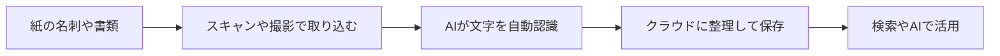

※本記事はアフィリエイト広告(PR)を含みます。

## AIで名刺・書類を整理する方法とは?この記事でわかること

「机の上に名刺や書類が山積みで、必要なときに見つからない…」そんな悩みを抱えていませんか?この記事では、**AIで名刺・書類を整理する方法**を初心者の方にもわかりやすく解説します。

この記事を読むと、次のことがわかります。

- AIを使った名刺・書類整理の基本的な仕組み
- おすすめのスキャナーやスキャンアプリの選び方
- 無料で始められる整理術と有料サービスの違い
- 整理した後にAIを活用してさらに便利にする方法

紙の管理に毎日少しずつ時間を奪われている方ほど、効果を実感しやすいテーマです。さっそく見ていきましょう。

## なぜ今、名刺・書類の整理にAIが使われるのか

これまで名刺や書類の整理といえば、ファイルに挟んだり、手作業でデータ入力したりするのが一般的でした。しかし最近は、**AI-OCR(エーアイ・オーシーアール)** と呼ばれる技術の進化で、作業が大きくラクになっています。

OCRとは「画像の中の文字を読み取ってデジタルのテキストに変換する技術」のことです。これにAI(人工知能)が加わることで、名刺のどこが会社名で、どこが氏名や電話番号なのかを自動で判別してくれるようになりました。

つまり、スマホで名刺を撮影するだけで、

- 会社名・氏名・役職・電話番号・メールアドレス

といった項目が自動で振り分けられ、データベースとして使えるようになるのです。手入力の手間が大幅に減り、入力ミスも起きにくくなります。

## 整理の流れを図解で理解しよう

まずは全体の流れをイメージしてみましょう。名刺や書類の整理は、大きく分けて「取り込む→読み取る→整理する→活用する」という4ステップで進みます。

この流れの中で「取り込む(スキャナー・アプリ選び)」と「活用する(AIの使い方)」が特に重要なポイントになります。順番に見ていきましょう。

## ステップ1:取り込み方法を選ぶ(スマホアプリ vs 専用スキャナー)

名刺や書類を取り込む方法は、大きく2つあります。どちらが向いているかは、扱う枚数によって変わります。

### 少量ならスマホアプリで十分

名刺が月に数枚〜十数枚程度なら、スマホアプリだけで十分です。代表的なものを紹介します。

| アプリ名 | 特徴 | 向いている人 |
|----------|------|--------------|
| Eight | 名刺をスマホで撮影して管理。SNSのようにつながれる | ビジネスパーソン全般 |
| myBridge | LINEが提供する名刺管理アプリ。無料で使える機能が多い | コストを抑えたい人 |
| Adobe Scan | 書類のスキャンに強く、PDF化が得意 | 書類中心の人 |

これらのアプリはAI-OCRを内蔵しており、撮影するだけで文字を読み取ってくれます。まずは無料アプリから試してみるのがおすすめです。

### 大量ならドキュメントスキャナーが効率的

名刺や書類が数百枚単位であるなら、専用の **ドキュメントスキャナー** が圧倒的に速くて快適です。複数枚をまとめてセットして、ボタン一つで一気に読み取れます。

名刺整理で人気の高い卓上スキャナーをチェックしてみたい方は、こちらから探せます。

👉 [Amazonで「ドキュメントスキャナー 名刺」を見る](https://af.moshimo.com/af/c/click?a_id=5632371&p_id=170&pc_id=185&pl_id=38594&url=https%3A%2F%2Fwww.amazon.co.jp%2Fs%3Fk%3D%25E3%2583%2589%25E3%2582%25AD%25E3%2583%25A5%25E3%2583%25A1%25E3%2583%25B3%25E3%2583%2588%25E3%2582%25B9%25E3%2582%25AD%25E3%2583%25A3%25E3%2583%258A%25E3%2583%25BC%2520%25E5%2590%258D%25E5%2588%25BA)

楽天で価格やレビューを比較したい場合はこちらもどうぞ。

👉 [楽天市場で「ScanSnap スキャナー」を探す](https://af.moshimo.com/af/c/click?a_id=5632328&p_id=54&pc_id=54&pl_id=616&url=https%3A%2F%2Fsearch.rakuten.co.jp%2Fsearch%2Fmall%2FScanSnap%2520%25E3%2582%25B9%25E3%2582%25AD%25E3%2583%25A3%25E3%2583%258A%25E3%2583%25BC%2F)

価格や付属ソフトの内容は変わることがあるので、購入前に公式サイトで最新情報を確認してください。

## ステップ2:スキャナー・アプリの選び方

「結局どれを選べばいいの?」と迷ったときは、次の3つの基準で考えると失敗しにくくなります。

### 1. 1日に処理する枚数で選ぶ

- **少ない(〜10枚程度):** スマホアプリで十分
- **そこそこ(数十枚):** USB接続のコンパクトスキャナー
- **多い(数百枚):** 自動給紙(複数枚を連続で読み取る機能)付きスキャナー

### 2. 保存先(クラウド連携)で選ぶ

スキャンしたデータをどこに保存するかも重要です。Googleドライブ、Dropbox、Evernoteなどのクラウドサービスと連携できると、スマホでもパソコンでも同じデータを見られて便利です。

### 3. 読み取り精度で選ぶ

手書き文字や特殊なデザインの名刺は読み取り精度が下がることがあります。レビューやお試し版で、自分の使う書類できちんと読み取れるか確認しておくと安心です。

## ステップ3:整理したデータをAIで活用する

ここからがAI整理の本領発揮です。デジタル化したデータは、ただ保存するだけでなく「活用」してこそ価値があります。

### 検索で一瞬で見つける

データ化された名刺や書類は、キーワードで一瞬で検索できます。「あの展示会で会った人」「去年の契約書」なども、会社名やキーワードを入力するだけで探し出せます。紙をめくって探していた時間がゼロになります。

### ChatGPTなどのAIチャットと組み合わせる

スキャンしてテキスト化した書類の内容を、ChatGPTやClaudeなどのAIチャットに貼り付ければ、要約させたり、内容について質問したりできます。例えば長い契約書を「ポイントを3つにまとめて」とお願いするだけで、要点をすぐ把握できます。

どのAIチャットを使えばいいか迷っている方は、[ChatGPTとClaudeとGeminiを徹底比較!初心者におすすめのAIチャットはどれ?](/2026/06/09/ai-chat-comparison/)を参考にすると選びやすくなります。

### お礼メールの作成も時短できる

名刺管理アプリで連絡先を整理したら、AIを使ってお礼メールを効率よく作成しましょう。文面を考える手間が減り、対応スピードが上がります。具体的なコツは[AIメール作成術\|ビジネスメールを3倍速く書く方法を初心者向けに解説](/2026/06/14/ai-email-writing/)で詳しく紹介しています。

## よくある質問(Q&A)

### Q. 名刺管理アプリは無料で使えますか?

はい、EightやmyBridgeなどは基本機能を無料で使えます。ただし、大量の名刺データの一括出力や、チームでの共有といった高度な機能は有料プランになることが多いです。まずは無料で試し、物足りなくなったら有料を検討するのがおすすめです。料金や機能は変更されることがあるので、公式サイトで最新情報を確認してください。

### Q. スキャンした紙の書類は捨ててもいいですか?

契約書や公的な書類など、原本の保管が法律で求められるものもあります。重要書類は念のため原本を残し、それ以外の参考資料はデジタル化して処分する、といった使い分けがおすすめです。

### Q. 読み取りミスが心配です

AI-OCRの精度は年々上がっていますが、100%ではありません。電話番号やメールアドレスなど、間違えると困る項目は、取り込み後にざっと目視チェックしておくと安心です。

## 整理を続けるためのコツ

ツールを導入しても、続かなければ意味がありません。長く続けるためのコツを紹介します。

- **その場でスキャンする習慣をつける:** もらった名刺や届いた書類は、後回しにせずすぐ取り込む
- **保存先のルールを決める:** フォルダ名や保存場所を最初に決めておく
- **週に一度の整理タイムを作る:** まとめてチェックする時間を予定に入れる

デスク周りそのものを整えると作業効率もぐっと上がります。在宅ワークの環境を見直したい方は[在宅ワークが捗るデスク周りガジェット10選\|快適環境の作り方](/2026/06/11/home-office-gadgets/)もあわせてご覧ください。

## まとめ

今回は、AIで名刺・書類を整理する方法を紹介しました。最後にポイントを振り返ります。

- AI-OCRの進化で、撮影・スキャンするだけで名刺や書類が自動でデータ化できる
- 少量ならスマホアプリ、大量なら自動給紙付きスキャナーが便利
- 選ぶときは「処理枚数・保存先・読み取り精度」の3点を基準に
- デジタル化したデータはAIチャットと組み合わせて、検索・要約・メール作成に活用できる
- 続けるコツは「その場で取り込む習慣」と「保存ルールの統一」

まずは無料の名刺管理アプリから試してみて、必要に応じて専用スキャナーを検討するのがおすすめです。紙の山から解放されて、必要な情報にすぐアクセスできる快適な環境を作っていきましょう。
