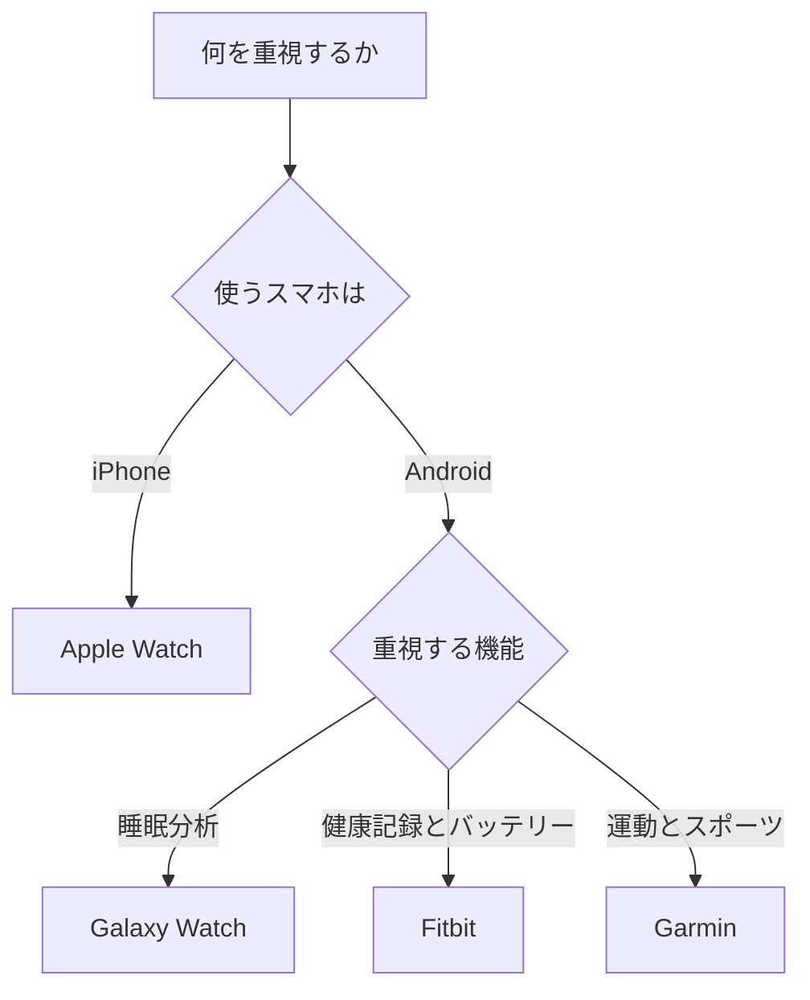

※本記事はアフィリエイト広告(PR)を含みます。

## この記事でわかること

「AI搭載スマートウォッチで健康管理や睡眠分析をしたいけれど、どれを選べばいいのかわからない」——そんな悩みを持つ方は多いのではないでしょうか。この記事では、**AI搭載スマートウォッチのおすすめモデルを健康管理・睡眠分析の観点で比較**し、初心者の方でも自分に合った1台を選べるように丁寧に解説します。

この記事を読むと、次のことがわかります。

- AI搭載スマートウォッチでできること（健康・睡眠の何がわかるのか）
- 主要モデルの特徴と違い
- 自分に合った選び方のポイント
- よくある疑問（料金や精度など）への答え

それでは、さっそく見ていきましょう。

## AI搭載スマートウォッチとは?

スマートウォッチとは、腕時計型のウェアラブル端末（身につけて使う小型のIT機器）のことです。最近のモデルは、心拍数や睡眠などのデータをただ記録するだけでなく、**AI（人工知能）が大量のデータを分析して、一人ひとりに合わせたアドバイスをくれる**ようになっています。

### AIで具体的に何ができるの?

代表的な機能は次のとおりです。

- **睡眠分析**: 浅い眠り・深い眠り・レム睡眠などを自動で判定し、睡眠スコアを表示
- **健康モニタリング**: 心拍数・血中酸素レベル・ストレス度などを常時測定
- **運動の自動認識**: ウォーキングやランニングなどをAIが自動で検出して記録
- **パーソナルアドバイス**: 「今日は回復が不十分なので軽めの運動を」といった提案

つまり、ただのデータ収集ではなく「あなた専用の健康コーチ」のような役割を果たしてくれるのが、AI搭載スマートウォッチの魅力です。

## 主要なAIスマートウォッチを比較

ここでは、健康管理・睡眠分析で人気の高い主要シリーズを比較します。なお、価格や対応機能は頻繁に更新されるため、**購入前に必ず公式サイトで最新情報をご確認ください**。

| シリーズ | 主な対応スマホ | 健康・睡眠機能 | 特徴 |
|---|---|---|---|
| Apple Watch | iPhone | 睡眠分析・心電図・血中酸素など充実 | iPhoneとの連携が抜群 |
| Galaxy Watch | Android中心 | 睡眠コーチング・体組成測定など | AI睡眠分析が高評価 |
| Fitbit | iPhone/Android | 睡眠スコア・ストレス管理が得意 | 健康特化でバッテリー長持ち |
| Garmin | iPhone/Android | 運動・回復度の分析が強い | スポーツ・アウトドア向け |

### Apple Watch:iPhoneユーザーの定番

iPhoneを使っている方には、まず候補に挙がるのがApple Watchです。睡眠分析や心拍数の常時測定はもちろん、転倒検出や緊急SOSなど安全機能も充実しています。iPhoneとの連携がスムーズなので、初めての1台としても安心です。

### Galaxy Watch:AI睡眠分析に強み

SamsungのGalaxy Watchは、AIによる睡眠コーチング機能が高く評価されています。睡眠の質を分析し、改善のためのアドバイスを継続的に提示してくれます。Androidスマホ、とくにGalaxyシリーズと組み合わせると真価を発揮します。

### Fitbit:健康管理に特化したいなら

Fitbitは健康・睡眠の記録に特化したブランドで、バッテリーが長持ちするモデルが多いのも魅力です。睡眠スコアやストレス管理機能が分かりやすく、「まず健康管理から始めたい」という方に向いています。

### Garmin:運動・スポーツ重視の方に

ランニングや登山などアクティブに身体を動かす方には、運動データの分析に強いGarminが人気です。回復に必要な時間を提案してくれるなど、トレーニングをサポートする機能が充実しています。

👉 [Amazonで「スマートウォッチ 睡眠 健康管理」を見る](https://af.moshimo.com/af/c/click?a_id=5632371&p_id=170&pc_id=185&pl_id=38594&url=https%3A%2F%2Fwww.amazon.co.jp%2Fs%3Fk%3D%25E3%2582%25B9%25E3%2583%259E%25E3%2583%25BC%25E3%2583%2588%25E3%2582%25A6%25E3%2582%25A9%25E3%2583%2583%25E3%2583%2581%2520%25E7%259D%25A1%25E7%259C%25A0%2520%25E5%2581%25A5%25E5%25BA%25B7%25E7%25AE%25A1%25E7%2590%2586)

## 自分に合ったスマートウォッチの選び方

選ぶときに大切なのは、「自分が何を重視するか」を先に決めることです。次のフローチャートを参考にしてみてください。

### チェックしたい4つのポイント

1. **スマホとの相性**: iPhoneならApple Watchが最も快適です。Androidなら選択肢が広がります。
2. **バッテリー持ち**: 毎日充電が面倒な方は、数日持つモデルを選びましょう。睡眠分析を使うなら、寝ている間も装着するのでバッテリーは重要です。
3. **欲しい健康機能**: 血中酸素・心電図・体組成など、必要な機能があるか確認しましょう。
4. **サイズと装着感**: 一日中つけるものなので、手首に合うサイズと軽さも大切です。

👉 [楽天市場で「スマートウォッチ 防水 心拍計」を探す](https://af.moshimo.com/af/c/click?a_id=5632328&p_id=54&pc_id=54&pl_id=616&url=https%3A%2F%2Fsearch.rakuten.co.jp%2Fsearch%2Fmall%2F%25E3%2582%25B9%25E3%2583%259E%25E3%2583%25BC%25E3%2583%2588%25E3%2582%25A6%25E3%2582%25A9%25E3%2583%2583%25E3%2583%2581%2520%25E9%2598%25B2%25E6%25B0%25B4%2520%25E5%25BF%2583%25E6%258B%258D%25E8%25A8%2588%2F)

## よくある疑問（Q&A）

### Q. スマートウォッチのアプリは無料で使える?

基本的な健康・睡眠の記録機能は、本体を買えば追加料金なしで使えることがほとんどです。ただし、より詳しいAI分析やパーソナルプランは、月額制のサブスクリプション（定額課金）が必要な場合があります。FitbitやGalaxyなど一部のサービスが該当します。最新の料金は公式サイトでご確認ください。

### Q. 睡眠分析の精度はどのくらい?

スマートウォッチの睡眠分析は、心拍数や体の動きから睡眠段階を推測するもので、医療機器ほどの精度ではありません。あくまで「傾向を把握して生活習慣を見直す」目安として活用するのがおすすめです。

### Q. 防水じゃないと困る?

手洗いや汗、突然の雨を考えると、ある程度の防水性能はあったほうが安心です。水泳でも使いたい場合は、より高い防水等級のモデルを選びましょう。

## 他のガジェットと組み合わせて快適に

スマートウォッチは単体でも便利ですが、ほかのガジェットと組み合わせることで生活全体が快適になります。たとえば在宅ワークの環境を整えたい方は[在宅ワークが捗るデスク周りガジェット10選](/2026/06/11/home-office-gadgets/)も参考になります。

また、音声操作で家電や音楽を楽しみたいなら[スマートスピーカーはどれを買うべき?Alexa・Google Home徹底比較](/2026/06/12/smart-speaker-comparison/)もチェックしてみてください。最近注目のウェアラブル端末については[AIメガネ(スマートグラス)おすすめ比較2026](/2026/06/16/ai-smart-glasses-2026/)で詳しく解説しています。

## まとめ

AI搭載スマートウォッチは、健康管理や睡眠分析を手軽に始められる頼もしいアイテムです。最後に選び方のポイントを振り返りましょう。

- **iPhoneユーザー**は連携が快適なApple Watchが安心
- **AI睡眠分析重視**ならGalaxy Watch
- **健康記録とバッテリー持ち**を求めるならFitbit
- **運動・スポーツ重視**ならGarmin

まずは「自分が一番何をしたいか」を決め、スマホとの相性とバッテリー持ちを確認するのが失敗しないコツです。価格や機能は更新が早いので、購入前には必ず公式サイトで最新情報を確認しましょう。あなたにぴったりの1台を見つけて、毎日の健康づくりに役立ててくださいね。
