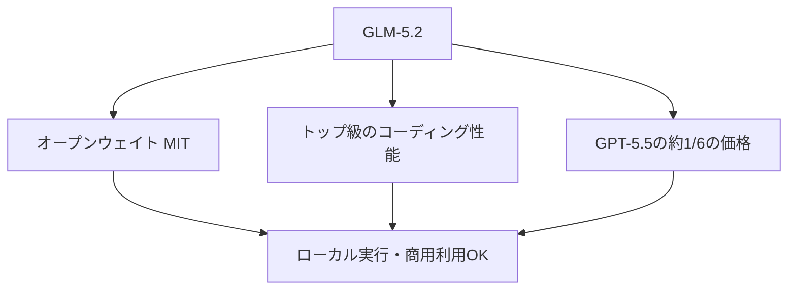

※本記事はアフィリエイト広告(PR)を含む場合があります。

## GLM-5.2が「安くて強い」と話題に

2026年6月、中国の **Z.ai(智譜AI / Zhipu AI)** が公開したAIモデル **GLM-5.2** が、世界の開発者の間で大きな話題になっています。

理由はシンプルで、**コーディング性能がトップクラスなのに、価格が圧倒的に安い**から。一部のベンチマークでは**GPT-5.5を上回り、Claude Opus 4.8に肉薄**しながら、API料金は**GPT-5.5のおよそ6分の1**とされています。

しかも**オープンウェイト(MITライセンス)**で公開され、誰でも無料でダウンロード・商用利用が可能。この記事では、**GLM-5.2の性能・料金を、GPTやClaudeと比較**しながら、初心者向けにわかりやすく解説します。

> ⚠️ ベンチマークの数値や料金は時期・条件で変わります。導入前に必ず公式の最新情報をご確認ください。

## GLM-5.2とは?(基本スペック)

- **提供元**:Z.ai(智譜AI / Zhipu AI、中国)
- **公開**:2026年6月(オープンウェイト)
- **種類**:約7,500億パラメータ級の MoE(複数の専門家を切り替える方式)
- **ライセンス**:MIT(地域制限なし・商用利用可)
- **コンテキスト長**:最大100万トークン(超長文を一度に処理)
- **得意分野**:**コーディングとエージェント的な長時間タスク**

最大の特徴は、**「オープンウェイト × 高性能 × 激安」**という3拍子がそろっている点です。Hugging Faceから誰でも入手でき、**自分のPCやサーバーで動かす(ローカル実行)**こともできます。

## 性能比較:GPT-5.5・Claude Opus 4.8と

報じられている主なコーディング系ベンチマークを比較します(数値は報告ベース)。

| ベンチマーク | GLM-5.2 | GPT-5.5 | Claude Opus 4.8 |
|---|---|---|---|
| SWE-bench Pro(実務的なバグ修正) | 62.1 | 58.6 | — |
| FrontierSWE(長時間タスク) | 74.4% | 72.6% | 75.1% |
| Terminal-Bench 2.1 | 81.0 | — | — |

ポイントは次の3つです。

- **SWE-bench ProでGPT-5.5を上回る**(62.1 vs 58.6)
- 長時間タスク(FrontierSWE)で**Claude Opus 4.8に肉薄**(74.4% vs 75.1%)
- **オープンモデルとして初めてTerminal-Benchで80%超**を達成

数学・推論系でも、AIME 2026で99.2、GPQA-Diamondで91.2など高スコアが報告されており、**「オープンモデルなのにトップ級」**という点が衝撃をもって受け止められています。各AIのコーディング比較全体像は、[ChatGPT・Claude・Geminiのプログラミング比較](/2026/06/16/ai-coding-comparison-2026/)もあわせてどうぞ。

## 料金比較:ここが一番のインパクト

### API料金(100万トークンあたり)

| モデル | 入力 | 出力 | 合計の目安 |
|---|---|---|---|
| GLM-5.2 | 約1.4ドル | 約4.4ドル | 約5.8ドル |
| GPT-5.5 | 約5ドル | 約30ドル | 約35ドル |

同等以上のコーディング性能で、**コストはおよそ6分の1**。大量にAPIを使う開発用途では、この差は非常に大きくなります。

### 定額プラン(コーディング向け)

Z.aiは「GLM Coding Plan」も提供しており、**Claude Codeなどのツールに挿して使える**のが特徴です。

| プラン | 月額の目安 |
|---|---|
| Lite | 約12〜18ドル〜 |
| Pro | 約50ドル |
| Max | 約112ドル |

(年額契約ベースの目安)Anthropicの上位プランと比べても割安な水準です。各AIサブスクの料金全体像は[AIサブスク料金比較](/2026/06/16/ai-subscription-pricing-2026/)で整理しています。

## 何がすごいのか(3つのポイント)

1. **オープンで自由**:MITライセンスで重みが公開。自分の環境で動かせ、商用利用も可能
2. **高性能**:コーディングで世界トップ級。Claude Codeなど既存ツールにも接続できる
3. **激安**:APIもプランも大幅に安く、コスト重視の開発に強い

背景には、米国製の最先端AIに[輸出規制などの制約](/2026/06/16/claude-fable-5-japan-impact/)が生じるなか、**「制約のないオープンなAI」への需要**が高まっている事情もあります。実際、公開を受けてZ.ai関連の株価が急騰する場面もありました。

## 注意点(導入前に確認したいこと)

- **データの取り扱い**:中国企業のクラウドAPIを使う場合、入力データの扱いや規約を必ず確認。機密情報の入力は慎重に(ローカル実行ならこの懸念は小さくなります)
- **ベンチマークは目安**:数値は条件で変わります。**自分の用途で試す**のが確実
- **商用利用の条件**:MITで自由度は高いものの、利用規約・各国の規制も確認を
- **日本語の使い勝手**:用途によってはGPT/Claudeのほうが手になじむ場合もあります

## 誰におすすめ?

- **コストを抑えて大量にコードを書かせたい開発者** → 第一候補
- **ローカル/自社環境でAIを動かしたい企業** → オープンウェイトが刺さる
- **まず気軽にAIチャットを使いたい初心者** → 無理にGLMでなくてOK。[ChatGPT・Claude・Geminiの比較](/2026/06/09/ai-chat-comparison/)から始めるのが安心

## よくある質問

### GLM-5.2は無料で使える?

オープンウェイトなので**モデル自体は無料で入手・ローカル実行が可能**です。手軽なクラウドAPIや定額プランは有料ですが、競合より大幅に安い水準です。

### 初心者でも使える?

ローカル実行は技術的なハードルがあります。初心者はまず、Claude CodeなどにGLMを接続するか、使い慣れたAIチャットから始めるのが現実的です。

### GPTやClaudeから乗り換えるべき?

コスト最優先・コーディング中心なら有力候補です。ただし日本語の細かなニュアンスや総合力では好みが分かれるため、**自分の用途で比較**してから判断しましょう。

## まとめ

- **GLM-5.2**は中国Z.aiのオープンモデル。**コーディングで世界トップ級**
- 一部ベンチマークで**GPT-5.5超え・Claude Opus 4.8に肉薄**、価格は**約6分の1**
- **MITライセンスでローカル実行・商用利用も可能**
- 注意点は**データの取り扱い・規約確認**。用途に合うかは自分で試すのが確実

「高性能AIは高い」という常識が崩れつつあります。オープンで安いGLM-5.2の登場は、AI活用のハードルをさらに下げる一手になりそうです。

### 参考リンク

- [Z.ai's open-weights GLM-5.2 beats GPT-5.5 on coding benchmarks for 1/6th the cost(VentureBeat)](https://venturebeat.com/technology/z-ais-open-weights-glm-5-2-beats-gpt-5-5-on-multiple-long-horizon-coding-benchmarks-for-1-6th-the-cost)
- [中国Z.aiがオープンモデル「GLM-5.2」公開 コーディング世界2位(claypier)](https://claypier.com/z-ai-glm-5-2-launch/)
- [GLM-5.2とは?その性能や使い方、料金を徹底解説(AI総合研究所)](https://www.ai-souken.com/article/what-is-glm-5-2)
