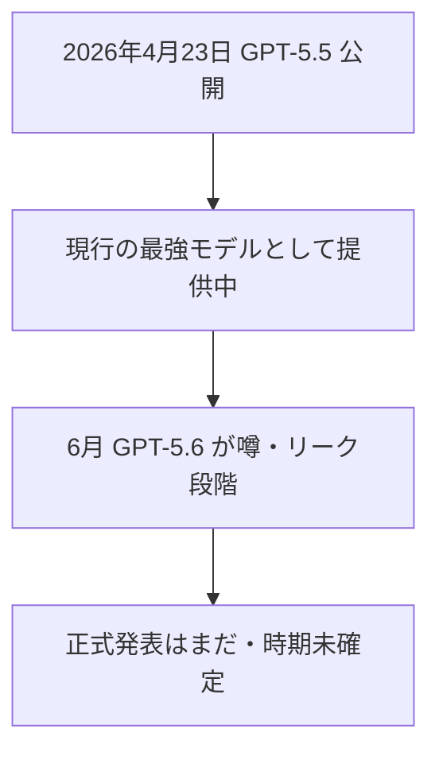

※本記事はアフィリエイト広告(PR)を含む場合があります。

> 🆕 **【更新:2026年6月26日】GPT-5.6が登場しました。** OpenAIがGPT-5.6を**限定プレビュー**で公開(Sol・Terra・Lunaの3モデル構成)。最新の内容は[GPT-5.6が限定プレビュー開始\|Sol・Terra・Lunaの特徴](/2026/06/26/gpt-5-6-sol-preview/)で解説しています。以下は発表前(噂段階)の記録としてお読みください。

## GPT-5.6、出そうで出ない——今わかっていること

「次のChatGPT、GPT-5.6っていつ出るの?」——いま最も検索されているAIの話題のひとつです。

結論から言うと、**2026年6月時点でGPT-5.6はまだ正式発表されていません**。ただし、開発者ツールのログに名前が現れたり、関係者の発言や予測市場の動きから、**登場が近いと見られている**段階です。

この記事では、**確定していること**と**まだ噂の段階のこと**をはっきり分けて、GPT-5.6の現状を整理します。

> ⚠️ **重要**:本記事の新機能・性能はリーク・予測市場・報道にもとづく**未確定情報**です。正式な仕様はOpenAIの公式発表をお待ちください。

## まず確定していること

- **GPT-5.5は2026年4月23日に公開**され、現在もChatGPT・Codexで提供中の主力モデルです。
- OpenAIのチーフサイエンティスト(Jakub Pachocki氏)が、GPT-5.6は前モデルからの**「有意な改善(meaningful improvement)」**になると社内で共有した、と報じられています。
- 一方で、**重み(モデル)・API・ベンチマーク・公開日のいずれも、OpenAIは正式発表していません。**

## 噂・リークされている主な強化点

ここからは**未確定の情報**です。リークや予測市場で語られている主なポイントを整理します。

| 項目 | 噂・期待されている内容 |
|---|---|
| コンテキスト長 | 最大150万トークン説(GPT-5.5比でおよそ4割増との報告) |
| コーディング | エージェント的なコーディング性能の向上 |
| 計画・自己修正 | 複数ステップの実行とエラー回復の改善 |
| トークン効率 | より少ないトークンで同等以上の性能 |
| 検証対象 | Terminal-Bench、SWE-bench Verified、FrontierMath などの伸び |

特に、開発者ツール「Codex」のログに **`gpt-5.6`** という名前が現れたことから、**コーディング・エージェント用途を中心に社内テスト中**ではないか、と見られています。

## いつ公開される?

公開時期も**未確定**ですが、目安として語られているのは次のとおりです。

- 予測市場では、一時**6月末までの公開に80〜90%前後**の確率が付けられていました。
- 保守的な見方では7月にずれ込む可能性も指摘されています。

いずれも**公式発表ではない**ため、確実なことは言えません。最新の動きは公式の発表で確認するのが確実です。

## GPT-5.5との違いは?(現時点の見立て)

GPT-5.5はすでに非常に高性能で、**コーディングに強い現行最強クラス**のモデルです。GPT-5.6は、そこから「**長い文脈・自律的な作業(エージェント)・効率**」をさらに伸ばす方向と見られています。

裏を返せば、**今GPT-5.5を使っていて困っていないなら、急いで待つ必要はありません**。AIモデルは数週間ごとに更新される時代で、実際この6月だけでも[複数のフラッグシップが相次いで登場](/2026/06/16/ai-model-flood-2026/)しています。

各AIの実力差(特にコーディング)は、[ChatGPT・Claude・Geminiのプログラミング比較](/2026/06/16/ai-coding-comparison-2026/)で詳しくまとめています。料金面は[AIサブスク料金比較](/2026/06/16/ai-subscription-pricing-2026/)もあわせてどうぞ。

## 私たちユーザーはどう備える?

- **慌てて待たない**:有料プランは料金据え置きで自動的に新モデルへ更新されることが多く、待つだけで恩恵を受けられます。
- **発表されたら"自分の用途"で試す**:ベンチマークの数字より、自分の作業で使えるかが大事です。
- **噂に振り回されない**:公開前は誤情報も増えます。一次情報(公式発表)を基準にしましょう。

まずは現行のGPT-5.5やChatGPTを使いこなしておくのが、結局いちばんの近道です。基礎を固めたい方は入門書も役立ちます。

👉 [Amazonで「ChatGPT 活用 本」を見る](https://af.moshimo.com/af/c/click?a_id=5632371&p_id=170&pc_id=185&pl_id=38594&url=https%3A%2F%2Fwww.amazon.co.jp%2Fs%3Fk%3DChatGPT%2520%25E6%25B4%25BB%25E7%2594%25A8%2520%25E6%259C%25AC)

## よくある質問

### GPT-5.6はもう使える?

いいえ。**2026年6月時点では未発表・未提供**です。現行の主力はGPT-5.5です。

### 無料版でも使える?

公開後の提供範囲は未定です。一般に最新の最上位モデルは有料プランが中心で、無料枠へは順次開放される傾向です。

### GPT-5.6を待つべき?それとも今課金すべき?

困っていないなら待つ必要はありません。**今の用途で必要なら、現行モデルで始めてOK**。新モデルが出ても、多くの場合は同じ料金で自動的に使えるようになります。

## まとめ

- **GPT-5.6は2026年6月時点で未発表**。Codexログのリークや関係者発言から登場が近いと見られている段階
- 噂される強化点は「**超長文脈(最大150万トークン説)・エージェント/コーディング・効率**」だが**いずれも未確定**
- 公開時期は**6月末〜7月**との見方があるものの公式発表はまだ
- ユーザーは慌てず、**現行のGPT-5.5を使いこなしつつ正式発表を待つ**のが賢明

最新の正確な情報は、OpenAIの公式発表でご確認ください。動きがあり次第、本ブログでも追っていきます。

### 参考リンク

- [GPT-5.6: OpenAI Chief Scientist Calls It a Meaningful Leap, June Launch Nears(Tech Times)](https://www.techtimes.com/articles/318492/20260616/gpt-56-openai-chief-scientist-calls-it-meaningful-leap-june-launch-nears.htm)
- [GPT-5.6の噂まとめ｜Codexログ、1.5Mコンテキスト説、公開時期(ファネルAi)](https://funnel-ai.jp/media/gpt-5-6-rumors/)
- [What to Expect from OpenAI's GPT-5.6 Release in June 2026(Geeky Gadgets)](https://www.geeky-gadgets.com/gpt-5-6-june-2026-release/)
