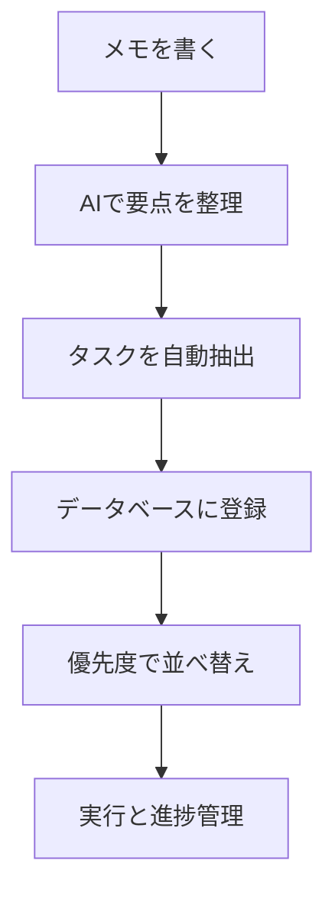

※本記事はアフィリエイト広告(PR)を含みます。

## Notion AIの使い方とは?この記事でわかること

「Notion AIの使い方を知りたい」「情報整理やタスク管理をもっと効率化したい」——そんな方に向けた完全ガイドです。

この記事を読むと、次のことがわかります。

- Notion AIで何ができるのか(基本機能)
- 情報整理・タスク管理を効率化する具体的な使い方
- 無料で使えるのか、料金はどうなっているのか
- 初心者がつまずかないための始め方のコツ

Notion(ノーション)は、メモ・ドキュメント・タスク管理・データベースをひとつにまとめられる「オールインワン作業ツール」です。その中に組み込まれたAI機能が「Notion AI」で、文章作成・要約・整理などを自動で手伝ってくれます。専門知識がなくても使えるので、安心して読み進めてください。

## Notion AIでできること

まずは、Notion AIが得意とする代表的な機能を整理しておきましょう。

| 機能 | できること |
|------|------------|
| 文章作成 | ブログ案・メール文・アイデア出しを自動生成 |
| 要約 | 長い議事録や記事を数行にまとめる |
| 翻訳 | 英語などの文章を日本語に変換 |
| 文章校正 | 誤字脱字や表現の修正 |
| 情報抽出 | 文章からタスクや要点を自動で取り出す |
| Q&A | 自分が書いたページの内容を質問して回答してもらう |

ポイントは、これらの機能が「いつものメモやドキュメントの中で」そのまま使えることです。別アプリに切り替える必要がありません。

## Notion AIの基本的な使い方

### スペースキーまたはショートカットで呼び出す

Notion AIの起動はとても簡単です。

1. ページ内の空白行で「スペースキー」を押す
2. 表示されたメニューからAIを選ぶ
3. やりたいこと(要約・続きを書く など)を選ぶ、または指示を入力する

選択した文章の上に出る「AIに依頼」ボタンからでも呼び出せます。まずは適当なメモを書いて、「この文章を要約して」と指示してみると、感覚がつかめます。

### 指示(プロンプト)は具体的にするのがコツ

AIへの指示は、具体的なほど精度が上がります。

- ❌「まとめて」
- ⭕「この会議メモを箇条書き3つに要約して、決定事項を最初に書いて」

こうした指示の出し方は、ChatGPTなど他のAIチャットでも共通です。AIチャットの違いが気になる方は[ChatGPTとClaudeとGeminiを徹底比較!初心者におすすめのAIチャットはどれ?](/2026/06/09/ai-chat-comparison/)もあわせてご覧ください。

## 情報整理を効率化する活用法

Notion AIが最も力を発揮するのが「情報整理」です。

### 散らかったメモを自動で構造化する

打ち合わせ中に殴り書きしたメモも、AIに「見出しと箇条書きで整理して」と頼めば、一瞬で読みやすい形になります。後から見返したときの理解が格段にラクになります。

### 長い資料を要約してインプットを時短

Web記事や報告書を貼り付けて要約させれば、要点だけを短時間で把握できます。情報収集にかかる時間を大きく減らせます。

### ページ内検索で「知識のデータベース」に

蓄積したページに対して質問すると、AIが内容を踏まえて答えてくれます。自分専用の知識ベースとして機能するのが大きな魅力です。

## タスク管理を効率化する活用法

### 文章からタスクを自動抽出する

会議メモを書いたあと、「この中からやるべきタスクを抽出して」と指示すると、ToDoリストが自動で作られます。「言った・言わない」「やり忘れ」を防げます。

議事録づくり自体を効率化したい方は、[AIで議事録作成を自動化する方法\|おすすめツール5選](/2026/06/10/ai-meeting-minutes/)も参考になります。

### データベースと組み合わせてタスクを見える化

Notionの「データベース」機能(表やカンバン形式でデータを管理できる仕組み)とAIを組み合わせると、タスクの優先度づけや分類も効率化できます。

スケジュール管理全体を自動化したい方には、[AIスケジュール管理術\|忙しい人のためのタスク自動化入門](/2026/06/13/ai-schedule-automation/)もおすすめです。

## Notion AIは無料で使える?料金について

よくある疑問が「Notion AIは無料で使えるの?」という点です。

- Notion本体には無料プランがありますが、Notion AIは基本的に**有料の追加機能(またはプランに含まれる形)**で提供されています。
- 無料で試せる「お試し回数」が用意されている場合もあります。
- 料金体系は変更されることがあるため、**最新の正確な金額は必ず公式サイトで確認してください。**

まずは無料の範囲で触ってみて、便利だと感じたら有料機能を検討する、という流れがおすすめです。他のAIサービスの料金感を比較したい方は[AIサブスク料金比較2026年6月](/2026/06/16/ai-subscription-pricing-2026/)も参考になります。

## より快適に使うための環境づくり

Notion AIは在宅ワークや外出先での作業と相性が抜群です。集中して使うなら、作業環境を整えるとさらに効率が上がります。

オンライン会議のメモをNotionに残す機会が多い方は、聞き取りやすいイヤホンがあると便利です。

👉 [Amazonで「ワイヤレスイヤホン ノイズキャンセリング」を見る](https://af.moshimo.com/af/c/click?a_id=5632371&p_id=170&pc_id=185&pl_id=38594&url=https%3A%2F%2Fwww.amazon.co.jp%2Fs%3Fk%3D%25E3%2583%25AF%25E3%2582%25A4%25E3%2583%25A4%25E3%2583%25AC%25E3%2582%25B9%25E3%2582%25A4%25E3%2583%25A4%25E3%2583%259B%25E3%2583%25B3%2520%25E3%2583%258E%25E3%2582%25A4%25E3%2582%25BA%25E3%2582%25AD%25E3%2583%25A3%25E3%2583%25B3%25E3%2582%25BB%25E3%2583%25AA%25E3%2583%25B3%25E3%2582%25B0)

デスク周りの快適化については[在宅ワークが捗るデスク周りガジェット10選](/2026/06/11/home-office-gadgets/)で詳しく紹介しています。

## 初心者がつまずかないためのコツ

- **最初から完璧を目指さない**:まずは1ページ、1機能から試す
- **テンプレートを活用する**:Notionには日報や議事録のテンプレートが豊富
- **AIの出力は必ず確認する**:AIは間違えることもあるので、最終チェックは自分で行う
- **毎日使う場所に置く**:メモ習慣ができると効果が一気に高まる

## まとめ

Notion AIは、情報整理とタスク管理を「ひとつの場所で」効率化できる強力なツールです。

- 文章作成・要約・翻訳・タスク抽出まで幅広く対応
- 散らかったメモを自動で構造化でき、情報整理が一気にラクに
- 会議メモからタスクを自動抽出して管理できる
- 無料で試せる範囲もあるが、料金は公式サイトで最新情報を確認

まずは普段のメモをNotionに書き、スペースキーからAIを呼び出してみるところから始めてみましょう。小さく試すうちに、自分なりの効率化スタイルが見えてきます。ぜひ今日から一歩踏み出してみてください。
