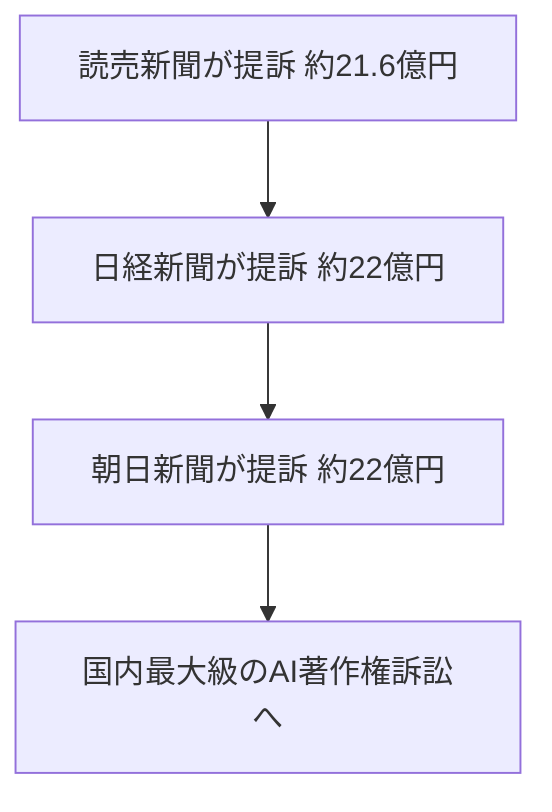
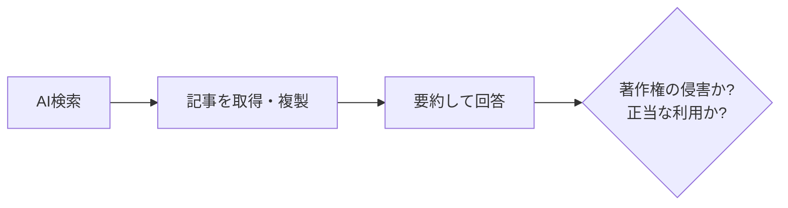

※本記事はアフィリエイト広告(PR)を含む場合があります。

## 大手新聞社が「AI検索」を相次いで提訴

「AIに質問すると、出典の記事を読まなくても答えだけ返ってくる」——便利なAI検索ですが、その裏で**コンテンツの作り手との対立**が深刻化しています。

日本でも、**読売新聞・日本経済新聞・朝日新聞**という大手3社が、AI検索サービス **Perplexity(パープレキシティ)** を著作権侵害で提訴。**各社が約22億円規模の賠償**を求める、国内最大級のAIをめぐる訴訟になっています。

この記事では、**何が起きたのか・何が争点なのか・私たち利用者や発信者にどう関係するのか**を、初心者向けに整理します。

## そもそもPerplexityとは?

Perplexityは、**「AI検索エンジン」**と呼ばれるサービスです。質問を入力すると、ウェブ上の情報を集めて**要約した回答**を、出典リンクつきで返してくれます。ChatGPTのようなチャットと、Googleのような検索を合わせたような使い勝手が支持され、急成長しました。

AIチャット全般の違いを知りたい方は、[ChatGPT・Claude・Geminiの比較記事](/2026/06/09/ai-chat-comparison/)もあわせてご覧ください。

## 何が起きたのか(時系列)

報道によると、提訴の概要は次のとおりです。

| 新聞社 | 請求額(報道ベース) |
|---|---|
| 読売新聞 | 約21億6800万円 |
| 日本経済新聞 | 約22億円 |
| 朝日新聞 | 約22億円 |

各社は、Perplexityが**自社の記事を無断で取得・複製し、似た内容の回答を利用者に提供している**として、**複製権・公衆送信権の侵害**を主張。東京地方裁判所に訴えを起こしています。

## 何が争点なのか

ポイントは、**「公開されている記事をAIが取得・要約して回答すること」が、著作権の侵害にあたるのか**という点です。

- **新聞社側**:記事を無断で複製・送信しており、権利侵害だと主張
- **AI側(一般的な反論)**:公開情報の要約であり、利用者の利便性に資する——といった立場が想定されます

背景には、日本の現行の著作権法が、AIの学習に比較的寛容で**「機械学習パラダイス」**とも言われてきた事情があります。AI検索が普及するなか、**ルールの線引き**が司法の場で問われる形になりました。

## 利用者・発信者へのどんな影響がある?

### AI検索を使う人へ

今すぐPerplexityが使えなくなるわけではありません。ただし、**AIの回答をそのまま鵜呑みにせず、出典元(一次情報)を確認する**習慣は引き続き大切です。

### ブログ・サイトを運営する発信者へ

自分の書いた記事が**AIに学習・要約される**可能性は、今後さらに高まります。対策として、

- **一次情報・独自の体験**など、AIが要約しにくい価値を記事に盛り込む
- robots.txt などで**AIクローラーの扱い**を方針として決めておく
- 引用・出典のルールを守り、自サイトの信頼性を高める

といった備えが現実的です。AI時代の記事づくりの考え方は、[AIでブログ記事を書く方法](/2026/06/12/ai-blog-writing-guide/)も参考になります。

## AIと法律・規制の大きな流れ

この訴訟は、単独の出来事ではありません。AIの急成長に対し、**各国で規制やルール整備が一気に進んでいる**流れの一部です。海外では国家安全保障を理由に[最先端AIが突然停止する出来事](/2026/06/16/claude-fable-5-japan-impact/)もありました。

「便利さ」と「権利・安全」のバランスをどう取るか——AIをめぐる社会のルールづくりは、いままさに過渡期にあります。

## よくある質問

### Perplexityは使っても大丈夫?

サービス自体は利用できます。ただし**回答の正確性は出典で確認**し、商用利用や引用の際は各サービスの規約・著作権に配慮しましょう。

### 自分のブログ記事もAIに使われてしまう?

公開している以上、AIに取得・要約される可能性はあります。完全に防ぐのは難しいため、**一次情報や独自性で価値を高める**のが前向きな対策です。

### この訴訟はどうなる?

本記事執筆時点では**係争中**で、結論は出ていません。判決は、今後のAI検索のあり方やルールに大きく影響する可能性があります。最新の経過は信頼できる報道でご確認ください。

## まとめ

- 読売・日経・朝日の大手3社が、AI検索 **Perplexity** を著作権侵害で提訴(**各社約22億円規模**)
- 争点は「**公開記事をAIが取得・要約して回答すること**」が権利侵害か否か
- 利用者は**出典確認**、発信者は**一次情報・独自性で価値を高める**ことが現実的な備え
- 結論は未確定。**AIと著作権のルールづくりの行方を左右する**重要な訴訟

AIの便利さの裏には、それを支える「コンテンツの作り手」がいます。使う側・作る側の双方にとって、納得できるルールが育っていくことが望まれます。

### 参考リンク

- [読売新聞、米AI新興Perplexityを提訴 検索サービスで著作権侵害(日本経済新聞)](https://www.nikkei.com/article/DGXZQOUE10AM60Q4A211C2000000/)
- [日経・朝日、米AI検索パープレキシティを提訴 著作権侵害で(日本経済新聞)](https://www.nikkei.com/article/DGXZQOUD302I50Q5A730C2000000/)
- [新聞社対Perplexityの生成AI著作権侵害訴訟では何が争点となり得るか(栗原潔 / Yahoo!ニュース)](https://news.yahoo.co.jp/expert/articles/342242c21eb5ea6f535bed02940d82a1e10106d8)
