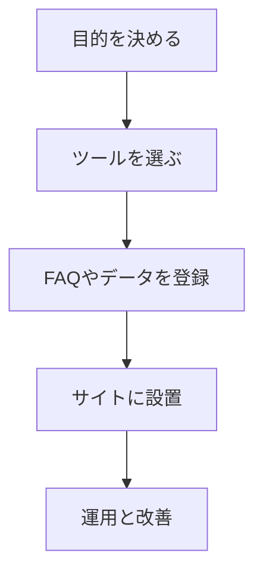

※本記事はアフィリエイト広告(PR)を含みます。

## AIチャットボットを自社サイトに導入する方法がこの記事でわかります

「自社サイトにAIチャットボットを導入したいけれど、何から始めればいいの?」と悩んでいませんか。この記事では、AIチャットボット(=サイト訪問者の質問に自動で答えてくれる会話プログラム)を自社サイトに導入する具体的な手順と、おすすめツールの比較、費用感、無料で使えるかどうかまでを、初心者の方にもわかりやすく解説します。

読み終えるころには、「自分の会社にはどのツールが合うのか」「どんな流れで設置すればいいのか」がイメージできるようになります。問い合わせ対応を自動化して、人手不足やコスト削減に役立てたい方はぜひ最後までご覧ください。

## そもそもAIチャットボットとは?

AIチャットボットとは、サイトを訪れたお客さまの質問に対し、AI(人工知能)が自動で会話形式の回答を返してくれるツールのことです。Webサイトの右下によく表示される「何かお困りですか?」という吹き出しを見たことがある方も多いのではないでしょうか。

近年は、ChatGPTに代表される生成AI(文章を自動で作るAI)の進化によって、より自然な会話ができるチャットボットが手軽に導入できるようになりました。

### 従来型と生成AI型の違い

大きく分けて、チャットボットには2つのタイプがあります。

| タイプ | 特徴 | 向いている用途 |
|---|---|---|
| シナリオ型 | あらかじめ決めた選択肢に沿って回答 | よくある質問への定型対応 |
| 生成AI型 | AIが文章を理解して柔軟に回答 | 自由な質問への自然な対応 |

シナリオ型は「決められた道筋」を案内するイメージ、生成AI型は「会話の相手」に近いイメージです。最近は両方を組み合わせたハイブリッド型も増えています。

## AIチャットボットを導入する3つのメリット

導入を検討するうえで、まずはメリットを整理しておきましょう。

- **24時間対応できる**:深夜や休日でも自動で問い合わせに答えられます。
- **人件費を削減できる**:よくある質問をボットに任せ、スタッフはより重要な業務に集中できます。
- **離脱を防げる**:疑問をその場で解消できるため、お客さまがサイトを離れにくくなります。

特に小規模な事業者や「一人会社」では、限られた人手を効率よく使うために大きな武器になります。少人数で事業を回す仕組みづくりに興味がある方は、[AI時代の「一人会社」入門\|ひとりでも回る仕組みとAI活用術](/2026/06/14/ai-solo-company/)もあわせてご覧ください。

## 導入の流れを4ステップで解説

実際の導入は、難しいプログラミングが不要なツールも多く、思っているよりシンプルです。基本的な流れを図で確認しましょう。

### ステップ1:導入の目的を決める

まずは「何のために導入するのか」をはっきりさせます。問い合わせ削減なのか、売上アップなのか、目的によって選ぶツールが変わります。

### ステップ2:ツールを選ぶ

後ほど紹介する比較を参考に、予算や機能に合ったツールを選びます。多くのツールに無料トライアルがあるので、まずは試してみるのがおすすめです。

### ステップ3:FAQやデータを登録する

お客さまからよく来る質問と回答を登録します。生成AI型の場合は、自社サイトのページやマニュアルを読み込ませることで、自動的に回答を作ってくれるものもあります。

### ステップ4:サイトに設置して運用する

発行されたコード(タグ)を自社サイトに貼り付ければ設置完了です。WordPressなどであれば、専用のプラグインを使えばコードを触らずに導入できる場合もあります。設置後は、答えられなかった質問を確認しながら少しずつ精度を高めていきましょう。

## おすすめAIチャットボットツール比較

ここでは代表的なツールのタイプと特徴を整理します。料金プランは改定されることが多いため、具体的な金額は各公式サイトで最新情報を確認してください。

| ツール | タイプ | 特徴 |
|---|---|---|
| ChatGPTを使った自作ボット | 生成AI型 | API連携で柔軟にカスタマイズ可能 |
| 国産のチャットボットSaaS | シナリオ+AI型 | 日本語サポートが手厚く初心者向け |
| WordPress用プラグイン | 生成AI型が多い | 既存のWordPressサイトに導入しやすい |
| 無料の小規模向けツール | シナリオ型中心 | コストを抑えて試せる |

### 初心者にはどれがおすすめ?

プログラミングに不慣れな方は、まず**国産のチャットボットSaaS**や**WordPressプラグイン**から始めるのがおすすめです。管理画面が日本語で、サポートも受けやすいため安心です。

一方、独自の対応を細かく作り込みたい場合は、ChatGPTなどのAPI(=外部サービスと連携する仕組み)を活用した自作が向いています。どのAIが自社に合うか迷う場合は、[ChatGPTとClaudeとGeminiを徹底比較!初心者におすすめのAIチャットはどれ?](/2026/06/09/ai-chat-comparison/)を読むと、それぞれの得意分野がわかります。

## AIチャットボットは無料で使える?

読者の方が気になる「無料で使えるの?」という疑問にお答えします。

結論から言うと、**無料で試せるツールは多数あります**。多くのSaaSには無料プランや無料トライアルが用意されており、小規模なサイトであれば無料のまま運用できるケースもあります。

ただし、無料プランには以下のような制限があるのが一般的です。

- 月あたりの会話数や問い合わせ件数の上限
- 利用できる機能の制限
- 提供元のロゴ表示

本格的に運用するなら有料プランが必要になることが多いので、「まず無料で試して、効果を感じたら有料に切り替える」という進め方が安全です。具体的な無料枠の内容は変わりやすいため、必ず公式サイトで最新情報を確認してください。

## 導入時に気をつけたいポイント

便利なAIチャットボットですが、運用には注意点もあります。

### 誤った回答(ハルシネーション)への対策

生成AIは、まれに事実と異なる回答を作ってしまうことがあります。これを「ハルシネーション(AIのもっともらしい嘘)」と呼びます。重要な情報については、ボットの回答だけに頼らず、有人対応への切り替えや問い合わせ窓口の案内を用意しておくと安心です。

### 個人情報の取り扱い

お客さまの個人情報を扱う場合は、プライバシーポリシーの整備や、データの保存先の確認が欠かせません。導入前にツールのセキュリティ方針をチェックしましょう。

### サイト全体の表示速度

チャットボットを設置すると、サイトの読み込みに影響することがあります。表示が重くならないか、設置後に確認しておくとよいでしょう。安定した運用にはサーバー環境も大切です。サイトの土台選びについては[AIブログにおすすめのレンタルサーバー比較\|WING・VPS・ロリポップ](/2026/06/14/rental-server-for-ai-blog/)も参考になります。

## オンライン対応をスムーズにする周辺環境も整えよう

チャットボットで一次対応を自動化しても、複雑な相談はオンライン会議や電話に切り替わることがあります。お客さまに良い印象を持ってもらうため、マイクやカメラなどの環境を整えておくのもおすすめです。

👉 [Amazonで「webカメラ マイク内蔵 高画質」を見る](https://af.moshimo.com/af/c/click?a_id=5632371&p_id=170&pc_id=185&pl_id=38594&url=https%3A%2F%2Fwww.amazon.co.jp%2Fs%3Fk%3Dweb%25E3%2582%25AB%25E3%2583%25A1%25E3%2583%25A9%2520%25E3%2583%259E%25E3%2582%25A4%25E3%2582%25AF%25E5%2586%2585%25E8%2594%25B5%2520%25E9%25AB%2598%25E7%2594%25BB%25E8%25B3%25AA)

オンライン会議の機材選びは[Webカメラ・マイクのおすすめ｜オンライン会議の印象を良くする機材選び](/2026/06/15/webcam-mic-online-meeting/)で詳しく解説しています。

## まとめ

今回は、AIチャットボットを自社サイトに導入する方法を解説しました。最後にポイントを振り返りましょう。

- AIチャットボットには「シナリオ型」と「生成AI型」があり、用途で選ぶ
- 導入は「目的を決める→ツール選び→データ登録→設置→運用改善」の4ステップ
- 初心者は国産SaaSやWordPressプラグインから始めると安心
- 無料で試せるツールは多いが、本格運用は有料プランが必要なことが多い
- 誤回答対策や個人情報の取り扱いには注意する

AIチャットボットは、問い合わせ対応の負担を減らし、お客さまの満足度を高める強い味方です。まずは無料トライアルのあるツールから、気軽に試してみてください。具体的な金額や無料枠は変わりやすいので、導入前に必ず各公式サイトで最新情報を確認しましょう。
