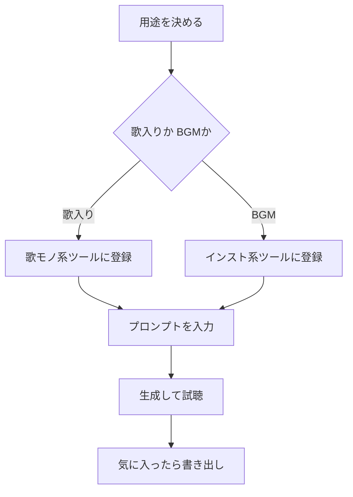

※本記事はアフィリエイト広告(PR)を含みます。

## AI音楽生成ツールとは?この記事でわかること

「動画のBGMを自分で作りたい」「作曲なんてしたことないけど、オリジナル曲を気軽に試したい」——そんな方に注目されているのが**AI音楽生成ツール**です。AI音楽生成ツールとは、文字で指示(プロンプト)を打ち込むだけで、AIが自動でメロディや伴奏、ときには歌声まで作ってくれるサービスのこと。楽器が弾けなくても、楽譜が読めなくても、数十秒で1曲が完成します。

この記事では、**AI音楽生成ツールを無料で始める方法**と、おすすめツールの比較、選び方のポイントをやさしく解説します。読み終えるころには「まず何を使えばいいか」「無料でどこまでできるか」「商用利用は大丈夫なのか」がスッキリわかります。専門用語にはそのつど説明を添えるので、初心者の方も安心して読み進めてください。

## まず結論:初心者は「無料プラン」から試すのが正解

結論からお伝えすると、AI音楽生成は**多くのツールに無料プランがあり、お金をかけずに始められます**。いきなり有料登録をする必要はありません。まずは無料枠でいくつか触ってみて、自分の用途に合うものを見つけるのがおすすめです。

AI音楽生成ツールは、大きく次の2タイプに分けられます。

- **歌モノ生成タイプ**:歌詞とジャンルを指定すると、ボーカル入りの楽曲を作ってくれる
- **インスト(BGM)特化タイプ**:歌なしの伴奏・効果音・環境音などを作るのが得意

どちらを選ぶかで、使うツールが変わってきます。

## 主要なAI音楽生成ツールを比較

代表的なツールを、特徴ごとにまとめました。なお、料金や無料枠の内容は変更されやすいため、**登録前に必ず公式サイトで最新情報を確認してください**。

| ツール | 得意分野 | 無料プランの目安 | こんな人に |
|---|---|---|---|
| Suno | 歌入りの楽曲生成 | 1日あたり一定数の生成が可能 | オリジナルソングを作りたい人 |
| Udio | 高音質な歌モノ | 月ごとの生成クレジット制 | 音質にこだわりたい人 |
| Stable Audio | BGM・効果音 | 無料枠あり | 動画用のインストが欲しい人 |
| SOUNDRAW | 商用BGM作成 | 試聴は無料・DLは有料が中心 | YouTubeや配信のBGM用途 |

### 歌モノを作りたいなら

ボーカル入りのオリジナル曲を作りたいなら、歌詞とスタイル(ジャンルや雰囲気)を入力するだけで歌ってくれるタイプが向いています。プレゼント用のオリジナルソングや、ちょっとした遊びにも人気です。

### 動画用BGMを作りたいなら

YouTubeやSNS動画の背景音楽が欲しい場合は、インスト(歌なし)に特化したツールや、商用利用を前提に作られたサービスが安心です。シーンの雰囲気(明るい・落ち着いた・緊張感など)を指定するだけで、必要な長さのBGMが作れます。

## AI音楽生成を無料で始める手順

初めての方でも迷わないよう、共通する基本の流れをまとめました。

手順をもう少し詳しく見てみましょう。

1. **用途を決める**:歌入りか、BGMか。これで使うツールが絞れます。
2. **無料アカウントを作る**:多くはGoogleアカウントなどで数分で登録できます。
3. **プロンプトを入力する**:「明るいアコースティックなカフェBGM」のように、雰囲気・ジャンル・テンポを言葉で指定します。
4. **生成して聴き比べる**:同じ指示でも複数パターンが出るので、気に入ったものを選びます。
5. **書き出す**:MP3などの音声ファイルとしてダウンロードします。

プロンプトのコツは、画像生成AIとよく似ています。具体的な言葉ほど狙った雰囲気に近づくので、コツをつかみたい方は[無料で使える画像生成AIおすすめ5選](/2026/06/11/free-image-ai-tools/)のプロンプトの考え方も参考になります。

## 制作した音楽を快適に聴くために

AIが作った曲は、スマホのスピーカーだけだと細かなニュアンスがわかりにくいことがあります。低音や音の広がりを確認するなら、モニター用途のイヤホンやヘッドホンがあると仕上がりの判断がしやすくなります。

👉 [Amazonで「モニターヘッドホン」を見る](https://af.moshimo.com/af/c/click?a_id=5632371&p_id=170&pc_id=185&pl_id=38594&url=https%3A%2F%2Fwww.amazon.co.jp%2Fs%3Fk%3D%25E3%2583%25A2%25E3%2583%258B%25E3%2582%25BF%25E3%2583%25BC%25E3%2583%2598%25E3%2583%2583%25E3%2583%2589%25E3%2583%259B%25E3%2583%25B3)

外出先で作業することが多い方は、遮音性の高いイヤホンも便利です。選び方は[テレワーク向けワイヤレスイヤホンの選び方](/2026/06/13/wireless-earphones-telework/)でも詳しく解説しています。

👉 [楽天市場で「ワイヤレスイヤホン ノイズキャンセリング」を探す](https://af.moshimo.com/af/c/click?a_id=5632328&p_id=54&pc_id=54&pl_id=616&url=https%3A%2F%2Fsearch.rakuten.co.jp%2Fsearch%2Fmall%2F%25E3%2583%25AF%25E3%2582%25A4%25E3%2583%25A4%25E3%2583%25AC%25E3%2582%25B9%25E3%2582%25A4%25E3%2583%25A4%25E3%2583%259B%25E3%2583%25B3%2520%25E3%2583%258E%25E3%2582%25A4%25E3%2582%25BA%25E3%2582%25AD%25E3%2583%25A3%25E3%2583%25B3%25E3%2582%25BB%25E3%2583%25AA%25E3%2583%25B3%25E3%2582%25B0%2F)

## よくある疑問(Q&A)

### Q. AI音楽は本当に無料で使える?

はい、多くのツールに無料プランがあります。ただし無料枠では、1日に作れる曲数の上限があったり、ダウンロードや商用利用に制限があったりするのが一般的です。「作って試す」までは無料、「本格的に使う・販売する」段階で有料、というイメージで考えるとわかりやすいです。

### Q. 作った曲をYouTubeや仕事で使ってもいい?

これは**ツールごとに利用規約が異なる**ため、最も注意が必要なポイントです。無料プランでは商用利用が禁止されている場合もあります。収益化する動画や仕事で使う予定なら、必ず公式サイトの利用規約を確認し、必要に応じて商用OKの有料プランを選びましょう。

### Q. 著作権はどうなる?

AI生成物の権利関係は、サービスのルールや各国の状況によって扱いが変わる発展途上の分野です。トラブルを避けるためにも、利用規約をよく読み、「誰が・どこまで使えるのか」を理解してから公開・販売することをおすすめします。AIと著作権の最近の話題は[新聞社がPerplexityを提訴\|AI検索と著作権の問題](/2026/06/17/perplexity-copyright-lawsuit/)もあわせてどうぞ。

## 作った音楽の活用アイデア

- YouTube動画やショート動画のオリジナルBGM
- ポッドキャストや配信のオープニング曲
- プレゼン資料やイベント用の雰囲気づくり
- 家族や友人へのプレゼントとしてのオリジナルソング

動画制作とあわせて使うなら、編集まで一気に効率化できます。映像づくりに興味がある方は[AI動画編集ツール比較](/2026/06/16/ai-video-editing-tools/)も役立つはずです。

## まとめ

AI音楽生成ツールは、楽器の知識がなくても、文字を打つだけでオリジナルのBGMや楽曲が作れる便利なサービスです。最後に大切なポイントを振り返りましょう。

- **まずは無料プランから**:お金をかけずに気軽に試せる
- **用途で選ぶ**:歌入りなら歌モノ系、動画BGMならインスト系が向く
- **プロンプトは具体的に**:ジャンル・雰囲気・テンポを言葉で指定
- **商用利用は規約を必ず確認**:収益化や仕事で使うなら有料プランが安心
- **料金・無料枠は変動する**:登録前に公式サイトで最新情報をチェック

まずは気になったツールに無料登録して、1曲作ってみるところから始めてみてください。思っていたよりずっと簡単に、自分だけの音楽が手に入りますよ。
