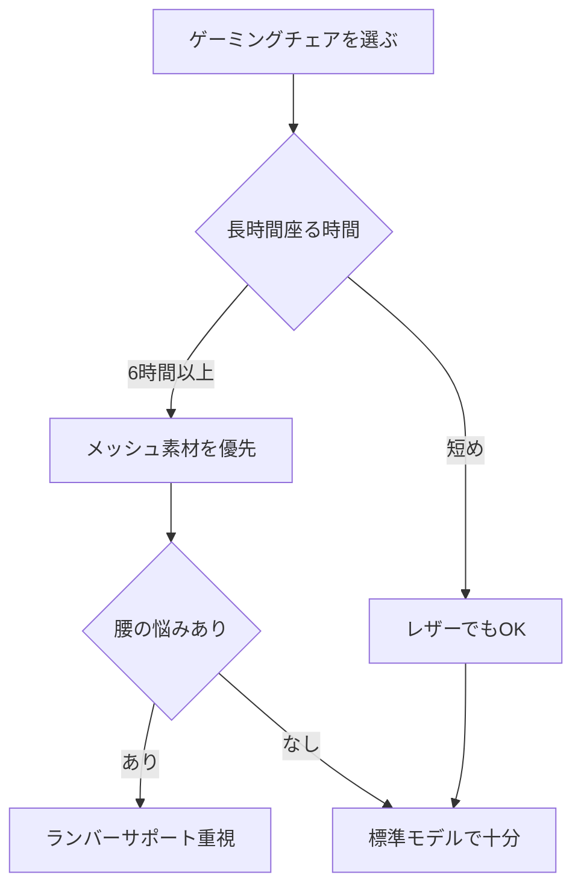

※本記事はアフィリエイト広告(PR)を含みます。

## ゲーミングチェアの選び方2026|この記事でわかること

「在宅ワークやゲームで長時間座っていると、腰や肩が痛くなる…」そんな悩みを抱えている方は多いのではないでしょうか。この記事では、2026年版のゲーミングチェアの選び方を、初心者の方にもわかりやすく解説します。

読み終えるころには、次のことがわかるようになります。

- ゲーミングチェアが長時間作業に向いている理由
- 失敗しないためにチェックすべき5つのポイント
- 価格帯ごとの選び方とおすすめの傾向
- オフィスチェアとの違いや、よくある疑問への答え

ゲーミングチェアは「ゲーム専用」と思われがちですが、実は長時間のデスクワークやテレワークにこそ向いている椅子です。それでは、さっそく見ていきましょう。

## そもそもゲーミングチェアとは?オフィスチェアとの違い

ゲーミングチェアとは、もともと長時間のゲームプレイを快適にするために設計された椅子のことです。レーシングカーのシートのような形状で、体をしっかり包み込む「ホールド感(体を支える感覚)」が特徴です。

一般的なオフィスチェアと比べると、次のような違いがあります。

| 項目 | ゲーミングチェア | 一般的なオフィスチェア |
|---|---|---|
| 形状 | バケットシート型で体を包む | フラットなものが多い |
| リクライニング | 大きく倒せる(135〜180度) | 浅めのことが多い |
| クッション | ランバーサポートや枕付き | シンプルな構造 |
| 価格帯 | 2万〜6万円程度が中心 | 幅広い |

ランバーサポートとは、腰のカーブを支えてくれるクッションのことです。長時間座っても腰が疲れにくくなる重要なパーツです。

なお、椅子だけでなくデスク全体の環境を整えたい方は、[スタンディングデスクは効果ある?在宅ワーカーの実践レビュー観点まとめ](/2026/06/14/standing-desk-review/)もあわせてチェックすると、座りっぱなしの負担を減らすヒントが見つかります。

## 失敗しない!ゲーミングチェア選び5つのポイント

ここからは、購入時に必ず確認したい5つのポイントを紹介します。

### ① 素材(メッシュ vs レザー)

ゲーミングチェアの座面・背もたれの素材は大きく分けて2種類あります。

- **ファブリック・メッシュ素材**:通気性が良く、夏でも蒸れにくい。長時間作業向き。
- **PUレザー(合成皮革)素材**:高級感があり手入れが簡単。ただし夏は蒸れやすい。

一年を通して長時間座るなら、通気性の高いメッシュ素材がおすすめです。

### ② ランバーサポートとヘッドレスト

腰を支えるランバーサポートと、首を支えるヘッドレスト(枕)があるかは重要です。これらが付いていると、長時間作業時の疲労感が大きく変わります。位置を調整できるタイプだと、自分の体型に合わせられて便利です。

### ③ アームレスト(肘掛け)の調整機能

アームレストは、上下・前後・左右・角度の「何方向に動くか」をチェックしましょう。よく「4D(4方向に調整可能)」と表記されます。キーボード作業が多い方ほど、肘をしっかり支えられるかが快適さに直結します。

### ④ リクライニングと耐荷重

休憩時に大きく倒せるリクライニング機能や、フラットに近い角度まで倒せるかも確認しましょう。また、自分の体重に対して余裕のある耐荷重(耐えられる重さ)のモデルを選ぶと安心です。

### ⑤ 座面の高さと部屋とのサイズ感

意外と見落としがちなのが、座面の高さとデスクの相性です。足の裏がしっかり床につく高さに調整できるかを確認しましょう。購入前に、設置スペースの寸法も測っておくと失敗を防げます。

## 選び方フローチャート

自分に合うタイプを、簡単なフローチャートで整理してみました。

## 価格帯ごとの選び方の目安

ゲーミングチェアは価格によって機能や品質が変わります。おおまかな目安を紹介します(価格は変動するため、必ず公式サイトや販売ページで最新情報を確認してください)。

- **〜2万円台**:エントリーモデル。基本機能は揃うが、調整機能は少なめ。
- **3〜4万円台**:価格と機能のバランスが良い人気帯。4Dアームレストやメッシュ素材も選べる。
- **5万円以上**:有名ブランドの上位モデル。耐久性や座り心地に長けている。

初めての方には、機能と価格のバランスが取れた3〜4万円台が選びやすいゾーンです。実際のモデルや在庫・価格は、下記から比較してみてください。

👉 [Amazonで「ゲーミングチェア メッシュ」を見る](https://af.moshimo.com/af/c/click?a_id=5632371&p_id=170&pc_id=185&pl_id=38594&url=https%3A%2F%2Fwww.amazon.co.jp%2Fs%3Fk%3D%25E3%2582%25B2%25E3%2583%25BC%25E3%2583%259F%25E3%2583%25B3%25E3%2582%25B0%25E3%2583%2581%25E3%2582%25A7%25E3%2582%25A2%2520%25E3%2583%25A1%25E3%2583%2583%25E3%2582%25B7%25E3%2583%25A5)

👉 [楽天市場で「ゲーミングチェア ランバーサポート」を探す](https://af.moshimo.com/af/c/click?a_id=5632328&p_id=54&pc_id=54&pl_id=616&url=https%3A%2F%2Fsearch.rakuten.co.jp%2Fsearch%2Fmall%2F%25E3%2582%25B2%25E3%2583%25BC%25E3%2583%259F%25E3%2583%25B3%25E3%2582%25B0%25E3%2583%2581%25E3%2582%25A7%25E3%2582%25A2%2520%25E3%2583%25A9%25E3%2583%25B3%25E3%2583%2590%25E3%2583%25BC%25E3%2582%25B5%25E3%2583%259D%25E3%2583%25BC%25E3%2583%2588%2F)

## よくある疑問Q&A

### Q. ゲーミングチェアは本当に疲れにくいの?

A. 体をしっかり支える設計のため、正しく調整して使えば長時間でも疲れにくくなります。ただし、どんな良い椅子でも「同じ姿勢を続けない」「1時間に一度は立つ」といった工夫は大切です。

### Q. 普通のオフィスチェアと迷っています。どちらがいい?

A. リクライニングで休憩したい方やホールド感が好きな方はゲーミングチェア、シンプルで部屋になじむデザインを重視するならオフィスチェアが向いています。仕事中心なら、見た目が落ち着いたゲーミングチェアも増えているので選択肢に入れてよいでしょう。

### Q. 安いモデルでも大丈夫?

A. 短時間の使用なら問題ありませんが、毎日長時間使うなら耐久性や調整機能の充実した中価格帯以上をおすすめします。安すぎるモデルは、ガス圧シリンダー(高さを調整する部品)の寿命が短い場合もあります。

## 椅子だけでなくデスク環境全体を整えよう

ゲーミングチェアの効果を最大限に引き出すには、デスク周りの環境づくりも欠かせません。モニターの高さやキーボードの位置を見直すだけでも、体への負担は大きく変わります。

快適な作業環境を作るアイテムについては、[在宅ワークが捗るデスク周りガジェット10選\|快適環境の作り方](/2026/06/11/home-office-gadgets/)で詳しく紹介しています。また、オンライン会議が多い方は[Webカメラ・マイクのおすすめ｜オンライン会議の印象を良くする機材選び](/2026/06/15/webcam-mic-online-meeting/)もあわせてご覧ください。

## まとめ

今回は、2026年版のゲーミングチェアの選び方を解説しました。最後にポイントを振り返ります。

- 長時間作業には**通気性の高いメッシュ素材**がおすすめ
- **ランバーサポート・ヘッドレスト・4Dアームレスト**の有無をチェック
- 初めてなら**3〜4万円台のバランス重視モデル**が選びやすい
- 椅子だけでなく**デスク環境全体**を整えると効果が高まる
- 価格や仕様は変わるため、**公式サイトや販売ページで最新情報を確認**

自分の作業スタイルや体型に合った一脚を選べば、毎日のデスクワークがぐっと快適になります。この記事を参考に、ぜひ後悔のないゲーミングチェア選びをしてみてください。
