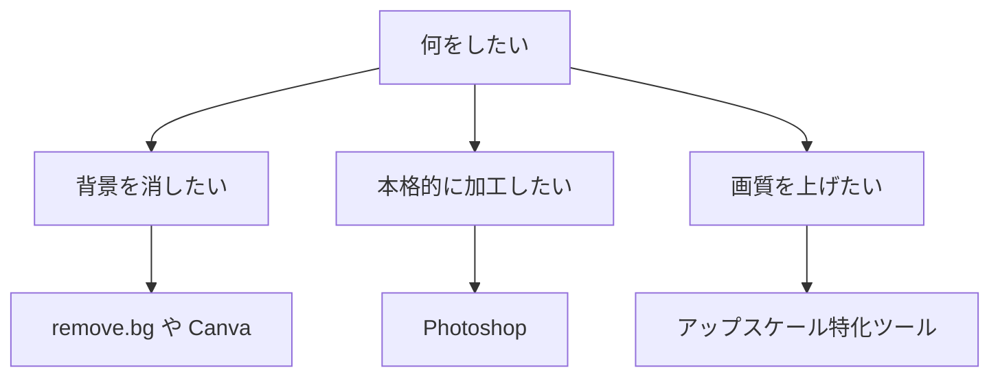

※本記事はアフィリエイト広告(PR)を含みます。

## この記事でわかること

「商品写真の背景を白くしたい」「人物だけを切り抜きたい」——そんなとき、これまでは手作業で時間のかかる細かい選択が必要でした。ですが今は、**AI画像編集ソフト**を使えば、背景透過(背景を透明にして切り抜くこと)や加工をほぼ自動で済ませられます。

この記事では、初心者でも使いやすいAI画像編集ソフトのおすすめ5選を比較し、それぞれの特徴・向いている用途・無料で使えるかどうかをわかりやすく解説します。読み終えるころには、あなたの目的に合った1本がきっと見つかるはずです。

## AI画像編集ソフトとは?何が自動化できるの?

AI画像編集ソフトとは、人工知能(AI)が画像の中身を自動で認識し、面倒な編集作業を肩代わりしてくれるツールのことです。代表的な機能は次のとおりです。

- **背景透過・切り抜き**:被写体とそれ以外をAIが判別し、ワンクリックで背景を消す
- **オブジェクト消去**:写り込んだ通行人や電線などを自然に消す
- **画質アップスケール**:小さい・粗い画像をくっきり高解像度に拡大する
- **背景の差し替え・生成**:切り抜いた後に新しい背景を自動で合成する

これらは以前はプロが時間をかけて行っていた作業です。AIによって、誰でも数秒〜数分でこなせるようになりました。

## AI画像編集ソフトの選び方

選ぶときに迷ったら、次のフローチャートを参考にしてみてください。

### チェックしたい3つのポイント

1. **目的に合っているか**:切り抜きだけなら専用ツール、総合編集ならPhotoshop系
2. **無料で試せるか**:多くは無料枠があり、まず試してから有料を検討できる
3. **操作のしやすさ**:ブラウザだけで完結するものはインストール不要で手軽

## おすすめAI画像編集ソフト5選を比較

以下に主要な5つのツールを表にまとめました。料金や仕様は変わりやすいため、最新情報は必ず公式サイトでご確認ください。

| ツール | 得意なこと | 形態 | 無料枠 |
|---|---|---|---|
| remove.bg | 背景透過の自動化 | ブラウザ | あり |
| Canva | 切り抜き＋デザイン | ブラウザ/アプリ | あり |
| Adobe Photoshop | 本格的な加工全般 | アプリ | 体験版あり |
| Pixlr | 手軽な総合編集 | ブラウザ | あり |
| Cleanup.pictures | 不要物の消去 | ブラウザ | あり |

### 1. remove.bg|背景透過に特化した定番

画像をアップロードするだけで、AIが背景を自動で消してくれる定番ツールです。人物・商品・動物など幅広く対応し、操作はほぼワンクリック。**とにかく背景だけ消したい**という方に最適です。高解像度ダウンロードは有料の場合があるため、用途に応じて確認しましょう。

### 2. Canva|切り抜きからデザインまで一気通貫

Canvaはデザイン作成ツールですが、有料機能の「背景リムーバ」を使えばワンクリックで切り抜きができます。切り抜いた画像をそのままSNS投稿やバナーのデザインに使えるのが大きな強みです。**画像編集とデザインをまとめて行いたい**人におすすめです。

### 3. Adobe Photoshop|プロ品質の本格加工

言わずと知れた業界標準ソフト。AI機能「生成塗りつぶし」により、被写体の選択・不要物の消去・背景の生成までを高精度でこなせます。学習コストはやや高めですが、**本格的に画像を作り込みたい**なら唯一無二の選択肢です。

### 4. Pixlr|無料で使える総合エディタ

ブラウザで動く無料中心の画像エディタで、AI背景削除やオブジェクト消去機能を備えています。インストール不要で気軽に始められるため、**まずは無料で色々試したい**初心者にぴったりです。

### 5. Cleanup.pictures|写り込みの消去が得意

消したい部分をなぞるだけで、AIが背景を補完して自然に消してくれるツールです。観光地の写真に写った人物や、不要なロゴ・電線の除去に重宝します。**「ここだけ消したい」**というニーズに強いツールです。

## AI画像編集ソフトは無料で使える?

結論から言うと、**多くのツールに無料枠があり、まず試すことは可能**です。ただし次のような制限があるケースが一般的です。

- 出力できる解像度が低めに制限される
- 1日あたりの処理回数に上限がある
- 商用利用や透かしの有無に条件がつく

ビジネスで使う画像や、印刷用の高解像度データが必要な場合は、有料プランを検討する価値があります。商用利用のルールはツールごとに異なるので、生成・編集した画像を仕事で使う際の注意点については[無料で使える画像生成AIおすすめ5選](/2026/06/11/free-image-ai-tools/)もあわせてご覧ください。

## 編集環境を快適にするとさらに捗る

AI画像編集は処理が軽いものも多いですが、高解像度の写真を扱うなら、画面が広く色再現の良い環境があると作業がぐっと快適になります。デスク周りを整えたい方は[在宅ワークが捗るデスク周りガジェット10選](/2026/06/11/home-office-gadgets/)も参考になります。

また、外付けモニターと組み合わせれば編集画面とプレビューを分けて表示でき、効率が上がります。

👉 [Amazonで「モニター 27インチ 4K」を見る](https://af.moshimo.com/af/c/click?a_id=5632371&p_id=170&pc_id=185&pl_id=38594&url=https%3A%2F%2Fwww.amazon.co.jp%2Fs%3Fk%3D%25E3%2583%25A2%25E3%2583%258B%25E3%2582%25BF%25E3%2583%25BC%252027%25E3%2582%25A4%25E3%2583%25B3%25E3%2583%2581%25204K)

ノートパソコンで作業する方は、処理性能やディスプレイ品質も気になるところです。選び方は[AIノートパソコンの選び方2026](/2026/06/11/ai-laptop-guide-2026/)で詳しく解説しています。

## よくある質問

**Q. スマホだけでも背景透過はできますか?**
A. はい。Canvaやremove.bgはスマホのブラウザやアプリからでも利用でき、手軽に切り抜きが可能です。

**Q. 切り抜きの精度が低いときはどうすれば?**
A. 髪の毛や細かい部分は苦手なツールもあります。複数のツールを試して、被写体に合うものを選ぶのがおすすめです。

## まとめ

AI画像編集ソフトを使えば、背景透過や不要物の消去といった面倒な作業を、初心者でも数秒〜数分で自動化できます。最後に選び方をおさらいしましょう。

- **背景だけ消したい** → remove.bg
- **切り抜き＋デザインも** → Canva
- **本格的に作り込みたい** → Adobe Photoshop
- **無料で気軽に試したい** → Pixlr
- **写り込みを消したい** → Cleanup.pictures

まずは無料枠のあるツールから気軽に試して、あなたの用途にぴったり合う1本を見つけてください。最新の料金や機能は変更されることがあるため、利用前に必ず公式サイトで確認することをおすすめします。
