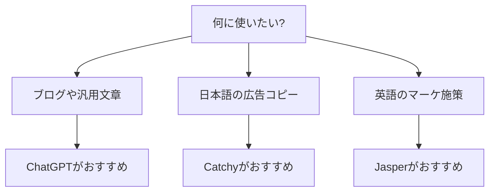

※本記事はアフィリエイト広告(PR)を含みます。

## AIライティングツール比較2026|まず結論からお伝えします

「AIライティングツールを使ってみたいけれど、ChatGPT・Jasper・Catchyのどれを選べばいいの?」と迷っていませんか。この記事を読むと、**それぞれのツールの得意分野・料金の考え方・初心者へのおすすめ度**がわかり、自分に合った1本を選べるようになります。

結論を先にお伝えすると、迷ったらまずは**ChatGPT**から始めるのが王道です。一方で、広告文やキャッチコピーを量産したい人は**Catchy(キャッチー)**、英語マーケティングを本格的にやる人は**Jasper(ジャスパー)**が選択肢に入ります。ここからは、それぞれの特徴を初心者にもわかりやすく解説していきます。

> ※AIライティングツールとは、文章の作成・要約・言い換えなどを人工知能が手伝ってくれるサービスのことです。

## 3つのAIライティングツールの基本を知ろう

まずは、それぞれがどんなツールなのかをざっくり把握しましょう。

### ChatGPT|何でもこなす万能型

ChatGPTは、OpenAI社が提供する対話型のAIです。ブログ記事・メール・要約・アイデア出しなど、文章にまつわるほとんどの作業をこなせる「万能型」として人気があります。日本語の精度も高く、無料プランでも十分に試せるのが大きな魅力です。

チャット形式のAIをもっと深く比べたい方は、[ChatGPTとClaudeとGeminiを徹底比較!初心者におすすめのAIチャットはどれ?](/2026/06/09/ai-chat-comparison/)もあわせてご覧ください。

### Jasper|英語マーケティングに強い専門型

Jasperは、主に海外のマーケティング担当者に支持されているAIライティングツールです。広告コピーやLP(ランディングページ=商品紹介の専用ページ)向けの「テンプレート」が豊富で、ブランドの口調を学習させる機能などもあります。ただしインターフェースは英語中心で、料金も比較的高めです。

### Catchy|日本語の広告・コピー量産が得意

Catchyは日本発のAIライティングツールで、**日本語のキャッチコピーや広告文、SNS投稿**などをテンプレートから手早く作れるのが特徴です。「何を書けばいいか分からない」という人でも、フォームに沿って入力するだけで複数案を出してくれます。

## 比較表|料金・得意分野・初心者おすすめ度

3つのツールの特徴を表にまとめました。

| 項目 | ChatGPT | Jasper | Catchy |
|------|---------|--------|--------|
| 得意分野 | 万能(記事・要約・対話) | 英語マーケ・広告 | 日本語コピー・広告文 |
| 日本語の自然さ | ◎ | ○ | ◎ |
| テンプレート | 少なめ(自由入力) | 豊富 | 豊富 |
| 無料プラン | あり | 体験中心 | 無料枠あり |
| 初心者おすすめ度 | ★★★ | ★ | ★★ |

※料金プランは改定が頻繁にあります。正確な金額は必ず各**公式サイトで最新情報を確認してください**。

なお、AIサービスの料金全体の動向については[AIサブスク料金比較2026年6月\|ChatGPT・Claude・Geminiが世代交代&値下げ](/2026/06/16/ai-subscription-pricing-2026/)で詳しく整理しています。

## あなたに合うツールはどれ?選び方フローチャート

「結局どれを選べばいいの?」という方のために、選び方を図にまとめました。

このように、**用途を起点に考える**と迷いにくくなります。まずは自分が一番書きたいものを思い浮かべてみましょう。

## 用途別のおすすめパターン

### ブログ記事を書きたいなら

ブログ運営が目的なら、まずはChatGPTで十分にスタートできます。見出し構成から本文、リライト(書き直し)まで一気通貫で頼めるからです。具体的な進め方は[AIでブログ記事を書く方法\|初心者向け完全ガイド](/2026/06/12/ai-blog-writing-guide/)で手順を解説しているので、参考にしてみてください。

### ビジネスメールや事務作業を効率化したいなら

仕事のメール作成を速くしたい方も、ChatGPTが活躍します。定型文の生成や丁寧な言い換えが得意です。

### 広告・SNS投稿を量産したいなら

「短くて刺さる言葉」を大量に作りたいなら、テンプレートが豊富なCatchyが向いています。複数案をまとめて出してくれるので、選ぶだけで形になります。

長時間タイピングする機会が増える方は、作業環境も整えておくと快適です。

👉 [Amazonで「静音メカニカルキーボード」を見る](https://af.moshimo.com/af/c/click?a_id=5632371&p_id=170&pc_id=185&pl_id=38594&url=https%3A%2F%2Fwww.amazon.co.jp%2Fs%3Fk%3D%25E9%259D%2599%25E9%259F%25B3%25E3%2583%25A1%25E3%2582%25AB%25E3%2583%258B%25E3%2582%25AB%25E3%2583%25AB%25E3%2582%25AD%25E3%2583%25BC%25E3%2583%259C%25E3%2583%25BC%25E3%2583%2589)

## Q&A|よくある疑問に先回りで回答

### Q. AIライティングツールは無料で使える?

はい、多くのツールに無料プランや無料体験枠があります。ChatGPTは無料でも基本機能を使え、Catchyにも無料で試せる枠があります。ただし無料版は使える回数や機能に制限があるのが一般的です。本格的に使うなら有料プランが快適ですが、まずは無料で触れて相性を確かめるのがおすすめです。

### Q. AIが書いた文章はそのまま公開していい?

AIの出力には事実誤りや不自然な表現が混じることがあります。**必ず人の目で確認・修正してから公開する**ようにしましょう。特に数字や固有名詞は要チェックです。

### Q. 日本語ならどれが一番自然?

体感としてはChatGPTとCatchyが自然です。Jasperは強力ですが英語圏向けの設計のため、日本語メインなら前者2つを優先すると失敗しにくいでしょう。

## まとめ|まずは無料で1本試してみよう

最後に、今回のポイントを整理します。

- **迷ったらChatGPT**:万能で日本語も自然、無料で始められる
- **日本語の広告・コピーならCatchy**:テンプレートで量産しやすい
- **英語マーケ本格派ならJasper**:海外向け施策に強い
- 料金は変動が多いので、**公式サイトで最新情報を確認**する
- AIの文章は**人の手で必ず確認・修正**してから使う

AIライティングツールは、使ってみて初めて相性がわかります。まずは無料プランで1本試し、自分の作業がどれだけラクになるかを体感してみてください。さらにAI活用の幅を広げたい方は、[生成AIが学べるオンラインスクールおすすめ比較\|失敗しない選び方](/2026/06/13/ai-online-school-guide/)も役立ちますよ。
