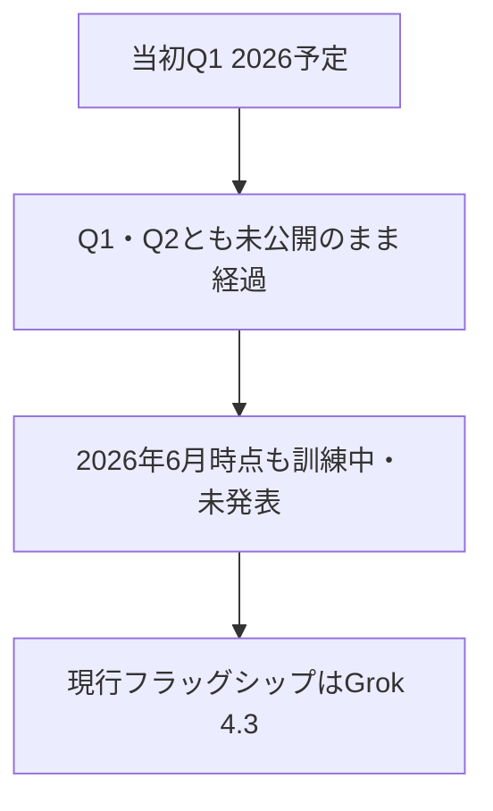

※本記事はアフィリエイト広告(PR)を含む場合があります。

## Grok 5、まだ出ていません

イーロン・マスク氏率いる **xAI** の次期フラッグシップAI **Grok 5**。期待が高まる一方で、**2026年6月時点ではまだ公開されていません**。当初の予定が何度かずれ込み、「いつ出るの?」という声が増えています。

この記事では、**確定していること**と**まだ噂の段階のこと**を分けて、Grok 5の現状を整理します。

> ⚠️ **重要**:本記事のスペックや時期はリーク・報道にもとづく**未確定情報**を多く含みます。正式な内容はxAIの公式発表をお待ちください。

## まず確定していること

- **Grok 5はまだ一般公開されていません**。当初のQ1、続くQ2の予定もすでに過ぎました。
- 早い段階で**訓練中**であることが共有されていますが、その後**公開日の正式発表はありません**。
- この間xAIは、**Grok Voice**(音声)・**Grok Imagine Video 1.5**(動画生成)・コーディング向けの**V9-Medium**などを投入していますが、**いずれもGrok 5本体ではありません**。
- 現在の主力(消費者向けフラッグシップ)は **Grok 4.3**(2026年4月30日)です。

## 噂・リークされている主なスペック

ここからは**未確定情報**です。報じられている主なポイントを整理します。

| 項目 | 噂・期待されている内容 |
|---|---|
| パラメータ規模 | 約6兆(Grok 4のおよそ倍)・MoE構成 |
| マルチモーダル | テキスト・画像・音声・動画にネイティブ対応 |
| コンテキスト長 | 最大150万トークン |
| 学習基盤 | ギガワット級スパコン「Colossus 2」 |
| 特徴 | リアルタイムのX(旧Twitter)データ連携、マルチエージェント |

特に、**動画のネイティブ理解**や**リアルタイムの誤情報検出**など、「単一のAIにできることの幅を広げる」方向が期待されています。

## いつ公開される?

公開時期は**未確定**です。

- 当初は2026年前半が目標とされていましたが、**Q1・Q2とも見送り**に。
- 直近では「**公開ベータが先行し、フルAPIはその後**」という見方が語られていますが、**正式な日付は未発表**です。

大規模モデルは学習・安全性検証に時間がかかり、**延期は珍しくありません**。確実な情報は公式発表で確認しましょう。

## 他社モデルとの位置づけ

2026年は、各社のフラッグシップが立て続けに動いた「モデルラッシュ」の年です(詳しくは[AIモデル大量リリースまとめ](/2026/06/16/ai-model-flood-2026/))。

- **OpenAI**:現行GPT-5.5、次期[GPT-5.6も噂段階](/2026/06/17/gpt-5-6-rumors/)
- **Anthropic**:Claude Opus 4.8
- **Google**:Gemini 3.5系
- **中国Z.ai**:オープンモデル[GLM-5.2](/2026/06/17/glm-5-2-guide/)が低価格で台頭
- **xAI**:現行Grok 4.3、**Grok 5は準備中**

Grok 5がこの最上位争いに食い込むには、**ベンチマークだけでなく実用的な使い勝手での飛躍**が必要、と見られています。各AIの実力差は[ChatGPT・Claude・Geminiのプログラミング比較](/2026/06/16/ai-coding-comparison-2026/)も参考にどうぞ。

## 私たちユーザーはどう待つ?

- **慌てない**:今すぐ必要なら、現行のGrok 4.3や他社モデルで十分に高性能です。
- **噂と公式を区別する**:公開前は誤情報が増えます。スペックは「確定」ではなく「噂」として捉えましょう。
- **出たら自分の用途で試す**:数字より「自分の作業に合うか」が大事です。

## よくある質問

### Grok 5はもう使える?

いいえ。**2026年6月時点では未公開**です。現行はGrok 4.3です。

### Grok 5はGPTやClaudeより強い?

未公開のため**現時点では比較できません**。噂のスペックは大規模ですが、実性能は発表後に評価する必要があります。

### Xの有料プランに入れば使える?

将来的にX(旧Twitter)の上位プランやAPIでの提供が見込まれますが、**Grok 5の提供形態は正式発表待ち**です。

## まとめ

- **Grok 5は2026年6月時点で未公開**。当初予定から延期が続き、現在も準備段階
- 噂スペックは「**6兆パラメータ・150万トークン・動画までのマルチモーダル**」だが**未確定**
- 現行フラッグシップは**Grok 4.3**。急ぐなら現行モデルや他社で十分
- 公開時期・性能は**公式発表を待つ**のが確実

動きがあり次第、本ブログでも追っていきます。最新情報はxAI/Xの公式発表でご確認ください。

### 参考リンク

- [Grok 5: Release Date & All We Know So Far (June 2026)(felloai)](https://felloai.com/all-we-know-so-far-about-grok-5/)
- [Grok 5 Launch Tracker: What AI Builders Should Watch(WaveSpeed)](https://wavespeed.ai/blog/posts/grok-5-launch-tracker/)
- [Grok 5: Release Date, Features & Everything We Know(NxCode)](https://www.nxcode.io/resources/news/grok-5-release-date-6t-parameters-agi-xai-complete-guide-2026)
