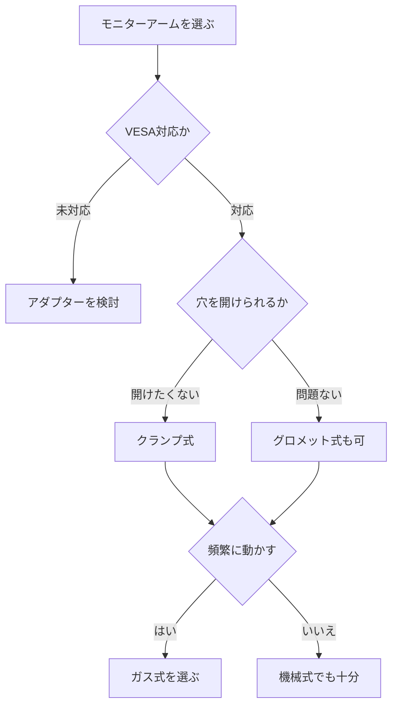

※本記事はアフィリエイト広告(PR)を含みます。

## モニターアームの選び方で在宅ワークのデスクが激変する

「デスクが狭くて作業しづらい」「モニターの位置が合わず首や肩が疲れる」——在宅ワークが当たり前になった今、こうした悩みを抱える方が増えています。そんなときに頼りになるのが**モニターアーム**です。

モニターアームとは、ディスプレイ(モニター)を支える台座(スタンド)の代わりに、アーム(腕のような可動式の支柱)でモニターを浮かせて固定する道具のこと。デスク上の台座スペースがなくなるため、机を広く使えるようになります。

この記事を読むと、次のことがわかります。

- モニターアームを使うと何が良いのか
- 失敗しないための選び方のポイント
- クランプ式・ガス式などタイプ別の比較
- 自分のモニターに合うかどうかの確認方法

初心者の方でも迷わず選べるよう、専門用語にはやさしい説明を添えながら解説していきます。

## モニターアームを使う3つのメリット

まずは「なぜモニターアームが在宅ワーカーに人気なのか」を整理しておきましょう。

### 1. デスクが広く使える

モニター付属の台座は意外と場所を取ります。アームに置き換えると、モニターの下の空間が丸ごと空くため、書類を広げたりキーボードを手前に引いたりと、机をフルに活用できます。

### 2. 姿勢が良くなり疲れにくい

モニターの高さや角度を自由に調整できるので、目線がちょうど画面の上部にくる理想的な位置に合わせられます。これにより**猫背や首・肩のこり**を軽減できます。長時間作業の疲労対策については、[ゲーミングチェアの選び方2026](/2026/06/18/gaming-chair-guide-2026/)や[スタンディングデスクは効果ある?在宅ワーカーの実践レビュー観点まとめ](/2026/06/14/standing-desk-review/)も合わせて読むと、より快適な環境づくりの参考になります。

### 3. デュアルモニターも快適に

2枚のモニターを並べる「デュアルモニター」環境も、アームを使えば省スペースかつ自由なレイアウトで実現できます。

## モニターアーム選びで確認したい5つのポイント

ここからが本題です。購入前に必ずチェックしておきたいポイントを5つにまとめました。

### ポイント1:VESA規格に対応しているか

**VESA(ベサ)規格**とは、モニター背面のネジ穴の間隔を定めた国際規格のこと。多くのモニターは「75×75mm」または「100×100mm」のVESA穴を備えており、対応するアームならネジで固定できます。

まずはお使いのモニターがVESA対応かどうかを確認しましょう。対応していない場合は、別途「VESAアダプター」が必要になることもあります。

### ポイント2:耐荷重(対応する重さ)

アームには「対応重量◯〜◯kg」という記載があります。モニターの重さがこの範囲に収まっているかを必ず確認してください。範囲を外れると、重すぎてアームが下がったり、軽すぎてバネが強く跳ね上がったりします。

### ポイント3:対応するモニターサイズ

「〜32インチ対応」のように、対応する画面サイズも決まっています。大型モニターや湾曲(カーブ)モニターを使う場合は、特に余裕を持ったモデルを選びましょう。

### ポイント4:固定方式(クランプ式かグロメット式か)

デスクへの取り付け方には主に2種類あります。

- **クランプ式**:デスクの天板を挟み込んで固定する方式。穴を開けないので最も手軽です。
- **グロメット式**:天板に穴を開けてボルトで固定する方式。よりがっちり固定できます。

賃貸や穴を開けたくない方は、クランプ式が無難です。ただしデスクの天板の厚みや奥行きに対応しているか確認しましょう。

### ポイント5:可動方式(ガス式か機械式か)

アームの動かしやすさも重要です。

- **ガス式(ガススプリング式)**:ガス圧で滑らかに高さ調整できる。片手で動かせて快適。
- **機械式(スプリング式)**:バネで支える。やや調整に力が必要なこともあるが価格は抑えめ。

頻繁に位置を変えたい方や、スタンディングと座り作業を切り替える方には、ガス式がおすすめです。

## 選び方フローチャート

迷ったときは、次の流れで考えると選びやすくなります。

## タイプ別の比較表

代表的なモニターアームのタイプを表にまとめました。

| タイプ | 特徴 | 向いている人 |
|--------|------|--------------|
| シングル・機械式 | 1画面用・価格控えめ | コスパ重視の初心者 |
| シングル・ガス式 | 1画面用・滑らかな調整 | 頻繁に位置を変える人 |
| デュアル | 2画面を1本の支柱で固定 | 作業領域を広げたい人 |
| 縦型(縦並び) | 上下2段にモニター配置 | デスクの横幅が狭い人 |

具体的な価格はモデルや時期によって変動するため、購入前に各販売サイトで最新情報を確認してください。

👉 [Amazonで「モニターアーム ガス式 シングル」を見る](https://af.moshimo.com/af/c/click?a_id=5632371&p_id=170&pc_id=185&pl_id=38594&url=https%3A%2F%2Fwww.amazon.co.jp%2Fs%3Fk%3D%25E3%2583%25A2%25E3%2583%258B%25E3%2582%25BF%25E3%2583%25BC%25E3%2582%25A2%25E3%2583%25BC%25E3%2583%25A0%2520%25E3%2582%25AC%25E3%2582%25B9%25E5%25BC%258F%2520%25E3%2582%25B7%25E3%2583%25B3%25E3%2582%25B0%25E3%2583%25AB)

## よくある質問

### Q. 安いモニターアームでも大丈夫?

価格が安いものでも、耐荷重とVESA規格さえ合っていれば基本的な役割は果たします。ただし、ガス圧の調整がしにくかったり、長期間使うと固定力が弱まったりするケースもあります。**毎日長時間使う方は、ある程度信頼できるメーカー品を選ぶと安心**です。

### Q. モニターアームだけ買えばすぐ使える?

ほとんどの製品は取り付けに必要なネジ類が付属しています。ただし、デスクの天板の厚みがクランプの対応範囲内か、奥行きに余裕があるかは事前に測っておきましょう。

### Q. デスク環境を全体的に整えたいときは?

モニターアーム単体だけでなく、周辺機器も合わせて見直すと作業効率が大きく変わります。詳しくは[在宅ワークが捗るデスク周りガジェット10選](/2026/06/11/home-office-gadgets/)で、おすすめのアイテムをまとめて紹介しています。オンライン会議が多い方は[Webカメラ・マイクのおすすめ](/2026/06/15/webcam-mic-online-meeting/)も参考にしてみてください。

## 購入前のチェックリスト

最後に、購入直前に確認したい項目をまとめます。

- [ ] モニターがVESA規格(75×75 or 100×100mm)に対応しているか
- [ ] モニターの重さがアームの耐荷重内か
- [ ] モニターサイズが対応範囲内か
- [ ] デスク天板の厚み・奥行きがクランプに対応しているか
- [ ] ガス式か機械式か、用途に合っているか

このリストをクリアできれば、設置後の失敗をほぼ防げます。

👉 [楽天市場で「モニターアーム デュアル VESA」を探す](https://af.moshimo.com/af/c/click?a_id=5632328&p_id=54&pc_id=54&pl_id=616&url=https%3A%2F%2Fsearch.rakuten.co.jp%2Fsearch%2Fmall%2F%25E3%2583%25A2%25E3%2583%258B%25E3%2582%25BF%25E3%2583%25BC%25E3%2582%25A2%25E3%2583%25BC%25E3%2583%25A0%2520%25E3%2583%2587%25E3%2583%25A5%25E3%2582%25A2%25E3%2583%25AB%2520VESA%2F)

## まとめ

モニターアームは、在宅ワークのデスク環境を一段とアップグレードしてくれる、コスパの良いアイテムです。選ぶ際のポイントをもう一度おさらいしましょう。

- **VESA規格・耐荷重・モニターサイズ**の3つは必ず確認する
- 穴を開けたくないなら**クランプ式**が手軽
- 頻繁に位置を変えるなら**ガス式**が快適
- デュアルや縦型など、使い方に合ったタイプを選ぶ

机が広くなり、姿勢も整うことで、毎日の作業がぐっと快適になります。価格や在庫は変動するため、最新情報は各販売サイトや公式サイトで確認のうえ、自分の環境にぴったりの一台を見つけてください。
