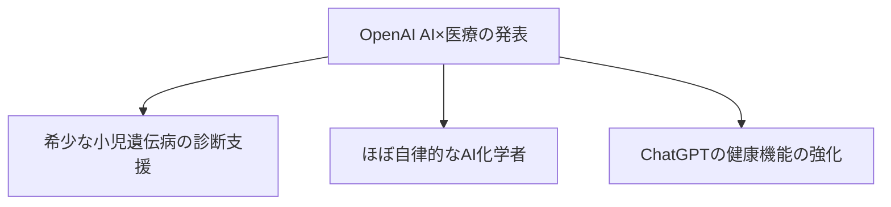

※本記事はアフィリエイト広告(PR)を含みます。

## OpenAIが「AI×医療」で大きな一歩

2026年6月18日、OpenAIが**AIと医療**に関する成果を相次いで発表しました。中でも注目されたのが、**子どもの希少な遺伝性疾患の診断を、AIが支援した**という研究です。

「AIが病気を診断する時代が来たの?」と驚いた方もいるかもしれません。ただし、ここはとても大事なポイントなので、**何ができて・何はしていないのか**を正確に整理します。

> ⚠️ 本記事は情報提供であり、医療アドバイスではありません。健康・病気の判断は必ず医師にご相談ください。

## 発表されたこと(3つ)

### 1. 子どもの希少疾患の診断を支援

医学誌「NEJM AI」に掲載された研究で、**AIを使った調査ワークフローが、難しい症例の手がかり探しを助けた**ことが報告されました。

- **OpenAI o3 Deep Research**が、専門家でも長年わからなかった症例の**手がかり(リード)を提示**
- 専門家のレビュー・追加検査・臨床確認を経て、**18件で診断が確定**(従来分析に上乗せで約4.8%の診断率向上)

ここで**最重要なのは、AIは患者を診断していない**ということです。**診断はすべて医師ら専門家が、正規の検査・確認プロセスで行いました**。AIはあくまで「見落とされていた可能性に光を当てる**研究の補助**」という位置づけです。

### 2. ほぼ自律的な「AI化学者」

OpenAIは、**創薬(医薬品づくり)で難しい化学反応を自ら改善する、ほぼ自律的なAI化学者**も発表しました。新しい薬の開発スピードを上げる可能性があり、注目されています。

### 3. ChatGPTの健康機能を強化

ChatGPTの健康・医療まわりの機能も強化されました。OpenAIによると、**週に約2.3億人がChatGPTで健康やウェルネスについて質問**しているとされ、2026年初めには医療記録と連携できる「ChatGPT Health」も登場しています。今回、その精度・使い勝手がさらに高められた形です。

## なぜこれが重要なのか

AIの医療応用で期待されるのは、「**人間の専門家を置き換える**」ことではなく、「**専門家の力を底上げする**」ことです。

- 膨大な論文・症例から、人では気づきにくい**手がかりを高速で洗い出す**
- 医師は、その候補を**専門知識で検証**して最終判断する

この「**AIが下調べ、専門家が判断**」という組み合わせは、当ブログでも繰り返し触れてきたAI活用の王道です(参考:[生成AIとかけ合わせると強い資格](/2026/06/16/ai-strong-certifications/))。医療はその効果が特に大きい分野と言えます。

## 私たちの暮らしへの影響

### 日常の健康相談はもっと身近に

「この症状、病院に行くべき?」といった一次的な情報収集に、AIを使う人はさらに増えそうです。ただし、**最終的な判断は必ず医師に**。AIの回答を鵜呑みにせず、受診のきっかけ程度に使うのが安全です。

### プライバシーには注意

健康・医療情報はとてもデリケートです。医療記録を連携する機能を使う際は、**何が・どこに保存されるか**を確認し、納得したうえで利用しましょう。

### 健康管理はガジェットとの合わせ技も

日々の体調管理は、スマートウォッチなどで数値を「見える化」しておくとAIにも相談しやすくなります。

👉 [Amazonで「スマートウォッチ 健康管理」を見る](https://af.moshimo.com/af/c/click?a_id=5632371&p_id=170&pc_id=185&pl_id=38594&url=https%3A%2F%2Fwww.amazon.co.jp%2Fs%3Fk%3D%25E3%2582%25B9%25E3%2583%259E%25E3%2583%25BC%25E3%2583%2588%25E3%2582%25A6%25E3%2582%25A9%25E3%2583%2583%25E3%2583%2581%2520%25E5%2581%25A5%25E5%25BA%25B7%25E7%25AE%25A1%25E7%2590%2586)

## よくある質問

### AIが病気を診断してくれるの?

いいえ。今回の研究でも、**診断したのは医師**です。AIは手がかりを提示する補助役で、医療判断は専門家が行います。

### ChatGPTに健康相談してもいい?

一般的な情報収集には使えますが、**診断や治療の判断はできません**。気になる症状は必ず医療機関で相談してください。

### 個人の医療データを入れて大丈夫?

機能や規約により扱いが異なります。連携前に**保存先・セキュリティ・利用目的**を必ず確認しましょう。

## まとめ

- 2026年6月18日、OpenAIが**AI×医療**の成果を発表(希少疾患の診断支援・AI化学者・ChatGPTの健康機能強化)
- 希少疾患の研究では、**AIは手がかりを提示しただけで、診断は医師が実施**(約4.8%の診断率向上)
- 期待されるのは「専門家の置き換え」ではなく「**専門家の底上げ**」
- 私たちは便利に使いつつ、**最終判断は医師・プライバシーに配慮**が鉄則

AIは医療を「奪う」のではなく「支える」方向で進化しています。賢く・安全に付き合っていきましょう。

### 参考リンク

- [Using AI to help physicians diagnose rare genetic diseases affecting children(OpenAI)](https://openai.com/index/diagnose-rare-childhood-diseases/)
- [AI Rare Disease Diagnoses: OpenAI o3 Solves 18 Cases Specialists Could Not(Tech Times)](https://www.techtimes.com/articles/318662/20260618/ai-rare-disease-diagnoses-openai-o3-solves-18-cases-specialists-could-not.htm)
- [Introducing ChatGPT Health(OpenAI)](https://openai.com/index/introducing-chatgpt-health/)
