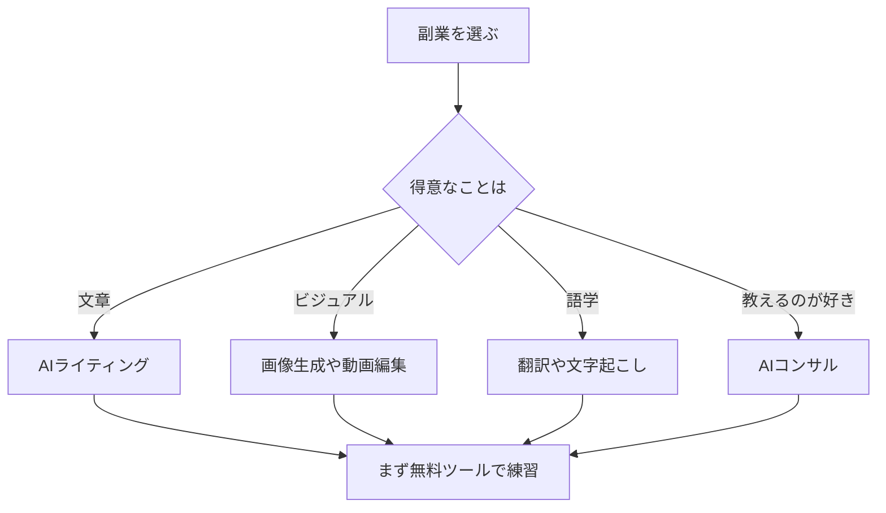

※本記事はアフィリエイト広告(PR)を含みます。

## この記事でわかること

「AIで副業を始めたいけれど、何から手をつければいいかわからない」——そんな方に向けた記事です。本記事では、**AI副業の始め方**を初心者向けにわかりやすく解説し、特別なスキルがなくても挑戦しやすい「稼げる仕事5選」と、それぞれに役立つおすすめツールを紹介します。

さらに、「AI副業は無料で始められるの?」といった疑問にも先回りでお答えします。読み終えるころには、自分に合った副業の種類が見え、今日から最初の一歩を踏み出せるはずです。

## なぜ今「AI副業」が始めやすいのか

生成AI(文章や画像などを自動で作り出すAI)の進化で、これまで専門家しかできなかった作業を、初心者でも短時間でこなせるようになりました。文章作成、画像作り、動画編集、翻訳といった作業をAIが下書きしてくれるため、**作業時間が大幅に短縮**できます。

つまり、「スキルを長期間かけて身につけてから副業を始める」のではなく、「AIに手伝ってもらいながら、稼ぎつつ学ぶ」ことが可能になったのです。これがAI副業の最大の魅力です。

## 初心者でも稼げるAI副業5選

ここからは、初心者でも取り組みやすい5つの仕事を紹介します。それぞれ「向いている人」と「使うツール」をセットで見ていきましょう。

### 1. AIライティング(記事・ブログ作成)

Webメディアやブログの記事を書く仕事です。クラウドソーシングサイト(仕事を発注・受注できるサービス)には文章作成の案件が多く、初心者の入り口として定番です。

AIに構成案やたたき台を作ってもらい、自分で事実確認や加筆をすることで、品質を保ちながら効率的に納品できます。具体的な進め方は[AIでブログ記事を書く方法\|初心者向け完全ガイド](/2026/06/12/ai-blog-writing-guide/)で詳しく解説しています。ツール選びに迷ったら[AIライティングツール比較2026](/2026/06/19/ai-writing-tool-comparison-2026/)も参考にしてください。

- **向いている人**:文章を書くのが苦でない人、コツコツ作業できる人
- **おすすめツール**:ChatGPT、Claude、Catchy など

### 2. AI画像生成(イラスト・素材作成)

キーワードを入力するだけで画像を作れるAIを使い、SNS用の画像やブログのアイキャッチ、ロゴ素材などを販売・受注する仕事です。絵が描けなくても始められるのが大きな魅力です。

ただし商用利用には著作権やライセンスの注意点があります。無料で使えるツールと注意点は[無料で使える画像生成AIおすすめ5選](/2026/06/11/free-image-ai-tools/)にまとめていますので、必ず確認しておきましょう。

- **向いている人**:デザインやビジュアルに興味がある人
- **おすすめツール**:各種画像生成AI(商用利用条件を要確認)

### 3. AI動画編集(YouTube・ショート動画)

YouTubeやショート動画の需要は高く、編集を代行する副業はニーズが続いています。AI編集ツールを使えば、不要部分の自動カットや字幕付けが半自動でできるため、未経験でも作業のハードルが下がっています。

どのソフトを選べばよいかは[AI動画編集ツール比較\|YouTube初心者におすすめの自動編集ソフト5選](/2026/06/16/ai-video-editing-tools/)が参考になります。

- **向いている人**:動画コンテンツが好きな人、地道な作業が得意な人
- **おすすめツール**:AI字幕・自動編集機能を備えた動画編集ソフト

### 4. AI翻訳・文字起こしのサポート

海外資料の翻訳や、会議・インタビューの文字起こしを代行する仕事です。AI翻訳やAI文字起こしの精度が上がったことで、「AIが下訳・下書きをし、人が仕上げる」スタイルが主流になりつつあります。

精度の高いツールを使いこなすことが品質のカギになります。

- **向いている人**:言語に興味がある人、丁寧なチェックができる人
- **おすすめツール**:DeepL、各種AI文字起こしツール

### 5. AIコンサル・運用代行

「AIをうまく使いたいけれど方法がわからない」という個人や企業に対し、ツールの導入支援や運用代行を行う仕事です。難易度はやや高めですが、その分単価が上がりやすいのが特徴です。

まずは自分でAIを使い倒し、ノウハウを蓄積することから始めましょう。将来的に「ひとりで事業を回す」発展形については[AI時代の「一人会社」入門](/2026/06/14/ai-solo-company/)も読んでみてください。

- **向いている人**:人に教えるのが好きな人、AIを深く学びたい人
- **おすすめツール**:幅広いAIツールの実践経験

## 自分に合う副業の選び方

「どれを選べばいいか迷う」という方のために、選び方の流れを図にまとめました。

ポイントは、**いきなり高度な仕事を狙わず、得意分野から小さく始める**ことです。まず無料ツールで練習し、慣れてきたら有料プランや高単価案件に広げていきましょう。

## AI副業は無料で始められる?

結論から言うと、**多くのAIツールには無料プランがあり、初期費用ゼロで始めることが可能**です。ChatGPTやClaudeなどのチャットAIにも無料版があり、まずはここから試すのがおすすめです。

ただし、無料版は使用回数や機能に制限があることが多く、本格的に稼ぎたくなると有料プランが選択肢に入ります。有料版を検討する際は[ChatGPT有料版は必要?無料版との違いと元が取れる使い方](/2026/06/20/chatgpt-paid-vs-free/)を読むと判断しやすいでしょう。料金は改定されることがあるため、契約前に必ず公式サイトで最新情報を確認してください。

## 作業環境を整えると効率が上がる

AI副業は在宅でできる仕事がほとんどです。長時間の作業を快適にするために、作業環境への投資も無駄になりません。特に動画編集や翻訳のように画面を見続ける作業では、ノートパソコンやモニター環境が作業効率に直結します。

オンライン打ち合わせが発生する仕事なら、相手に好印象を与えるマイク環境も整えておくと安心です。

👉 [Amazonで「USBマイク 高音質」を見る](https://af.moshimo.com/af/c/click?a_id=5632371&p_id=170&pc_id=185&pl_id=38594&url=https%3A%2F%2Fwww.amazon.co.jp%2Fs%3Fk%3DUSB%25E3%2583%259E%25E3%2582%25A4%25E3%2582%25AF%2520%25E9%25AB%2598%25E9%259F%25B3%25E8%25B3%25AA)

また、外出先でも作業したい方は、バッテリー切れに備えてモバイルバッテリーを用意しておくとよいでしょう。

👉 [楽天市場で「モバイルバッテリー 大容量」を探す](https://af.moshimo.com/af/c/click?a_id=5632328&p_id=54&pc_id=54&pl_id=616&url=https%3A%2F%2Fsearch.rakuten.co.jp%2Fsearch%2Fmall%2F%25E3%2583%25A2%25E3%2583%2590%25E3%2582%25A4%25E3%2583%25AB%25E3%2583%2590%25E3%2583%2583%25E3%2583%2586%25E3%2583%25AA%25E3%2583%25BC%2520%25E5%25A4%25A7%25E5%25AE%25B9%25E9%2587%258F%2F)

## スキルアップで単価を上げる

副業に慣れてきたら、より高単価の案件を狙うためにスキルを体系的に学ぶのも効果的です。独学で行き詰まった場合は[生成AIが学べるオンラインスクールおすすめ比較](/2026/06/13/ai-online-school-guide/)を参考に、自分に合った学習方法を探してみてください。学びながら稼ぎ、稼ぎながら学ぶ——この循環がAI時代の副業を伸ばすコツです。

## まとめ

最後に、この記事のポイントを振り返ります。

- AIの進化で、初心者でも「稼ぎながら学ぶ」副業が始めやすくなった
- おすすめは「ライティング」「画像生成」「動画編集」「翻訳・文字起こし」「AIコンサル」の5つ
- 自分の得意分野から小さく始め、まず無料ツールで練習するのが成功の近道
- 多くのツールは無料で始められるが、本格化するなら有料プランも検討する
- 作業環境やスキルへの投資で、効率と単価を着実に上げられる

まずは気になったAIツールを1つ試してみることが、AI副業への確実な第一歩です。今日から小さく始めて、自分のペースで収入の柱を育てていきましょう。
