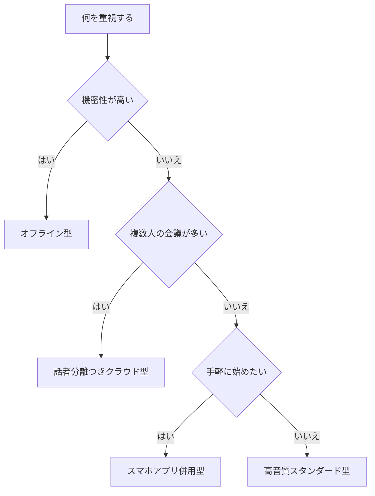

※本記事はアフィリエイト広告(PR)を含みます。

## この記事でわかること

「会議や取材の録音を、自動で文字に起こしてくれる便利な機械はないかな?」——そんな悩みを持つ方に向けて、この記事では**AI搭載ボイスレコーダーのおすすめと選び方**をわかりやすく比較していきます。

AI搭載ボイスレコーダーとは、録音した音声をその場で(またはアプリ経由で)自動的にテキストに変換してくれる録音機のことです。手作業で音声を聞き返しながらタイピングする手間が一気に減るため、議事録づくりやインタビューのまとめが驚くほどラクになります。

この記事を読むと、次のことがわかります。

- AI搭載ボイスレコーダーとスマホアプリの違い
- 会議・取材に最適なモデルを選ぶときのポイント
- 注目の人気タイプと、それぞれが向いている人
- 「無料で使えるの?」という疑問への答え

それでは順番に見ていきましょう。

## AI搭載ボイスレコーダーとは?スマホアプリとの違い

まず押さえておきたいのが、「専用ボイスレコーダー」と「スマホの文字起こしアプリ」の違いです。どちらも文字起こしはできますが、得意分野が異なります。

| 項目 | AI搭載ボイスレコーダー | スマホアプリ |
|---|---|---|
| 録音品質 | 高い(高性能マイク内蔵) | 機種による |
| 長時間録音 | 得意(電話やバッテリーを気にしない) | 通知や電話で中断することも |
| 文字起こし | クラウド連携で自動化 | アプリ次第 |
| 持ち運び | 軽量で目立たない | 普段持ち歩く端末で完結 |

専用レコーダーの強みは、**雑音の多い会議室でも声をしっかり拾える高性能マイク**と、**長時間でも安定して録音できる安心感**です。一方、スマホアプリは追加の機材を買わずに始められる手軽さが魅力です。

なお、ソフト面での文字起こし精度を重視する方は、[AI文字起こしツールおすすめ比較\|会議・インタビューに最適なのは?](/2026/06/12/ai-transcription-comparison/)もあわせて読むと、自分に合った組み合わせが見つけやすくなります。

## AI搭載ボイスレコーダーの選び方5つのポイント

失敗しないために、購入前にチェックしたいポイントを5つにまとめました。

### 1. 文字起こしの方式(本体内 or クラウド)

文字起こしには大きく2つの方式があります。

- **クラウド方式**:録音データをインターネット上のAIに送って変換。精度が高い反面、通信環境や月額料金が関わることがあります。
- **オフライン方式**:本体内で処理。電波がなくても使え、機密性の高い会議向きです。

### 2. 日本語の認識精度

会議や取材で使うなら、**日本語の精度**が最重要です。専門用語や固有名詞の多い現場では、後から手直しが必要になることもあります。購入前にレビューや公式サンプルを確認しておくと安心です。

### 3. 話者分離(誰が話したか)の機能

「話者分離」とは、**誰の発言かを自動で振り分けてくれる機能**です。複数人の会議では、これがあるかないかで議事録の使いやすさが大きく変わります。

### 4. バッテリーと録音時間

長時間の会議やセミナーを録音するなら、連続録音時間とバッテリー持ちは要チェックです。

### 5. 料金体系(買い切り or サブスク)

本体代だけで使えるものもあれば、文字起こし時間に応じた月額プランが必要なものもあります。具体的な金額は変動しやすいため、必ず**公式サイトで最新情報を確認してください**。

## タイプ別・自分に合うレコーダーの選び方

下のフローチャートで、自分に向いているタイプをざっくり確認してみましょう。

### オフライン型がおすすめな人

社外秘の会議や、通信環境が不安定な場所で使う方に向いています。データを外部に送らないため、セキュリティ面で安心です。

### 話者分離つきクラウド型がおすすめな人

参加者の多い定例会議や座談会の議事録を作る方に最適です。発言者ごとに整理されるため、後の編集が格段にラクになります。

### スマホアプリ併用型がおすすめな人

「まずはコストを抑えて試したい」という方は、レコーダーで録音し、アプリやAIで文字起こしする方法から始めるのがおすすめです。

AI搭載ボイスレコーダーは種類が豊富なので、まずは実機のラインアップを見てみるとイメージが湧きやすいです。

👉 [Amazonで「AI ボイスレコーダー 文字起こし」を見る](https://af.moshimo.com/af/c/click?a_id=5632371&p_id=170&pc_id=185&pl_id=38594&url=https%3A%2F%2Fwww.amazon.co.jp%2Fs%3Fk%3DAI%2520%25E3%2583%259C%25E3%2582%25A4%25E3%2582%25B9%25E3%2583%25AC%25E3%2582%25B3%25E3%2583%25BC%25E3%2583%2580%25E3%2583%25BC%2520%25E6%2596%2587%25E5%25AD%2597%25E8%25B5%25B7%25E3%2581%2593%25E3%2581%2597)

👉 [楽天市場で「ボイスレコーダー 文字起こし AI」を探す](https://af.moshimo.com/af/c/click?a_id=5632328&p_id=54&pc_id=54&pl_id=616&url=https%3A%2F%2Fsearch.rakuten.co.jp%2Fsearch%2Fmall%2F%25E3%2583%259C%25E3%2582%25A4%25E3%2582%25B9%25E3%2583%25AC%25E3%2582%25B3%25E3%2583%25BC%25E3%2583%2580%25E3%2583%25BC%2520%25E6%2596%2587%25E5%25AD%2597%25E8%25B5%25B7%25E3%2581%2593%25E3%2581%2597%2520AI%2F)

## 録音から議事録までの流れ

AI搭載レコーダーを使った、文字起こしの基本的な流れは次のとおりです。

1. レコーダーで会議や取材を録音する
2. 専用アプリやクラウドに音声をアップロード
3. AIが自動で文字起こし・話者分離
4. テキストを確認して固有名詞などを修正
5. 要約や議事録の形に整える

この「要約・議事録化」の工程は、ChatGPTなどのAIチャットと組み合わせるとさらに効率的です。具体的な自動化の手順は[AIで議事録作成を自動化する方法\|おすすめツール5選](/2026/06/10/ai-meeting-minutes/)で詳しく解説しているので、あわせてご覧ください。

## よくある質問

### AI搭載ボイスレコーダーは無料で使える?

本体は当然有料ですが、**文字起こし機能そのもの**については製品によって扱いが異なります。一定時間まで無料で、それ以上は月額課金になるケースが多いです。「録音は無制限だが文字起こしは月◯時間まで無料」といった形が一般的なので、購入前に対象モデルの料金条件を必ず確認しましょう。

コストを抑えたい場合は、安価なレコーダーで録音だけ行い、無料の文字起こしツールやAIを使う方法もあります。

### オンライン会議の録音にも使える?

使えますが、PCの音声をきれいに拾うには内蔵マイクの位置取りが重要です。オンライン会議の音質や見え方を底上げしたい方は、[Webカメラ・マイクのおすすめ｜オンライン会議の印象を良くする機材選び](/2026/06/15/webcam-mic-online-meeting/)も参考になります。

### 精度は完璧?

残念ながら100%ではありません。専門用語や同音異義語は誤変換が起きやすいため、**最終チェックは人の目で行う**前提で考えておくと失敗しません。

## まとめ

今回は、AI搭載ボイスレコーダーの選び方とタイプ別のおすすめを比較しました。最後にポイントを振り返ります。

- 専用レコーダーは**高音質・長時間録音・自動文字起こし**が強み
- 選ぶときは**精度・話者分離・料金体系**を必ずチェック
- 機密会議なら**オフライン型**、多人数会議なら**話者分離つきクラウド型**
- 文字起こし機能の無料枠や料金は**公式サイトで最新情報を確認**
- 議事録化はAIチャットと組み合わせるとさらに時短できる

まずは自分の使い方(会議か取材か、人数は何人か)を整理し、フローチャートで向いているタイプを把握するところから始めてみてください。録音から議事録づくりまでの作業時間が、きっと大きく短縮できるはずです。
