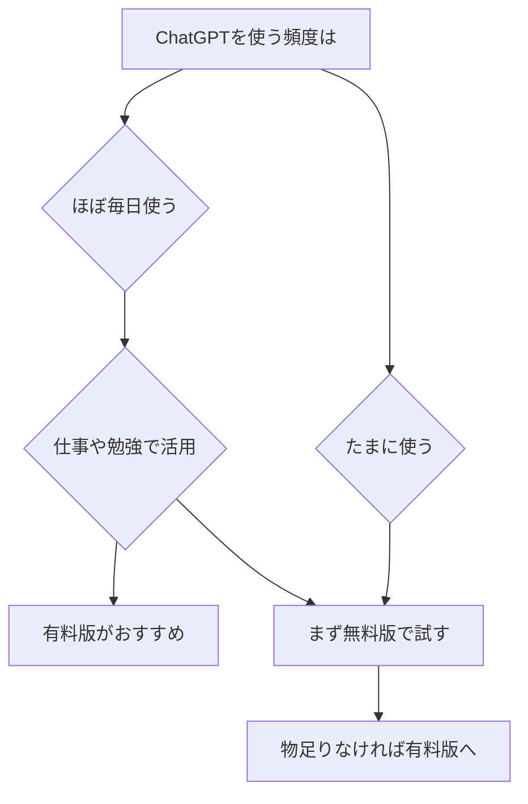

※本記事はアフィリエイト広告(PR)を含みます。

## ChatGPT有料版は必要?まず結論からお伝えします

「ChatGPTの有料版って本当に必要なの?」「無料版とどこが違うの?」と気になって検索された方も多いのではないでしょうか。この記事では、ChatGPTの有料版と無料版の違い、料金の目安、そして「元が取れる使い方」を初心者の方にもわかりやすく解説します。

結論からお伝えすると、**たまにちょっと質問する程度なら無料版で十分**ですが、**仕事や勉強で毎日使う・画像生成やファイル分析も活用したいなら有料版が圧倒的におすすめ**です。この記事を読めば、自分に有料版が必要かどうかをはっきり判断できるようになります。

なお、ChatGPTとは、OpenAI社が提供する「対話型のAIチャットサービス」のことです。質問を入力すると、人間のように自然な文章で答えてくれるツールだとイメージしてください。

## ChatGPT無料版でできること

まずは無料版で何ができるのかを整理しましょう。無料版でも、近年はかなり高性能なモデル(AIの頭脳にあたる部分)が使えるようになっています。

- 文章の作成・要約・添削
- アイデア出しや相談
- 簡単な翻訳や会話練習
- 基本的な画像生成やファイルの読み込み(回数制限あり)

つまり「ちょっと文章を整えたい」「調べ物の相談をしたい」といった日常的な用途なら、無料版でも十分に役立ちます。

ただし無料版には、**混雑時に速度が落ちる**、**高性能モデルの利用回数に上限がある**、**一定回数を超えると性能の低いモデルに切り替わる**といった制限があります。

## ChatGPT有料版(ChatGPT Plus)でできること

有料版は一般的に「ChatGPT Plus」と呼ばれるプランです。主なメリットは以下のとおりです。

- **最新・最高性能のモデルを優先的に使える**
- **混雑時でも安定して高速に応答してくれる**
- 画像生成やファイル分析、データ処理などの利用枠が大きい
- 高度な音声会話や、Web検索との連携機能が使いやすい
- 新機能をいち早く試せる

仕事の資料作成、プログラミング、長文の分析など「本気で使う」場面では、この性能差と安定性が大きな違いを生みます。

料金はプランや為替の影響で変わることがあるため、正確な金額は[OpenAIの公式サイトで最新情報を確認してください](https://openai.com/)。他社サービスとの料金比較は[AIサブスク料金比較2026年6月](/2026/06/16/ai-subscription-pricing-2026/)でも詳しく解説しています。

## 無料版と有料版の違いを表で比較

| 項目 | 無料版 | 有料版(Plus) |
|------|--------|----------------|
| 利用料金 | 無料 | 月額制(公式で確認) |
| 使えるモデル | 標準モデル中心 | 最新・高性能モデル |
| 応答速度 | 混雑時は遅い | 安定して高速 |
| 利用回数 | 上限が低め | 大幅に拡大 |
| 画像生成・ファイル分析 | 制限あり | たっぷり使える |
| 新機能 | 後から提供 | いち早く利用可 |

この表を見ると、**「使う量」と「仕事で使うかどうか」**が判断の分かれ目になることがわかります。

## あなたに有料版が必要か診断フローチャート

下の図で、自分に有料版が向いているかをチェックしてみましょう。

ポイントは「無料版で物足りなさを感じたら有料版へ」というステップを踏むことです。いきなり契約しなくても、まずは無料版で使い心地を確かめるのが失敗しないコツです。

## 有料版で「元が取れる」具体的な使い方

有料版の料金以上の価値を引き出すには、毎日の作業に組み込むのが一番です。具体例を紹介します。

### 1. ビジネスメール・文章作成の時短

メールや報告書の下書きをAIに任せれば、作業時間を大幅に短縮できます。具体的なやり方は[AIメール作成術](/2026/06/14/ai-email-writing/)で詳しく紹介しています。1日30分の時短ができれば、月額料金はすぐに回収できる計算です。

### 2. 資料作成・アイデア出し

プレゼン資料の構成案や、企画のアイデア出しもお手のものです。たたき台を一瞬で作れるので、ゼロから考える負担が一気に減ります。

### 3. 学習・スキルアップ

プログラミング学習や英会話の練習相手としても優秀です。わからないところを何度でも質問できるので、独学の心強い味方になります。

### 4. ブログ・副業での活用

副業でブログや情報発信をしている方なら、記事の構成作りやリサーチに大活躍します。AIライティングツールとの使い分けは[AIライティングツール比較2026](/2026/06/19/ai-writing-tool-comparison-2026/)も参考にしてください。

こうした作業を快適に行うには、長時間の入力でも疲れにくい環境づくりも大切です。

👉 [Amazonで「ワイヤレスキーボード 静音」を見る](https://af.moshimo.com/af/c/click?a_id=5632371&p_id=170&pc_id=185&pl_id=38594&url=https%3A%2F%2Fwww.amazon.co.jp%2Fs%3Fk%3D%25E3%2583%25AF%25E3%2582%25A4%25E3%2583%25A4%25E3%2583%25AC%25E3%2582%25B9%25E3%2582%25AD%25E3%2583%25BC%25E3%2583%259C%25E3%2583%25BC%25E3%2583%2589%2520%25E9%259D%2599%25E9%259F%25B3)

## よくある疑問Q&A

### Q. ChatGPTは無料でどこまで使える?

基本的な文章作成や相談、簡単な画像生成までは無料で使えます。ただし高性能モデルや画像生成には回数制限があり、上限に達すると性能が下がったり待たされたりします。「もっと使いたい」と感じ始めたら有料版の検討タイミングです。

### Q. ほかのAIと比べてChatGPTはどう?

ChatGPTのほかにもClaudeやGeminiなど優秀なAIがあります。それぞれ得意分野が違うので、[ChatGPTとClaudeとGeminiを徹底比較](/2026/06/09/ai-chat-comparison/)の記事で自分に合うものを見つけてみてください。

### Q. 解約はいつでもできる?

月額プランは基本的にいつでも解約できます。「1か月だけ試す」という使い方も可能なので、まずは試してみて判断するのがおすすめです。最新の解約条件は公式サイトでご確認ください。

## まとめ

ChatGPTの有料版が必要かどうかは、**使う頻度と用途**で決まります。

- **たまに使う程度なら無料版で十分**
- **毎日使う・仕事や勉強で活用するなら有料版がおすすめ**
- まずは無料版で試し、物足りなさを感じたら有料版へ
- メール作成・資料作り・学習に毎日使えば、料金はすぐに元が取れる

有料版は安定した速度と高性能モデルで作業効率を大きく高めてくれます。料金や機能は変わることがあるので、契約前に必ず公式サイトで最新情報を確認しましょう。まずは無料版から、ぜひ気軽にChatGPTを使い始めてみてください。
