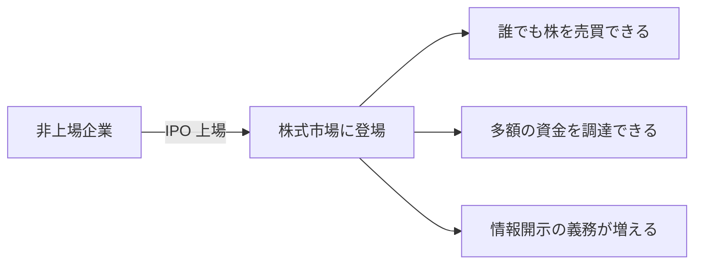

※本記事はアフィリエイト広告(PR)を含む場合があります。

## AI企業が次々と「上場」へ動き出した

2026年、AI業界で大きな地殻変動が起きています。**ClaudeのAnthropicがIPO(新規株式公開=株式市場への上場)に向けてSEC(米証券取引委員会)へ申請**したと報じられ、評価額は**約9,650億ドル(およそ140兆円)規模**とされています。

さらに**OpenAIも追随する動き**を見せ、「**AI上場ラッシュ**」とも呼ばれる局面に入りました。これは「AI企業が、実験的なスタートアップから、株式市場で評価される巨大企業へと成熟しつつある」ことの象徴です。

この記事では、**何が起きているのか・なぜ今なのか・私たちユーザーにどう関係するのか**を、初心者向けにわかりやすく整理します。

> ⚠️ 評価額や申請状況は時期により変動します。また本記事は投資の助言ではありません。最新の正確な情報は公式発表・各種報道でご確認ください。

## そもそもIPO(上場)とは?

**IPO(Initial Public Offering)**とは、それまで一部の投資家しか株を持てなかった会社が、**株式市場に上場して、誰でも株を売買できるようにする**ことです。会社にとっては、

- **大きな資金を調達できる**(AI開発には莫大なお金がかかる)
- **知名度・信頼性が上がる**
- 一方で、**業績などの情報開示の義務**が増える

というメリット・責任が生まれます。

## なぜ今、上場ラッシュなのか

背景には、**AI開発に天文学的なコストがかかる**一方で、**ビジネスとして急成長している**という事情があります。

- AIモデルの学習には、巨大なデータセンターと電力が必要 → **継続的に莫大な資金が要る**
- 同時に、ChatGPTやClaudeの収益は急拡大し、**株式市場から評価される段階**に到達した
- ライバル(OpenAI、xAI、Googleなど)との競争に勝つため、**資金調達を急ぐ**必要がある

つまり、「**もっと大きく戦うための軍資金を、株式市場から集める**」フェーズに入った、というわけです。

## 私たちユーザーへの影響

### サービスはより安定する?それとも値上げ?

上場で資金が潤沢になれば、**サービスの開発・維持に追い風**になります。一方で、上場企業は**株主への利益還元**を求められるため、**将来的な値上げや有料化の圧力**にもつながりえます。

実際、AIの料金体系は流動的で、[料金プランが二転三転した例](/2026/06/16/claude-agent-billing-reversed/)もありました。料金の全体像は[AIサブスク料金比較](/2026/06/16/ai-subscription-pricing-2026/)も参考にしてください。

### 「依存しすぎない」視点も大切

巨大化するAI企業のサービスに、私たちの仕事や生活が深く依存していくのも事実です。先日の[Claude Fable 5の停止と日本への影響](/2026/06/16/claude-fable-5-japan-impact/)でも触れたように、**特定のサービスに過度に依存しない備え**は引き続き大切です。

### 投資対象としては?

「AI企業の株を買いたい」と思う人もいるでしょう。ただし、**現時点でAnthropicは非上場**(申請段階)のため、一般の株式市場ではまだ買えません。上場すれば売買可能になりますが、**評価額が高い=割高なリスク**もあります。投資は自己責任で、冷静な判断を。

## よくある質問

### Anthropicの株はもう買える?

いいえ。**現時点では上場前(申請段階)**のため、一般の市場では購入できません。上場後に売買可能になります。

### 上場するとClaudeは使えなくなる?

いいえ。上場は資金調達の手段で、サービスはむしろ強化される方向です。ただし料金・プランは変わる可能性があるため、最新情報の確認は続けましょう。

### 評価額140兆円ってどれくらいすごい?

日本を代表する大企業に匹敵・凌駕する規模感です。一企業、しかも創業から日が浅いAI企業としては、**異例の高評価**といえます。

## まとめ

- 2026年、**AnthropicがIPOを申請**(評価額約9,650億ドル規模)、**OpenAIも続く「上場ラッシュ」**へ
- 背景は「**莫大な開発費**」と「**急成長する収益**」、そして**競争のための資金調達**
- ユーザーには**サービス強化の追い風**だが、**値上げ圧力**にもなりうる
- Anthropicは**現時点で非上場**。投資は自己責任で、最新情報の確認を

AIは「すごい技術」から「巨大ビジネス」へと、確実にステージを変えつつあります。この大きな流れを知っておくと、ニュースの見え方が変わってくるはずです。

### 参考リンク

- [AnthropicがIPOに向けた非公開申請を行ったと発表(GIGAZINE)](https://gigazine.net/news/20260602-anthropic-ipo-confidential-draft/)
- [Anthropic IPO 2026\|評価額・時期・業界への影響(AI Career Japan)](https://ai-career-japan.jp/posts/anthropic-ipo-2026/)
