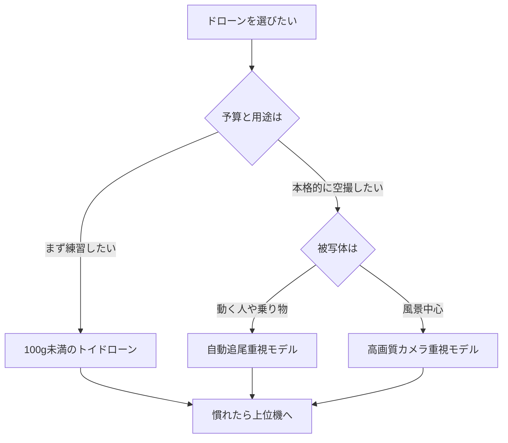

※本記事はアフィリエイト広告(PR)を含みます。

「空撮をしてみたいけれど、AI搭載ドローンってどう選べばいいの?」とお悩みではありませんか。この記事では、**AI搭載ドローンの選び方**を初心者向けにやさしく解説します。自動追尾(被写体を自動で追いかけて撮影する機能)や障害物回避といったAI機能の違い、価格帯ごとの特徴、そして安全に飛ばすための法律のポイントまで、これ1本で全体像がつかめる内容です。

読み終えるころには、「自分にはどんなドローンが合っているのか」「次に何を確認すればいいのか」がはっきりするはずです。それでは順番に見ていきましょう。

## AI搭載ドローンとは?従来機との違い

まず、AI搭載ドローンと普通のドローンの違いを整理しておきましょう。

AI搭載ドローンとは、カメラに映った人や物を認識し、自動で判断して動くことができるドローンのことです。従来は操縦者がすべてを手動で操作していましたが、AIが「被写体を追いかける」「障害物を避ける」といった作業を肩代わりしてくれます。

代表的なAI機能には次のようなものがあります。

- **自動追尾(ActiveTrackなど)**:歩いている人や走る車を、ドローンが自動で追いかけながら撮影
- **障害物回避**:前方や周囲のセンサーで木や壁を検知し、ぶつかる前に止まる・避ける
- **自動構図・自動編集**:AIが「映える」アングルを選び、短い動画を自動で仕上げる
- **ジェスチャー操作**:手の動きで撮影開始や着陸を指示できる

こうした機能のおかげで、操縦に不慣れな初心者でも、プロのような滑らかな空撮映像を撮りやすくなっています。

## 初心者がドローン選びで見るべき5つのポイント

機種選びで迷ったら、次の5点をチェックすると失敗しにくくなります。

### 1. 重量(機体の重さ)

重量は法律(後述)にも関わる重要ポイントです。**100g以上のドローン**は航空法の規制対象になり、原則として機体登録が必要です。一方、100g未満の「トイドローン」は規制が比較的ゆるく、入門には手軽です。ただし軽い機体は風に弱い傾向があります。

### 2. カメラの画質

空撮を楽しむなら、**4K(高精細な映像規格)対応**かどうかを確認しましょう。センサーサイズが大きいほど、暗い場所でもきれいに撮れます。SNS投稿が中心なら、無理に最高画質を求めなくても十分なこともあります。

### 3. 飛行時間

バッテリー1本あたりの飛行時間は機種によって異なります。一般的に20〜40分程度が目安ですが、実際の飛行は風などの影響で短くなりがちです。予備バッテリーがあると安心して撮影に集中できます。

### 4. AI機能の充実度

自動追尾や障害物回避の精度は、価格に比例して高くなる傾向があります。動く被写体を撮りたいなら自動追尾、森や街中で飛ばすなら障害物回避を重視しましょう。

### 5. 携帯性

折りたたみ式でコンパクトになるモデルは、旅行や登山での持ち運びに便利です。リュックに入るサイズかどうかも、長く使ううえで意外と効いてきます。

## 選び方フローチャート

自分に合うタイプを下のフローチャートで確認してみましょう。

## 価格帯ごとの特徴

おおまかな価格帯ごとの傾向をまとめました。具体的な価格は変動が大きいため、必ず公式サイトや販売ページで最新情報を確認してください。

| 価格帯 | 特徴 | 向いている人 |
|---|---|---|
| エントリー | 軽量・操作がシンプル。AI機能は最小限 | 初めての練習用 |
| ミドル | 4K撮影・自動追尾・障害物回避を搭載 | 趣味で本格的に空撮したい人 |
| ハイエンド | 大型センサー・高度なAI・長い飛行時間 | 作品づくりや仕事で使う人 |

まずは入門機で操作に慣れ、物足りなくなったら上位機へステップアップするのが、お金を無駄にしないコツです。実際の機種を見比べたい方は、こちらから探してみてください。

👉 [Amazonで「ドローン 4K カメラ 自動追尾」を見る](https://af.moshimo.com/af/c/click?a_id=5632371&p_id=170&pc_id=185&pl_id=38594&url=https%3A%2F%2Fwww.amazon.co.jp%2Fs%3Fk%3D%25E3%2583%2589%25E3%2583%25AD%25E3%2583%25BC%25E3%2583%25B3%25204K%2520%25E3%2582%25AB%25E3%2583%25A1%25E3%2583%25A9%2520%25E8%2587%25AA%25E5%258B%2595%25E8%25BF%25BD%25E5%25B0%25BE)

👉 [楽天市場で「ドローン 初心者 空撮」を探す](https://af.moshimo.com/af/c/click?a_id=5632328&p_id=54&pc_id=54&pl_id=616&url=https%3A%2F%2Fsearch.rakuten.co.jp%2Fsearch%2Fmall%2F%25E3%2583%2589%25E3%2583%25AD%25E3%2583%25BC%25E3%2583%25B3%2520%25E5%2588%259D%25E5%25BF%2583%25E8%2580%2585%2520%25E7%25A9%25BA%25E6%2592%25AE%2F)

## 飛ばす前に知っておきたいルールと安全対策

ドローンは「買ってすぐどこでも飛ばせる」わけではありません。日本では航空法などのルールがあり、知らずに飛ばすと罰則の対象になることもあります。

主なポイントは次のとおりです。

- **100g以上の機体は登録が必須**(国土交通省への機体登録)
- **空港周辺・人口密集地・高度150m以上**などは原則飛行禁止
- **夜間飛行・目視外飛行**などには許可・承認が必要
- 私有地や公園では**管理者のルール**にも従う

ルールは改正されることがあるため、飛行前に必ず国土交通省などの公式情報で最新のルールを確認しましょう。安全に配慮することが、趣味を長く楽しむ第一歩です。

## よくある質問

### Q. ドローンの操作にAIがあれば、まったくの初心者でも飛ばせますか?

AIが補助してくれるとはいえ、基本の操縦感覚は練習が必要です。まずは広い屋外や練習用の安価な機体で、上昇・下降・旋回といった基本動作に慣れることをおすすめします。AIの自動追尾はあくまで「サポート役」と考えましょう。

### Q. AI搭載ドローンの撮影データは、AIで編集すると楽になりますか?

はい。撮影した映像はAI動画編集ツールを使うと、初心者でも手早く仕上げられます。自動でハイライトを抽出してくれるツールも増えています。詳しくは[AI動画編集ツール比較\|YouTube初心者におすすめの自動編集ソフト5選](/2026/06/16/ai-video-editing-tools/)をご覧ください。

### Q. ドローン以外のAIガジェットも気になります

空撮以外にも、生活を便利にするAIガジェットは続々と登場しています。[AI搭載スマートウォッチおすすめ比較\|健康管理・睡眠分析に最適なのは?](/2026/06/17/ai-smartwatch-comparison/)や[ロボット掃除機の選び方2026\|AI搭載モデルを価格・機能で徹底比較](/2026/06/16/robot-vacuum-guide-2026/)もあわせて参考になりますよ。

## まとめ

AI搭載ドローンは、自動追尾や障害物回避といった機能のおかげで、初心者でもプロ顔負けの空撮を楽しめる時代になりました。選ぶときは次の点を意識しましょう。

- **重量**:100g未満は手軽、100g以上は登録が必要
- **カメラ画質と飛行時間**:用途に合わせて選ぶ
- **AI機能**:動く被写体なら自動追尾、街中なら障害物回避
- **携帯性**:折りたたみ式は持ち運びに便利
- **ルール厳守**:飛ばす前に必ず最新の法律を確認

まずは入門機で操作に慣れ、撮りたい映像が明確になってきたら上位機へステップアップするのがおすすめです。撮った映像はAI編集ツールで仕上げれば、SNSやYouTubeでの発信もぐっと楽しくなります。あなたにぴったりの一台を見つけて、空からの絶景を撮影してみてくださいね。
